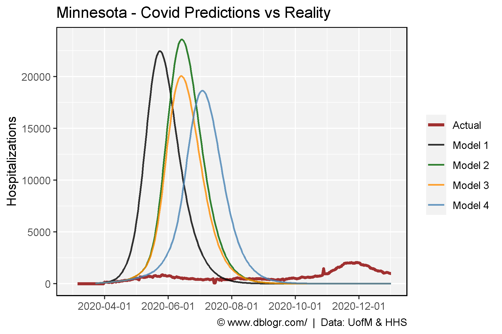
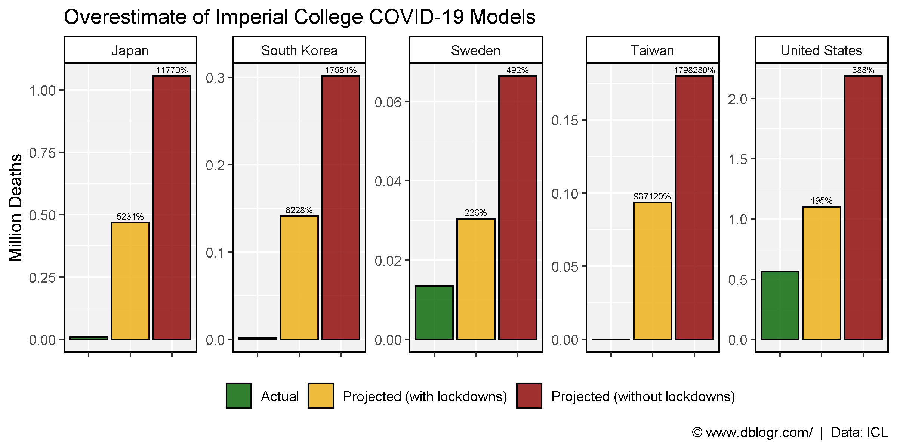

```{r setup, include=FALSE}
knitr::opts_chunk$set(echo = T, message = F, warning = F)
```

---

# Data Sources

USA Covid Data

https://beta.healthdata.gov/Hospital/COVID-19-Reported-Patient-Impact-and-Hospital-Capa/g62h-syeh/data

Minnesota Models

https://github.com/MN-COVID19-Model/Model_v3

Imperial Models

https://www.aier.org/article/the-failure-of-imperial-college-modeling-is-far-worse-than-we-knew/

https://www.aier.org/article/imperial-college-predicted-catastrophe-in-every-country-on-earth-then-the-models-failed/

https://github.com/mrc-ide/covid-sim

```{r echo = F}
downloadthis::download_link(
  link = "https://github.com/derekmichaelwright/dblogr/blob/master/content/dblogr/covid_models/covid_usa.csv",
  button_label = "covid_usa.csv",
  button_type = "success",
  has_icon = TRUE,
  icon = "fa fa-save",
  self_contained = FALSE
)
downloadthis::download_link(
  link = "https://github.com/derekmichaelwright/dblogr/blob/master/content/dblogr/covid_models/models_minnesota.csv",
  button_label = "models_minnesota.csv",
  button_type = "success",
  has_icon = TRUE,
  icon = "fa fa-save",
  self_contained = FALSE
)
downloadthis::download_link(
  link = "https://github.com/derekmichaelwright/dblogr/blob/master/content/dblogr/covid_models/models_imperial.csv",
  button_label = "models_imperial.csv",
  button_type = "success",
  has_icon = TRUE,
  icon = "fa fa-save",
  self_contained = FALSE
)
```

---

# Prepare data

```{r}
# devtools::install_github("derekmichaelwright/agData")
library(agData) # Loads: tidyverse, ggpubr, ggbeeswarm, ggrepel
# Prep data
models <- c("Model 1", "Model 2", "Model 3", "Model 4")
colors <- c("darkred", "black", "darkgreen", "darkorange", "steelblue")
x1 <- read.csv("models_minnesota.csv") %>% 
  rename(Hospitalizations=prevalent_hospitalizations,
         Data=strategy) %>%
  mutate(Data = plyr::mapvalues(Data, 1:4, models),
         Date = as.Date("2020-03-22") + t)
x2 <- read.csv("covid_usa.csv") %>%
  filter(state == "MN") %>%
  rename(Date=date,
         Hospitalizations=inpatient_bed_covid_utilization_numerator) %>%
  mutate(Data = "Actual",
         Date = as.Date(Date))
d1 <- bind_rows(x1, x2)
# 
x1 <- read.csv("models_imperial.csv") %>%
  select(Area=1, `Projected (with lockdowns)`=2, `Projected (without lockdowns)`=3, Actual=4) %>%
  gather(Trait, Value, 2:4) %>%
  mutate(Value = as.numeric(gsub(",", "", Value)))
x2 <- read.csv("models_imperial.csv") %>%
  select(Area=1, `Projected (with lockdowns)`=7, `Projected (without lockdowns)`=8) %>%
  gather(Trait, OverEstimate, 2:3)
d2 <- left_join(x1, x2, by = c("Area","Trait"))
```

---

# Minnesota Models

```{r}
# Plot
mp <- ggplot(d1, aes(x = Date, y = Hospitalizations, color = Data, size = Data)) +
  geom_line(alpha = 0.8) +
  scale_x_date(breaks = "2 month", limits = as.Date(c("2020-03-01","2021-01-01"))) +
  scale_size_manual(name = NULL, values = c(1.25,0.75,0.75,0.75,0.75)) +
  scale_color_manual(name = NULL, values = colors) +
  theme_agData() +
  labs(title = "Minnesota - Covid Predictions vs Reality", x = NULL,
       caption = "\xa9 www.dblogr.com/  |  Data: UofM & HHS")
ggsave("covid_models_01.png", mp, width = 6, height = 4)
```

```{r echo = F}
ggsave("featured.png", mp, width = 6, height = 4)
```



---

# Imperial Models

```{r}
# Plot
mp <- ggplot(d2, aes(x = Trait, y = Value / 1000000, fill = Trait)) +
  geom_bar(stat = "identity", color = "black", alpha = 0.8) +
  geom_text(aes(label = OverEstimate), size = 2, vjust = -0.5) +
  facet_wrap(Area ~ ., ncol = 5, scales = "free_y") +
  scale_fill_manual(name = NULL, values = agData_Colors) +
  theme_agData(legend.position = "bottom",
               axis.text.x = element_blank()) +
  labs(title = "Overestimate of Imperial College COVID-19 Models",
       y = "Million Deaths", x = NULL,
       caption = "\xa9 www.dblogr.com/  |  Data: ICL")
ggsave("covid_models_02.png", mp, width = 8, height = 4)
```



---

&copy; Derek Michael Wright [www.dblogr.com/](https://dblogr.com/)