```{r setup, include=FALSE}
knitr::opts_chunk$set(echo = T, message = F, warning = F)
```

---

# Data

```{r}
# devtools::install_github("derekmichaelwright/agData")
library(agData) # Loads: tidyverse, ggpubr, ggbeeswarm, ggrepel
library(gapminder)
library(gganimate)
```

```{r}
DT::datatable(gapminder %>% arrange(year))
```

---

# Plots

```{r}
mp <- ggplot(gapminder %>% filter(year %in% c(1952, 1982, 2007)), 
       aes(gdpPercap / 1000, lifeExp, size = pop, colour = country)) +
  geom_point(alpha = 0.7) +
  scale_colour_manual(values = country_colors) +
  scale_size(range = c(2, 12)) +
  scale_x_log10() +
  facet_wrap(. ~ year, ncol = 5) +
  theme_agData(legend.position = "none") +
  labs(x = "GDP Per Capita ($1000)", y = "Life Expectancy",
       caption = "\xa9 www.dblogr.com/  |  Data: gapminder")
ggsave("gapminder_01.png", mp, width = 6, height = 4)
```

```{r echo = F}
ggsave("featured.png", mp, width = 6, height = 4)
```

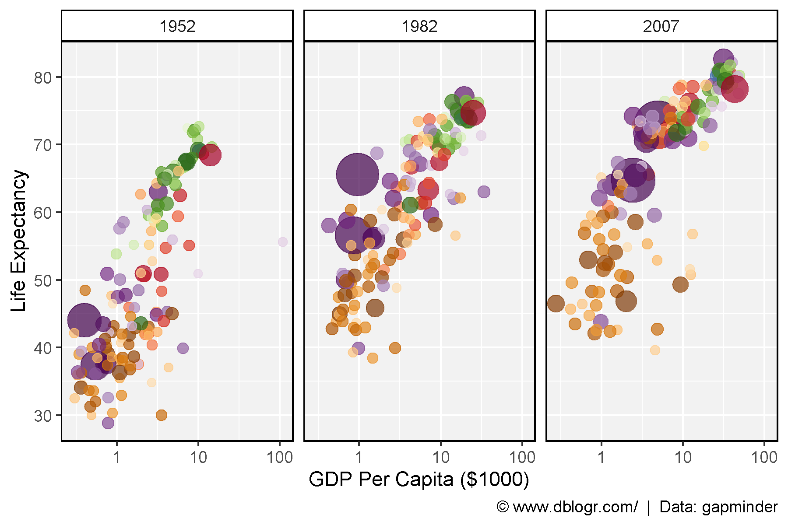

---

```{r}
mp <- ggplot(gapminder, aes(x = year, y = lifeExp, colour = country)) +
  geom_line(alpha = 0.7) +
  scale_colour_manual(values = country_colors) +
  scale_x_continuous(breaks = seq(1950, 2010, 20)) +
  coord_cartesian(xlim = c(1950, 2010)) +
  facet_wrap(. ~ continent, ncol = 5) +
  theme_agData(legend.position = "none", 
               axis.text.x = element_text(angle = 90, hjust = 1, vjust = 0.5)) +
  labs(x = NULL, y = "Life Expectancy",
       caption = "\xa9 www.dblogr.com/  |  Data: gapminder")
ggsave("gapminder_02.png", mp, width = 10, height = 5)
```

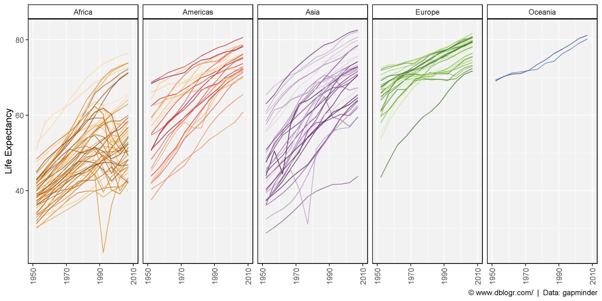

---

```{r}
mp <- ggplot(gapminder, aes(x = year, y = gdpPercap / 1000, colour = country)) +
  geom_line(alpha = 0.7) +
  scale_colour_manual(values = country_colors) +
  scale_x_continuous(breaks = seq(1950, 2010, 20)) +
  scale_y_log10() +
  coord_cartesian(xlim = c(1950, 2010)) +
  facet_wrap(. ~ continent, ncol = 5) +
  theme_agData(legend.position = "none", 
               axis.text.x = element_text(angle = 90, hjust = 1, vjust = 0.5)) +
  labs(x = NULL, y = "GDP Per Capita ($1000)",
       caption = "\xa9 www.dblogr.com/  |  Data: gapminder")
ggsave("gapminder_03.png", mp, width = 10, height = 5)
```

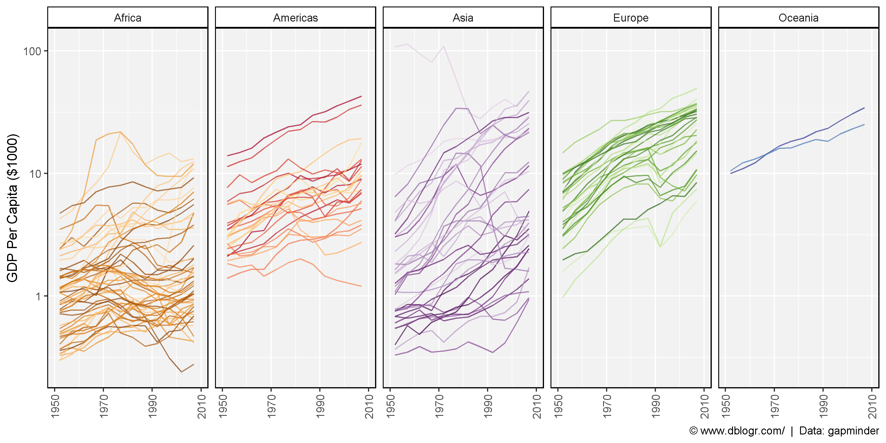

---

# Animations

```{r}
# gganimate example
mp <- ggplot(gapminder, aes(x = gdpPercap / 1000, y = lifeExp, size = pop, fill = country)) +
  geom_point(alpha = 0.7, show.legend = F, pch = 21, color = "black") +
  scale_fill_manual(values = country_colors) +
  scale_size(range = c(2, 12)) +
  scale_x_log10() +
  facet_wrap(. ~ continent, ncol = 5) +
  theme_agData() +
  # Here comes the gganimate specific bits
  labs(title = 'Year: {frame_time}', x = 'GDP Per Capita ($1000)', y = 'Life Expectancy',
       caption = "\xa9 www.dblogr.com/  |  Data: gapminder") +
  transition_time(year) +
  shadow_wake(wake_length = 0.1, alpha = F)
  #ease_aes('linear')
anim_save("gapminder_gifs_01.gif", mp, width = 600, height = 400)
```

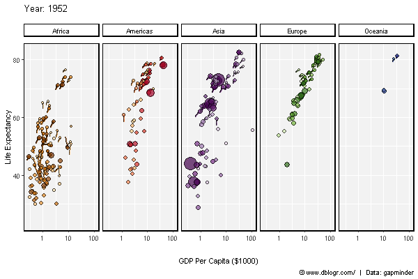

---

```{r}
xx <- gapminder %>% arrange(rev(year), gdpPercap) %>% 
  mutate(country = factor(country, levels = unique(country)))
#
mp <- ggplot(xx, aes(x = country, y = gdpPercap / 1000, size = pop, fill = country)) +
  geom_point(alpha = 0.7, show.legend = F, pch = 21, color = "black") +
  scale_fill_manual(values = country_colors) +
  scale_size(range = c(2, 12)) +
  scale_y_log10() +
  theme_agData(axis.text.x = element_blank(),
               axis.ticks.x = element_blank()) +
  # Here comes the gganimate specific bits
  labs(title = 'Year: {frame_time}', x = NULL, y = 'GDP Per Capita ($1000)',
       caption = "\xa9 www.dblogr.com/  |  Data: gapminder") +
  transition_time(year) +
  shadow_wake(wake_length = 0.1, alpha = F)
anim_save("gapminder_gifs_02.gif", mp, width = 600, height = 400)
```

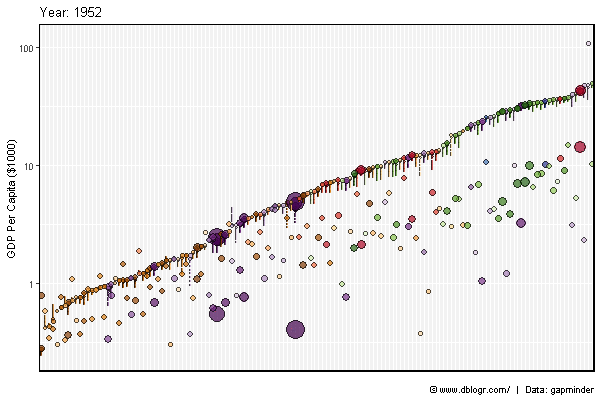

---

```{r}
xx <- gapminder %>% arrange(rev(year), lifeExp) %>% 
  mutate(country = factor(country, levels = unique(country)))
#
mp <- ggplot(xx, aes(x = country, y = lifeExp, size = pop, fill = country)) +
  geom_point(alpha = 0.7, show.legend = F, pch = 21, color ="black") +
  scale_fill_manual(values = country_colors) +
  scale_size(range = c(2, 12)) +
  scale_y_log10() +
  theme_agData(axis.text.x = element_blank(),
               axis.ticks.x = element_blank()) +
  # Here comes the gganimate specific bits
  labs(title = 'Year: {frame_time}', x = NULL, y = 'Life Expectancy',
       caption = "\xa9 www.dblogr.com/  |  Data: gapminder") +
  transition_time(year) +
  shadow_wake(wake_length = 0.1, alpha = F)
anim_save("gapminder_gifs_03.gif", mp, width = 600, height = 400)
```

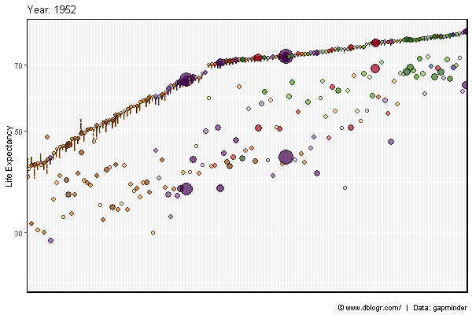

---

```{r}
gg_gapminder1 <- function(x) {
  ggplot(x, aes(x = gdpPercap / 1000, y = lifeExp, size = pop, fill = country)) +
    geom_point(alpha = 0.7, pch = 21, color = "black") +
    geom_text(aes(label = country), alpha = 0.7, alpha = 0.3) +
    scale_fill_manual(values = country_colors) +
    scale_size(range = c(2, 12)) +
    scale_x_log10() +
    theme_agData(legend.position = "none") +
    labs(title = "Year: {frame_time}", y = "Life Expectancy", x = "GDP Per Capita ($1000)",
         caption = "\xa9 www.dblogr.com/  |  Data: gapminder") +
    transition_time(year) +
    shadow_wake(wake_length = 0.1, alpha = F)
}
```

---

```{r}
mp <- gg_gapminder1(gapminder)
anim_save("gapminder_gifs_04.gif", mp, width = 600, height = 400)
```

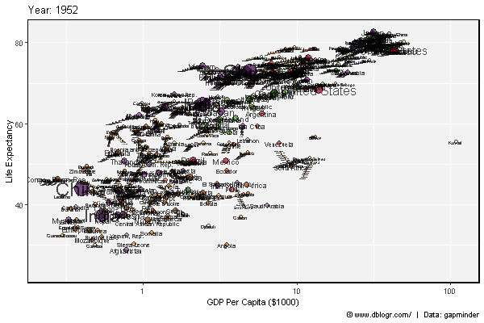

---

# Regions

```{r}
mp <- gg_gapminder1(gapminder %>% filter(continent == "Africa"))
anim_save("gapminder_gifs_05.gif", mp, width = 600, height = 400)
```

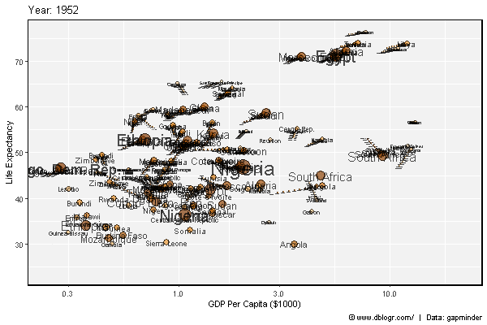

---

```{r}
mp <- gg_gapminder1(gapminder %>% filter(continent == "Americas"))
anim_save("gapminder_gifs_06.gif", mp)
```

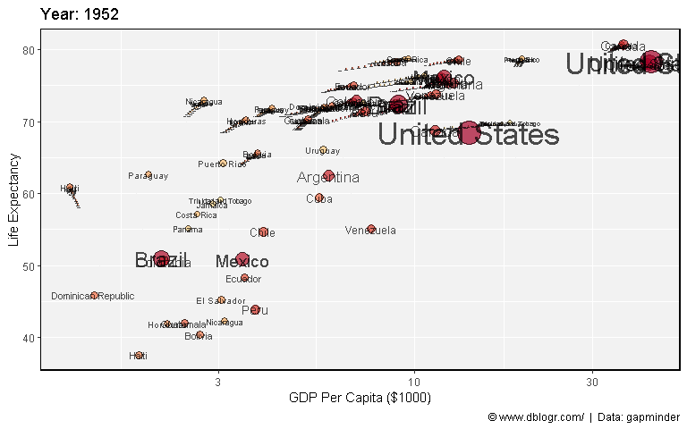

---

```{r}
mp <- gg_gapminder1(gapminder %>% filter(continent == "Asia"))
anim_save("gapminder_gifs_07.gif", mp, width = 600, height = 400)
```

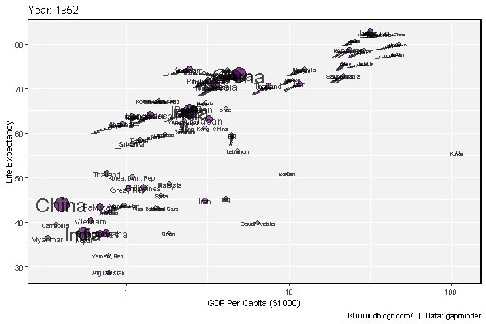

---

```{r}
mp <- gg_gapminder1(gapminder %>% filter(continent == "Europe"))
anim_save("gapminder_gifs_08.gif", mp, width = 600, height = 400)
```

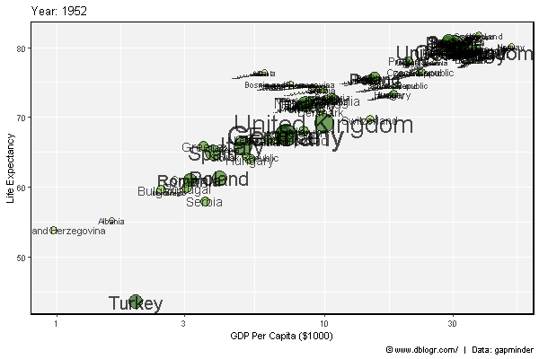

---

# Countries

```{r}
gg_gapminder2 <- function(mycountries) {
  x <- gapminder %>% filter(country %in% mycountries)
  ggplot(x, aes(x = gdpPercap / 1000, y = lifeExp, fill = country)) +
    geom_point(size = 3, pch = 21, color = "black") +
    geom_line(alpha = 0.7) +
    scale_colour_manual(values = country_colors) +
    scale_x_log10() +
    theme_agData(legend.position = "bottom") +
    labs(title = "Year: {frame_along}", y = "Life Expectancy", x = "GDP Per Capita ($1000)",
         caption = "\xa9 www.dblogr.com/  |  Data: gapminder") +
    transition_reveal(year) +
    shadow_wake(wake_length = 0.1, alpha = F)
}
```

---

```{r}
mp <- gg_gapminder2("Canada")
anim_save("gapminder_gifs_09.gif", mp, width = 600, height = 400)
```

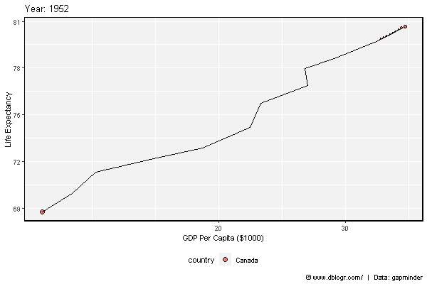

---

```{r}
mp <- gg_gapminder2("China")
anim_save("gapminder_gifs_10.gif", mp, width = 600, height = 400)
```

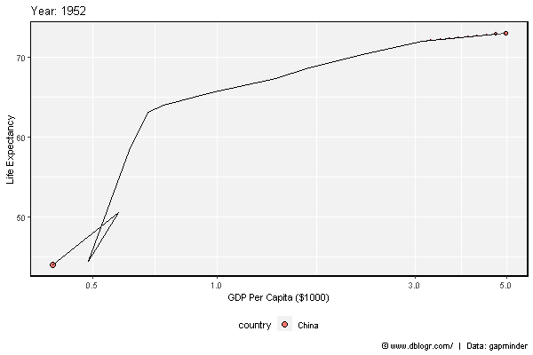

---

```{r}
mp <- gg_gapminder2(c("Rwanda", "South Africa", "Nigeria"))
anim_save("gapminder_gifs_11.gif", mp, width = 600, height = 400)
```

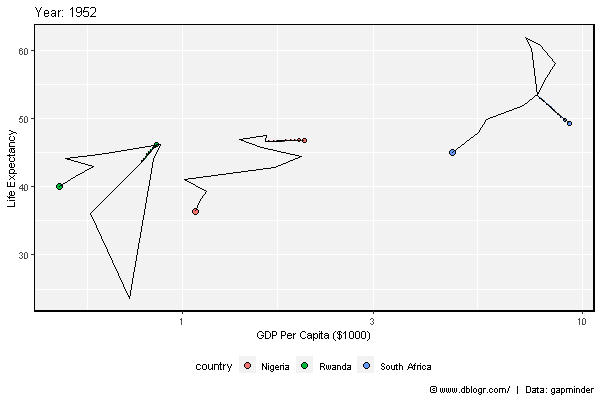

---

&copy; Derek Michael Wright [www.dblogr.com/](https://dblogr.com/)