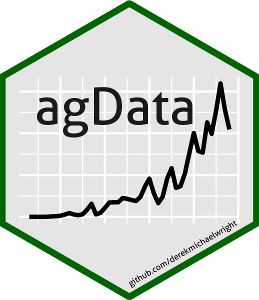
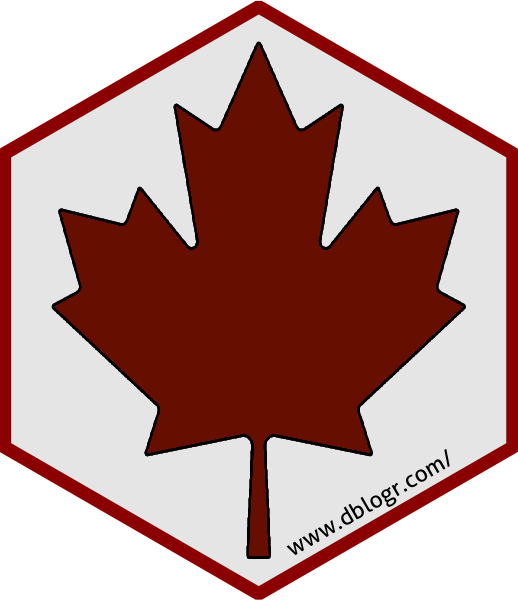
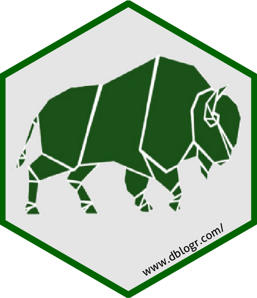
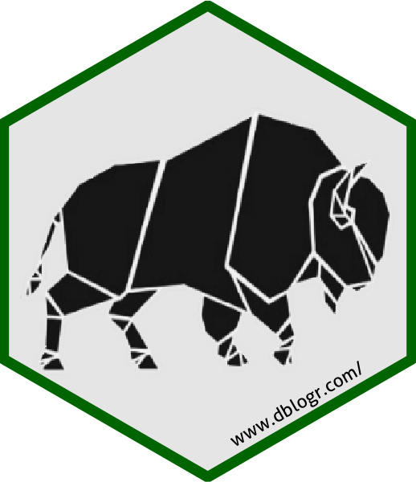

```{r setup, include = FALSE}
knitr::opts_chunk$set(echo = T, message = F, warning = F, fig.align="center")
```

---

```{r}
# devtools::install_github("derekmichaelwright/agData")
library(agData) # Loads: tidyverse, ggpubr, ggbeeswarm, ggrepel
library(hexSticker)
```

---

# dblogr

```{r}
sticker(filename="hex_dblogr.png", package="",  
        # Logo
        "logo_mapleleaf_dblogr.png", 
        s_x = 1, s_y = 1, 
        s_width = 0.8,
        # Border
        h_fill = "grey90", h_color = "darkgreen", h_size = 1.5,
        # Url
        url = "www.dblogr.com/", u_color = "black",
        u_x = 1.1, u_y = 0.15, u_size = 6 )
```


---

# agData

```{r}
# Prep data
xx <- agData_FAO_Crops %>% 
  filter(Area        == "Canada", 
         Crop        == "Lentils", 
         Measurement == "Production")
# Create sticker
mp <- ggplot(xx, aes(x = Year, y = Value) ) + 
  geom_line(size = 1) + 
  theme_void() +
  theme(panel.grid.major = element_line(size = 0.5,  colour = "white"), 
        panel.grid.minor = element_line(size = 0.25, colour = "white") ) 
#
sticker(filename = "hex_agData.png",
        package = "agData", p_color = "grey10",
        p_x = 0.9, p_y = 1.3, p_size = 27,
        # Logo
        mp, s_x = 1, s_y = 1, 
        s_width = 1.5, s_height = 1,
        # Border 
        h_fill = "grey90", h_color = "darkgreen", h_size = 1.5,#"darkolivegreen"
        # Url
        url = "github.com/derekmichaelwright", u_color = "black",
        u_x = 1, u_y = 0.09, u_size = 4.5 )
```



---

# Green mapleleaf

```{r}
sticker(filename="hex_mapleleaf_green.png", package="",  
        # Logo
        "logo_mapleleaf_green.png", #"logo_dblog.png", 
        s_x = 1, s_y = 1, 
        s_width = 0.8,
        # Border
        h_fill = "grey90", h_color = "darkgreen", h_size = 1.5,
        # Url
        url = "www.dblogr.com/", u_color = "black",
        u_x = 1.1, u_y = 0.15, u_size = 6 )
```


---

# Red mapleleaf

```{r}
sticker(filename="hex_mapleleaf_red.png", package="",  
        # Logo
        "logo_mapleleaf_red.png", #"logo_dblog.png", 
        s_x = 1, s_y = 1, 
        s_width = 0.8,
        # Border
        h_fill = "grey90", h_color = "darkred", h_size = 1.5,
        # Url
        url = "www.dblogr.com/", u_color = "black",
        u_x = 1.1, u_y = 0.15, u_size = 6 )
```



---

# buffalo

```{r}
sticker(filename="hex_buffalo_green.png", package="",  
        # Logo
        "logo_buffalo_green.png", 
        s_x = 1, s_y = 1.1, 
        s_width = 0.9,
        # Border
        h_fill = "grey90", h_color = "darkgreen", h_size = 1.5,
        # Url
        url = "www.dblogr.com/", u_color = "black",
        u_x = 1.1, u_y = 0.15, u_size = 6 )
```



```{r}
sticker(filename="hex_buffalo_black.png", package="",  
        # Logo
        "logo_buffalo_black.png", 
        s_x = 1, s_y = 1.1, 
        s_width = 0.9,
        # Border
        h_fill = "grey90", h_color = "darkgreen", h_size = 1.5,
        # Url
        url = "www.dblogr.com/", u_color = "black",
        u_x = 1.1, u_y = 0.15, u_size = 6 )
```



---

```{r echo = F, eval = F}
# Copy to gallery
#file.copy(from = "hex_dblogr.png", 
#          to = "C:/gitfolder/dblogr/content/dblogr/hex_stickers/gallery/hex_dblogr.png", overwrite = T)
#file.copy(from = "hex_agData.png", 
#          to = "C:/gitfolder/dblogr/content/dblogr/hex_stickers/gallery/hex_agData.png", overwrite = T)
#file.copy(from = "hex_mapleleaf_green.png", 
#          to = "C:/gitfolder/dblogr/content/dblogr/hex_stickers/gallery/hex_mapleleaf_green.png", overwrite = T)
#file.copy(from = "hex_mapleleaf_red.png", 
#          to = "C:/gitfolder/dblogr/content/dblogr/hex_stickers/gallery/hex_mapleleaf_red.png", overwrite = T)
# Copy for feature.png
file.copy(from = "hex_dblogr.png", to = "featured.png", overwrite = T)
file.copy(from = "hex_dblogr.png", to = "C:/gitfolder/dblogr/assets/images/hex_dblogr.png", overwrite = T)
# Copy for agData package
file.copy(from = "hex_agData.png", 
          to = "C:/gitfolder/agData/hex_agData.png", overwrite = T)
file.copy(from = "hex_agData.png", 
          to = "C:/gitfolder/agData/docs/hex_agData.png", overwrite = T)
# Copy to other posts
#file.copy(from = "hex_agData.png", 
#          to = "C:/gitfolder/htmls/scripts/agdata/introduction_to_agdata/hex_agData.png", overwrite = T)
file.copy(from = "hex_agData.png", 
          to = "C:/gitfolder/dblogr/content/agdata/introduction_to_agdata/featured.png", overwrite = T)
#
#file.copy(from = "hex_dblogr.png", to = "C:/gitfolder/dblogr/hex_dblogr.png", overwrite = T)
#file.copy(from = "hex_dblogr.png", to = "C:/gitfolder/dblogr/docs/hex_dblogr.png", overwrite = T)
#file.copy(from = "hex_dblogr.png", to = "C:/gitfolder/personalblog/static/img/logo.png", overwrite = T)
#file.copy(from = "hex_dblogr.png", to = "C:/gitfolder/personalblog/content/resume/hex_dblogr.png", overwrite = T)
#
#file.copy(from = "hex_agData.png", to = "C:/gitfolder/personalblog/content/resume/hex_agData.png", overwrite = T)
#
#file.copy(from = "hex_dblogr.png", to = "C:/gitfolder/dblogr/content/dblogr/Hex_Wall/hex_files/dblogr.png", overwrite = T)
#file.copy(from = "hex_agData.png", to = "C:/gitfolder/dblogr/content/dblogr/Hex_Wall/hex_files/agData.png", overwrite = T)
#
library(magick)
im1 <- image_read("hex_dblogr.png")
im2 <- image_read("hex_agData.png")
im3 <- image_read("Logo_dblogr.png") %>% 
  image_resize("x600")
#
#im <- im1 %>% image_resize("32x32")
#image_write(im, "C:/gitfolder/dblogr/static/img/icon-32.png")
#im <- im1 %>% image_resize("192x192")
#image_write(im, "C:/gitfolder/dblogr/static/img/icon-192.png")
im <- im1 %>% image_resize("512x512")
image_write(im, "C:/gitfolder/dblogr/assets/images/icon.png")
#
#im <- image_append(c(im1,im2))
#image_write(im, "hex_ALL.png")
#im <- image_append(c(im1,im2))
#image_write(im, "C:/gitfolder/personalblog/content/resume/hex_stickers.png")
#magick::image_write(im,  "C:/gitfolder/personalblog/static/img/logo.png")
#
im <- image_append(c(im1,im3,im2))
#image_write(im, "C:/gitfolder/dblogr/assets/images/logo.png")
image_write(im, "C:/gitfolder/dblogr/static/media/logo_banner.png")
image_write(im, "C:/gitfolder/htmls/css/logo_dblogr.png")
#image_write(im, "C:/gitfolder/dblogr/static/img/logo.png")
```

---

&copy; Derek Michael Wright [www.dblogr.com/](https://dblogr.com/)