```{r setup, include = FALSE}
knitr::opts_chunk$set(echo = T, message = F, warning = F)
```

---

```{r}
library(agData)
library(memer)
library(magick)
```

# Pyramid Pie Chart

```{r}
png("memes_01.png")
par(mar = c(0, 0, 2, 0))
pie(
  x      = c(280, 60, 20),
  col    = c('#0292D8', '#F7EA39', '#C4B632'),
  labels = c('No', 'Nope', 'Nein'),
  main = "Are GE Crops Hazardous To Your Health?",
  init.angle = -50, border = NA
)
invisible(dev.off())
```

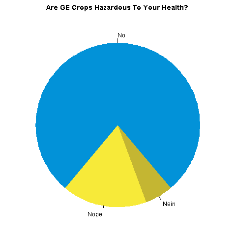

---

# Outlier Meme

```{r}
# Prep Data
d1 <- data.frame(
  x = c(jitter(1:100, 10), 45),
  y = c(jitter(1:100, 10), 88),
  z = factor(c(rep("General Trend", 100), "Outlier"), 
             levels = c("Outlier", "General Trend")))
d2 <- d1 %>% 
  mutate(z = plyr::mapvalues(z, 
    c("Outlier",                "General Trend"), 
    c("100% irrefutable proof", "Paid studies with an agenda")))
# Plot Function
outlierPlot <- function(d) {
  ggplot(d, aes(x = x, y = y^3, color = z)) + geom_point() +
    scale_x_continuous(breaks = seq(0, 100, by = 20)) +
    scale_color_manual(name = NULL, values = c("Red", "Black")) +
    theme_agData(legend.position = "top", 
                 axis.text.x = element_blank(),
                 axis.text.y = element_blank(),
                 axis.ticks = element_blank(),
                 axis.title.x = element_blank(),
                 axis.title.y = element_blank())
}
# Plot
mp <- ggarrange(outlierPlot(d1), outlierPlot(d2), ncol = 2, nrow = 1) 
ggsave("memes_02.png", mp, width = 8, height = 4)
```

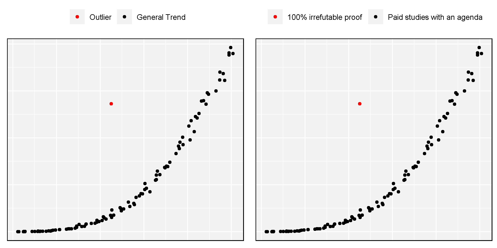

---

# Environmentalists

```{r}
mm <- meme_get("DistractedBf") %>% 
  meme_text_distbf("      virtue\n  signalling", 
                   "environmentalists", 
                   "protecting the\nenvironemnt",
                   size = 30)
image_write(mm, "memes_03.png")
```

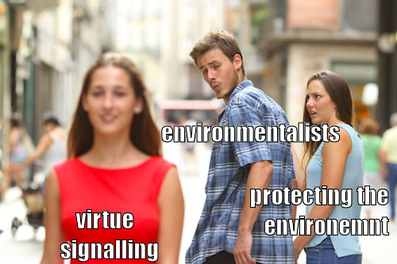

---

# Ancient Aliens

```{r}
mm <- meme_get("AncientAliens") %>%
  meme_text_bottom("GMOs", size = 80)
image_write(mm, "memes_04.png")
```

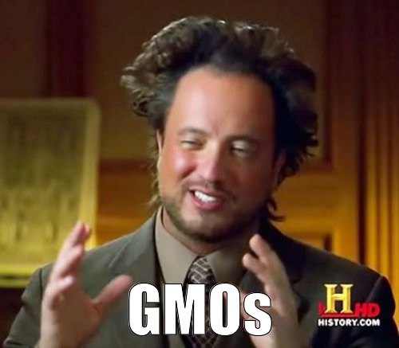

---

# ggplot2

```{r}
mm <- meme_get("PicardFacePalm") %>%
  meme_text_top("When you see the ugly") %>%
  meme_text_bottom("ggplot2 default colors")
image_write(mm, "memes_05.png")
```

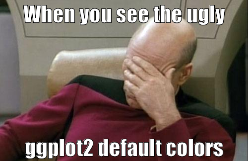

---

# NonGMO Project

```{r}
mm <- meme_get("ThinkAboutIt") %>%
  meme_text_top("Not deceptive marketing", size = 35) %>%
  meme_text_bottom("If you bribe the Non-GMO project", size = 35)
image_write(mm, "memes_06.png")
```

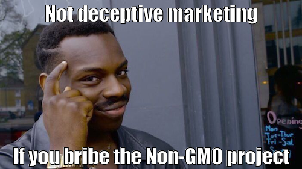

---

# Darwin

```{r}
mm <- image_read("input/darwin.jpg") %>%
  meme_text_top("First person to document heterosis") %>%
  meme_text_bottom("Married his cousin")
image_write(mm, "memes_07.png")
```


---

# Montoya Meme

```{r}
mm <- image_read("input/montoya_meme.jpg") %>%
  meme_text_top("Science") %>%
  meme_text_bottom("I dont think you\nknow what it means")
image_write(mm, "memes_08.png")
```


---

# Sunset Meme

```{r}
mm <- image_read("input/sunset.jpg") %>%
  meme_text_top("if god doesn't exist,") %>%
  meme_text_bottom("who the fuck painted this?")
image_write(mm, "memes_09.png")
```


---

# Vavilov Memes

```{r}
mm <- image_read("input/vavilov2.jpg") %>%
  meme_text_top("Established the world's largest seedbank\nto help combat global food insecurity") %>%
  meme_text_bottom("Died of starvation in a Siberian gulag")
image_write(mm, "memes_10.png")
```

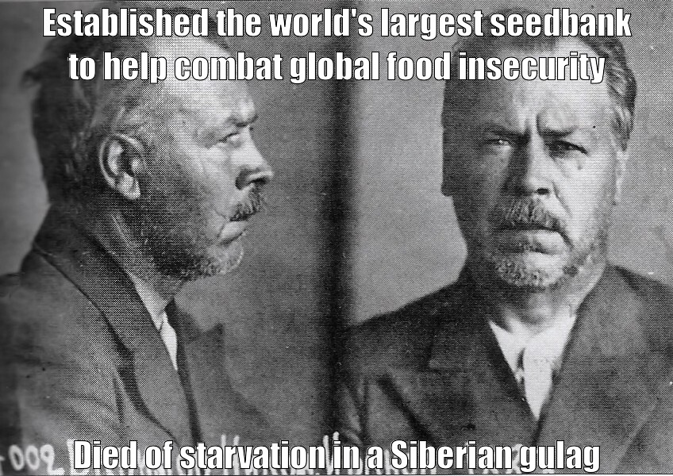

---

```{r}
m1 <- image_read("input/vavilov1.jpg") %>%
  meme_text_top("Vavilov") %>%
  meme_text_bottom("Willing to die for his\nscientific beleifs")
m2 <- image_read("input/lysenko1.jpg") %>%
  meme_text_top("Lysenko") %>%
  meme_text_bottom("Willing to murder for his\nscientific beleifs")
image_write(m1, "input/memes_11_1.png") 
image_write(m2, "input/memes_11_2.png") 
mm <- image_append(c(
  image_read("input/memes_11_1.png"),
  image_read("input/memes_11_2.png")) )
image_write(mm, "memes_11.png")
```


# Borlaug Memes

```{r}
mm <- image_read("input/borlaug.jpg") %>%
  meme_text_top("  \n\n\n\n\n\nBelieve in science\nEven if it means feeding everyone") %>%
  meme_text_bottom("just cross it")
image_write(mm, "memes_12.png")
```

```{r echo = F}
image_write(mm, "featured.png")
```

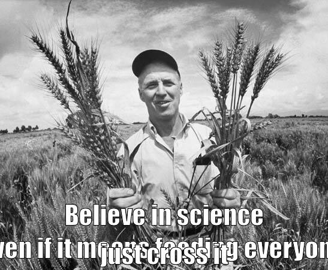

---

```{r}
m1 <- image_read("input/malthus.jpg") %>%
  meme_text_top("Malthus") %>%
  meme_text_bottom("Worried population growth\nwould limit progress\ntowards utopia")
m2 <- image_read("input/borlaug_cropped.png") %>%
  meme_text_top("Borlaug") %>%
  meme_text_bottom("Worried about people\nstarving to death")
image_write(m1, "input/memes_13_1.png")
image_write(m2, "input/memes_13_2.png")
mm <- image_append(c(
  image_read("input/memes_13_1.png"),
  image_read("input/memes_13_2.png")) )
image_write(mm, "memes_13.png")
```

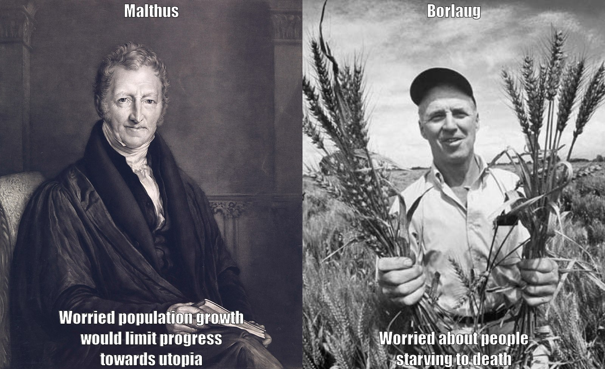

---

```{r}
mm <- image_read("input/borlaug2.png") %>%
  meme_text_top("paperwork!!!") %>%
  meme_text_bottom("bureaucracy!!!")
image_write(mm, "memes_14.png")
```

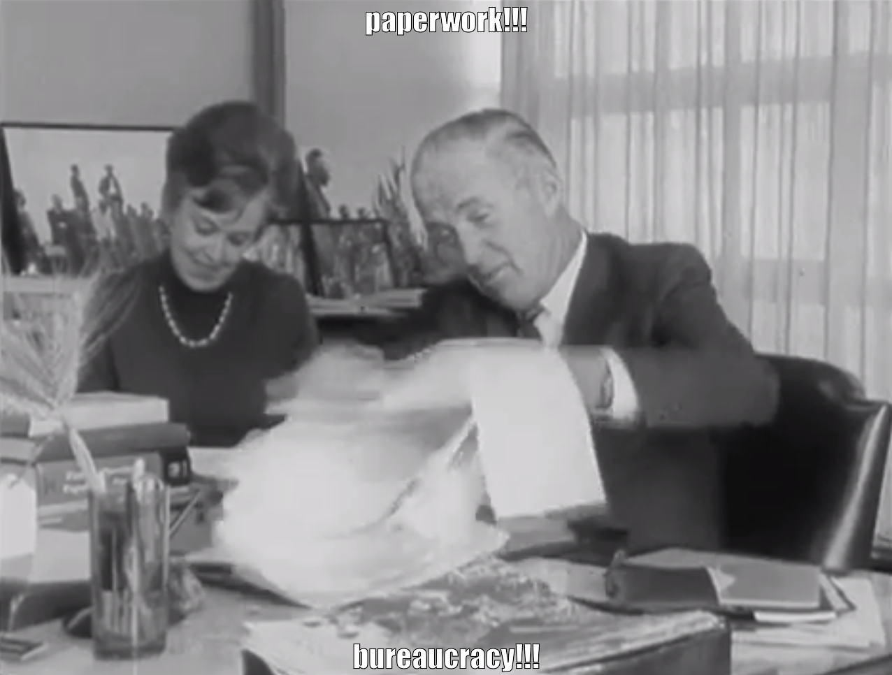

---

# Red Army Activists

```{r}
mm <- image_append(c(
  image_scale(image_read("input/redarmy1.jpg"), "x600"),
  image_read("input/redarmy2.jpg")))
image_write(mm, "input/redarmy.jpg")
mm <- image_read("input/redarmy.jpg") %>%
  meme_text_top("when the activists find out") %>%
  meme_text_bottom("you've been growing GMOs")
image_write(mm, "memes_15.png")
```

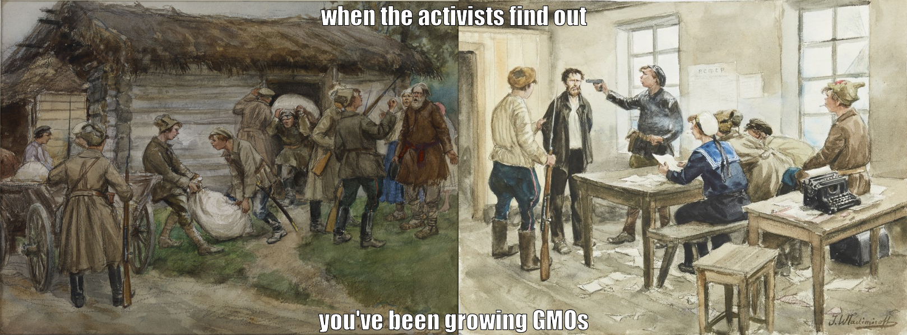

---

```{r eval = F, echo = F}
# Amorphophallus titanum
im1 <- image_read("A_titanum.jpg")
im2 <- image_read("trollface.jpg") %>% 
  image_scale("x1143") %>%
  image_crop("1000x1143+250")
im <- image_append(c(im1,im2))
image_write(im, "Amorph.png")
#
mm <- meme("Amorph.png",
  upper = "largest unbranched inflorescence\nin the world",
  lower = "let's name it amorphophalus titanum", 
  size = 1.75, 
  vjust = 0.02,
  r = 0.5)
image_write(mm, "gallery/meme_amorph.png", width = 7)
```

```{r eval = F, echo = F}
library(magick)
m1 <- image_read("borlaug.jpg") %>% 
  image_scale("x977") %>% image_crop("800x977+194")
image_write(m1, "borlaug_cropped.png")
detach("package:magick", unload = T)
```

&copy; Derek Michael Wright [www.dblogr.com/](https://dblogr.com/)