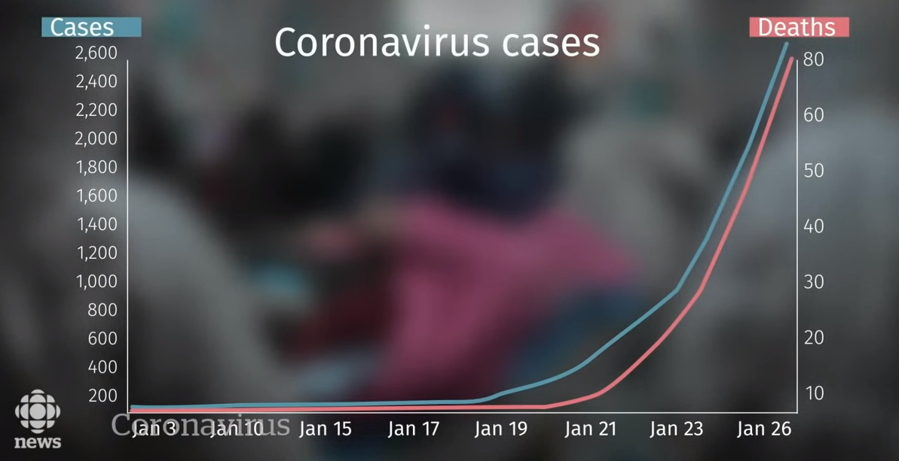

+++
widget = "blank"  # See https://sourcethemes.com/academic/docs/page-builder/
headless = false  # This file represents a page section.
active = false  # Activate this widget? true/false
weight = 2  # Order that this section will appear.

title = "Misleading Graphs"
subtitle = "A guide illustrating how to mislead with graphs"
summary  = "A guide illustrating how to mislead with graphs"
tags = [ "dblogr", "SciComm", "Featured" ]
toc = true

[image]
  preview_only = true
  
[design]
  columns = "1"
+++

{}
**< R Script >**: [misleading_graphs.html](https://derekmichaelwright.github.io/htmls/dblogr/misleading_graphs.html)
{}

---

# Introduction

Using statistics to mislead can be a trivial thing. This vignette will go through some examples of how to one can mislead people with improper graphs. Examples include:

1. Truncating the y-axis
2. Using dual y-axes
3. Cherry picking data

---

# Truncating The y-axis

Truncating the y-axis is the most commonly used example for misleading graphs. It is a simple way to create the appearance of a larger difference between groups than what reality would suggest.

---

# Dual y-axis

In some cases, a graph with two y-axes is desired for visualizing two different sets of data. However, this is sometimes frowned upon since the required scaling of the data can be adjusted to fit the desired narative. *e.g.*, 

To illustrate this, here is a real life example of a graph created by the CBC during the reporting of the Coronoa virus in 2020... while they emphazised that **we should not panic**.

If you miss the second y-axis on the right, it would appear that there is **A LOT** more deaths than in reality. In this example, the two data sets are at least related to eachother. However, if they arent, dual y-axes can also lead to spurious correlations

Now lets make our own by correlating autism rates with the rise of organic agriculture in Canada.

---

# 3. Cherry Picking Data

In 1994 the first GM maize variety was released in the USA. If we only focus on yield data from 1995-2010, it looks as if the introduction of GE crop varieties greatly increased maize yields. However, when we take a step back and look at all the data, we can see that not only have we avoided the poor yields of 2012, but there also has been a trend of yearly increasing yields from long before the introduction of GE varieties. From this perspective, it would be more appropriate to attribute these yield gains to conventional breeding along with changes in production practices.

---
