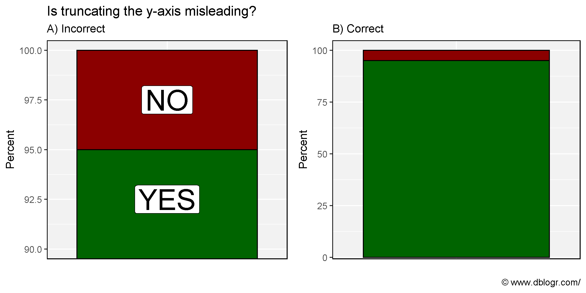
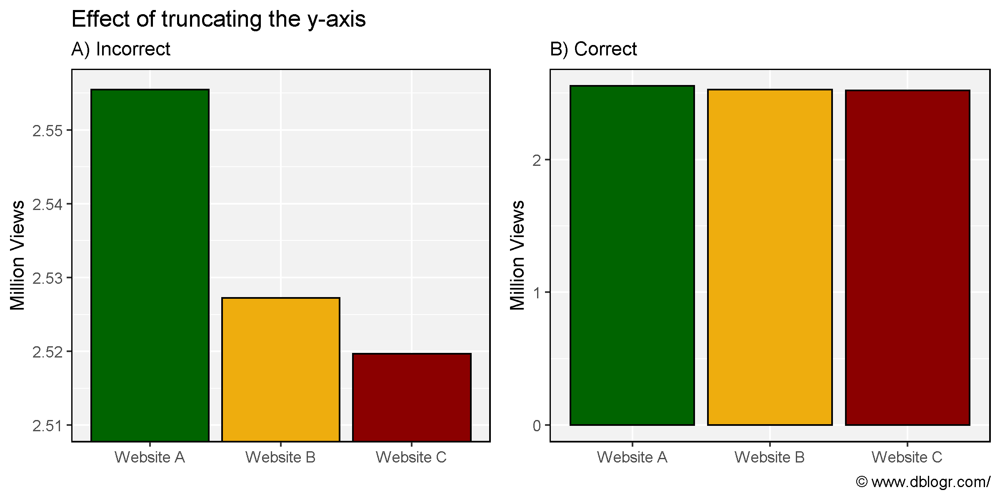
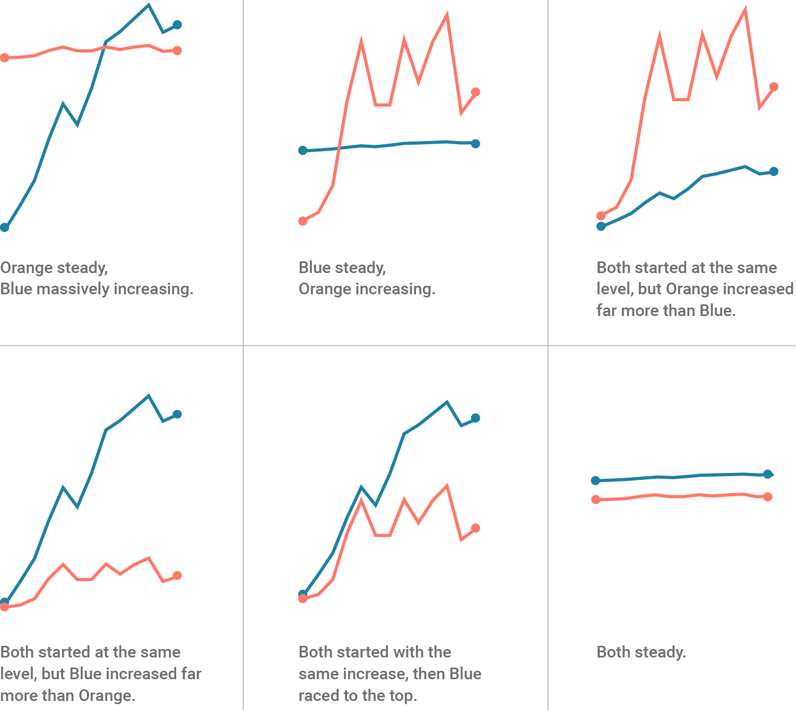
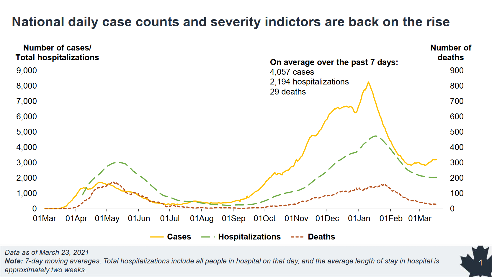
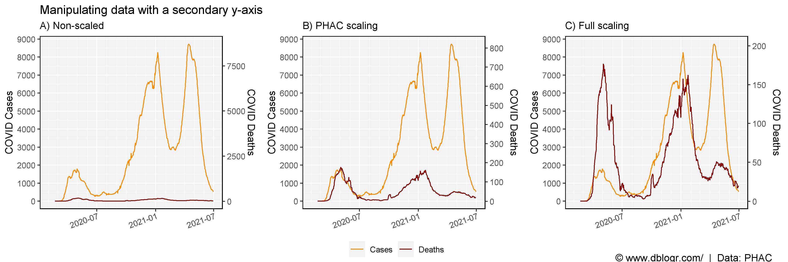
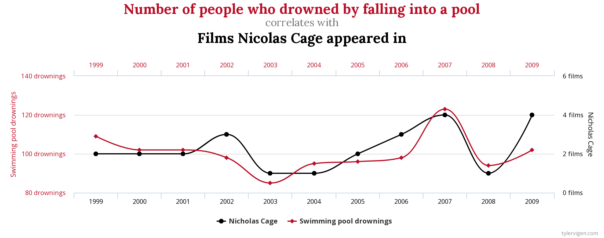
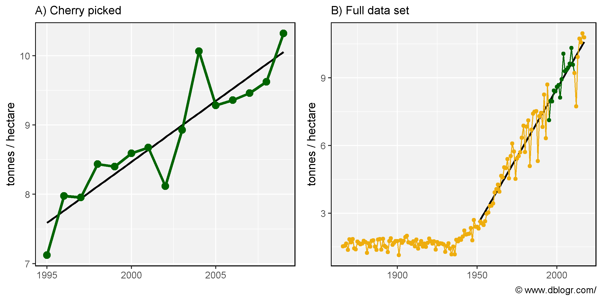
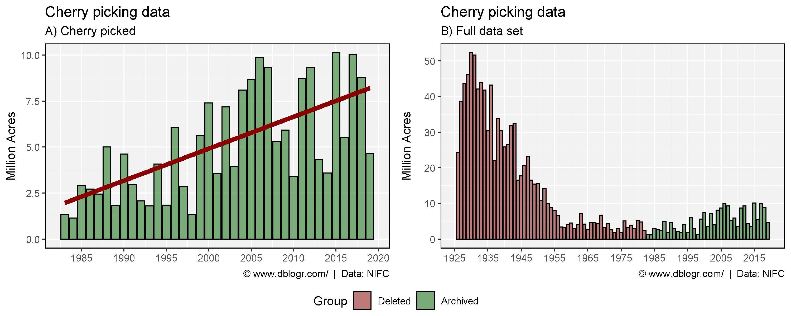
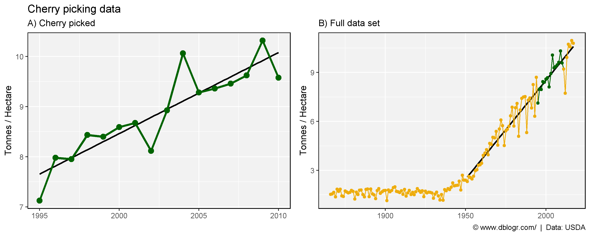

```{r setup, include=FALSE}
knitr::opts_chunk$set(echo = T, message = F, warning = F)
```

---

# Introduction

Using statistics to mislead can be a trivial thing. This vignette will go through some examples of how to one can mislead people with improper graphs.

1. [Truncating The y-axis](#1._truncating_the_y-axis)
2. [Dual y-axes](#2._dual_y-axis)
3. [Spurious Correlations](#3._spurious_correlations)
4. [Cherry Picking Data](#4._cherry_picking_data)

```{r}
# devtools::install_github("derekmichaelwright/agData")
library(agData) # Loads: tidyverse, ggpubr, ggbeeswarm, ggrepel
library(ggpmisc) # stat_poly_eq()
```

---

# 1. Truncating The y-axis

Truncating the y-axis is the most commonly used example for misleading graphs. It is a simple way to create the appearance of a larger difference between groups than what reality would suggest.

```{r}
# Prep data
xx <- data.frame(Answer   = c("NO", "YES"),
                 Percent  = c(5,    95),
                 Position = c(97.5, 92.5))
# Plot
mp1 <- ggplot(xx, aes(x = "")) + 
  geom_bar(aes(y = Percent, fill = Answer), stat = "identity", color = "black") +
  scale_fill_manual(values = c("darkred","darkgreen")) +
  coord_cartesian(ylim = c(4, 100)) +
  theme_agData(legend.position = "none",
               axis.ticks.x = element_blank()) +
  labs(subtitle = "B) Correct", x = NULL,
       caption = "\xa9 www.dblogr.com/")
mp2 <- mp1 + 
  geom_label(aes(y = Position, label = Answer), size = 10) + 
  coord_cartesian(ylim = c(90, 100)) +
  labs(title = "Is truncating the y-axis misleading?", 
       subtitle = "A) Incorrect", x = NULL, caption = NULL)
mp <- ggarrange(mp2, mp1, ncol = 2, align = "h")
ggsave("misleading_graphs_01.png", mp, width = 8, height = 4)
```

```{r echo = F} 
ggsave("featured.png", mp, width = 8, height = 4)
```



```{r}
# Prep data
xx <- data.frame(Company = c("Website A", "Website B", "Website C"),
                 Views   = c( 2555486,     2527246,     2519643))
# Plot
mp1 <- ggplot(xx, aes(x = Company, y = Views / 1000000, fill = Company)) + 
  geom_bar(stat = "identity", color = "black") +
  scale_fill_manual(values = agData_Colors) +
  theme_agData(legend.position = "none") +
  labs(subtitle = "B) Correct", y = "Million Views", x = NULL,
       caption = "\xa9 www.dblogr.com/")
mp2 <- mp1 + 
  coord_cartesian(ylim = c(2510000, 2556000) / 1000000) +
  labs(title = "Effect of truncating the y-axis",
       subtitle = "A) Incorrect", y = "Million Views", x = NULL,
       caption = NULL)
mp <- ggarrange(mp2, mp1, ncol = 2, align = "h")
ggsave("misleading_graphs_02.png", mp, width = 8, height = 4)
```



---

# 2. Dual y-axis

In some cases, a graph with two y-axes is desired for visualizing two different sets of data. However, this is sometimes frowned upon since the required scaling of the data can be adjusted to fit the desired narrative. e.g.,



To illustrate this, here is a real life example of a graph created by the CBC during the reporting of the Coronoa virus in 2020… while they emphasized that **we should not panic**.


If you miss the second y-axis on the right, it would appear that there is A LOT more deaths than in reality. In a similar example of covid cases/deaths from the Canadian government, the scaling of the secondary y-axis for deaths allows for the manipulation of the red dashed line. *e.g.*, imagine the graph if scaled from *0-200* instead of *0-900* OR *0-9000* like the primary y-axis.



We will reproduce this graph with different scales to illustrate this.

Canada's Covid data: https://health-infobase.canada.ca/covid-19/dashboard/about.html

```{r}
# Prep data
xx <- read.csv("https://health-infobase.canada.ca/src/data/covidLive/covid19-download.csv") %>%
  rename(area=prname) %>%
  filter(area == "Canada") %>%
  mutate(date = as.POSIXct(date, format = "%Y-%m-%d"))
y1_min <- min(xx$numtoday)
y1_max <- max(xx$numtoday)
y2_min <- min(xx$numdeathstoday)
y2_max <- max(xx$numdeathstoday)
xx <- xx %>%
  mutate(deaths_scaled1 = (numdeathstoday - 0) * (y1_max - y1_min) / (900 - 0) + y1_min,
         deaths_scaled2 = (numdeathstoday - y2_min) * (y1_max - y1_min) / (y2_max - y2_min) + y1_min,
         numtoday = zoo::rollmean(numtoday, 7, na.pad = T),
         numdeathstoday = zoo::rollmean(numdeathstoday, 7, na.pad = T),
         deaths_scaled1 = zoo::rollmean(deaths_scaled1, 7, na.pad = T),
         deaths_scaled2 = zoo::rollmean(deaths_scaled2, 7, na.pad = T))
# Plot
mp1 <- ggplot(xx, aes(x = date)) +
  geom_line(aes(y = numtoday, color = "1")) +
  geom_line(aes(y = numdeathstoday, color = "2")) +
  scale_color_manual(name = NULL, values = c("darkorange","darkred"), labels = c("Cases","Deaths")) +
  scale_x_datetime(date_minor_breaks = "1 month") +
  scale_y_continuous(breaks = seq(0, 9000, 1000), sec.axis = sec_axis(~ ., name = "COVID Deaths")) +
  theme_agData(axis.text.x = element_text(angle = 20, hjust = 1, vjust = 1.1)) +
  labs(title = "Manipulating data with a secondary y-axis",
       subtitle = "A) Non-scaled", y = "COVID Cases", x = NULL)
mp2 <- ggplot(xx, aes(x = date)) +
  geom_line(aes(y = numtoday, color = "1")) +
  geom_line(aes(y = deaths_scaled1, color = "2")) +
  scale_color_manual(name = NULL, values = c("darkorange", "darkred"), labels = c("Cases", "Deaths")) +
  scale_x_datetime(date_minor_breaks = "1 month") +
  scale_y_continuous(breaks = seq(0, 9000, 1000),
                     sec.axis = sec_axis(~ (. - y1_min) * (900 - 0) / (y1_max - y1_min) + 0,
                                         name = "COVID Deaths", breaks = seq(0, 900, 100))) +
  theme_agData(axis.text.x = element_text(angle = 20, hjust = 1, vjust = 1.1)) +
  labs(subtitle = "B) PHAC scaling", y = "COVID Cases", x = NULL)
mp3 <- ggplot(xx, aes(x = date)) +
  geom_line(aes(y = numtoday, color = "1")) +
  geom_line(aes(y = deaths_scaled2, color = "2")) +
  scale_color_manual(name = NULL, values = c("darkorange", "darkred"), labels = c("Cases", "Deaths")) +
  scale_x_datetime(date_minor_breaks = "1 month") +
  scale_y_continuous(breaks = seq(0, 9000, 1000),
                     sec.axis = sec_axis(~ (. - y1_min) * (y2_max - y2_min) / (y1_max - y1_min) + y2_min, 
                                         name = "COVID Deaths")) +
  theme_agData(axis.text.x = element_text(angle = 20, hjust = 1, vjust = 1.1)) +
  labs(subtitle = "C) Full scaling", y = "COVID Cases", x = NULL)
mp <- ggarrange(mp1, mp2, mp3, ncol = 3, align = "hv",
                common.legend = T, legend = "bottom") %>%
  annotate_figure(fig.lab = "\xa9 www.dblogr.com/  |  Data: PHAC",
                  fig.lab.pos = "bottom.right")
ggsave("misleading_graphs_03.png", mp, width = 12, height = 4)
```



In this example, the two data sets are at least related to each other. However, if they aren't, dual y-axes can also lead to spurious correlations.

---

# 3. Spurious Correlations

Spurious correlation occur when two variables appear to have a cause-and-effect relationship, when in reality, there may not be. *e.g.*, between Nicolas Cage films and the number of deaths by drowning.  



Now lets make our own by correlating autism rates with the rise of organic agriculture in Canada.

Data for Canadian autism rates can be found at https://www.canada.ca/en/public-health/services/publications/diseases-conditions/autism-spectrum-disorder-children-youth-canada-2018.html.

```{r}
# Prep data
x1 <- read.csv("quebec_autism_rates.csv")
x2 <- agData_FAO_LandUse %>% 
  filter(Item == "Agriculture area certified organic", Area == "Canada") %>%
  select(Year, Oranic_Area=Value)
xx <- left_join(x2, x1, by = "Year") %>% 
  filter(!is.na(Rate))
y1_min <- min(xx$Oranic_Area)
y1_max <- max(xx$Oranic_Area)
y2_min <- min(xx$Rate)
y2_max <- max(xx$Rate)
xx <- xx %>%
  mutate(AR_scaled = (Rate - y2_min) * (y1_max - y1_min) / (y2_max - y2_min) + y1_min)
# Plot
mp1 <- ggplot(xx, aes(x = Oranic_Area, y = Rate)) + 
  geom_point(size = 3) + 
  geom_smooth(method = "lm", se = F) +
  stat_poly_eq(formula = y ~ x, aes(label = ..rr.label..), rr.digits = 3, parse = T) +
  theme_agData() +
  labs(title = "Correlation does not equal causation", subtitle = "A)",
       x = "Canadian Agricultural Area Certified Organic (1000 Hectares)", 
       y = "Autism Rate in Quebec (Per 1000 People)")
mp2 <- ggplot(xx, aes(x = Year)) +
  geom_line(aes(y = Oranic_Area, color = "Area Certified Organic (Canada)"), size = 1.5, alpha = 0.5) + 
  geom_point(aes(y = Oranic_Area, color = "Area Certified Organic (Canada)"), size = 2) +
  geom_line(aes(y = AR_scaled, color = "Autism Rates (Quebec)"), size = 1.5, alpha = 0.5) + 
  geom_point(aes(y = AR_scaled, color = "Autism Rates (Quebec)"), size = 2) +
  scale_color_manual(name = NULL, values = c("darkgreen","darkred")) +
  scale_x_continuous(breaks = seq(2005,2015,2), minor_breaks = 2004:2015) +
  scale_y_continuous(name = "Thousand Hectares",  
                     sec.axis = sec_axis(~ (. - y1_min) * (y2_max - y2_min) / (y1_max - y1_min) + y2_min,
                     name = "Rate Per 1000 People")) +
  theme_agData(legend.position = c(0.30,0.85)) +
  labs(subtitle = "B)", x = NULL,
       caption = "\xa9 www.dblogr.com/  |  Data: STATCAN & FAOSTAT")
mp <- ggarrange(mp1, mp2, ncol = 2, align = "h")
ggsave("misleading_graphs_04.png", mp, width = 10, height = 4)
```



Although an *R^2* of 0.956 is an extremely high correlation coefficient, these two data sets are obviously, completely unrelated to each other.

---

# 4. Cherry Picking Data

The National Interagency Fire Center (NIFC) recently deleted some data from their database, which can be retrived using internet archives. Let's take a look at the data they deleted and speculate why they deleted it.

https://www.nifc.gov/fire-information/statistics/wildfires

https://web.archive.org/web/20210129125036/https://www.nifc.gov/fireInfo/fireInfo_stats_totalFires.html

```{r}
# Prep data
dd <- read.csv("fires_usa.csv") %>%
  mutate(Group = ifelse(Year < 1983, "Deleted", "Archived"),
         Group = factor(Group, levels = c("Deleted", "Archived")))
# Plot
mp1 <- ggplot(dd %>% filter(Year >= 1983), aes(x = Year, y = Acres / 1000000)) +
  geom_bar(stat = "identity", fill = "darkgreen", color = "black", alpha = 0.5) +
  geom_smooth(method = "lm", se = F, size = 2, color = "darkred") +
  scale_x_continuous(breaks = seq(1985, 2020, 5)) +
  theme_agData() +
  labs(title = "Cherry picking data", subtitle = "A) Cherry picked", 
       y = "Million Acres", x = NULL,
       caption = "\xa9 www.dblogr.com/  |  Data: NIFC")
mp2 <- ggplot(dd, aes(x = Year, y = Acres / 1000000, fill = Group)) + 
  geom_bar(stat = "identity", alpha = 0.5, color = "black") +
  scale_fill_manual(values = c("darkred", "darkgreen")) +
  scale_x_continuous(breaks = seq(1925, 2015, 10)) +
  theme_agData() +
  labs(title = "Cherry picking data", subtitle = "B) Full data set",
       y = "Million Acres", x = NULL,
       caption = "\xa9 www.dblogr.com/  |  Data: NIFC")
mp <- ggarrange(mp1, mp2, ncol = 2, align = "hv",
                common.legend = T, legend = "bottom")
ggsave("misleading_graphs_05.png", mp, width = 10, height = 4)
```



As one can see, without deleting most of the older data, the recent increases in wild fires seems irrelevant/inconsequential compared to the pre-1955 data.

---

In 1994 the first GM maize variety was released in the USA. If we only focus on yield data from 1995-2010, it looks as if the introduction of GE crop varieties greatly increased maize yields. However, when we take a step back and look at all the data, we can see that not only have we avoided the poor yields of 2012, but there also has been a trend of yearly increasing yields from long before the introduction of GE varieties. From this perspective, it would be more appropriate to attribute these yield gains to the more traditional breeding along with changes in production practices.

```{r}
# Prep data
xx <- agData_USDA_Crops %>%
  filter(Measurement == "Yield", Crop == "Maize") %>%
  mutate(CherryPicked = ifelse(Year > 1994 & Year < 2011, "Yes", "No"),
         CherryPicked = factor(CherryPicked, levels = c("Yes", "No")))
y1 <- xx %>% filter(Year > 1994, Year < 2011)
y2 <- xx %>% filter(Year > 1950)
# Plot
mp1 <- ggplot(y1, aes(x = Year, y = Value, color = CherryPicked)) +
  geom_smooth(method = "lm", se = F, color = "black") +
  geom_line(size = 1.25) + 
  geom_point(size = 3) +
  scale_color_manual(values = agData_Colors) +
  scale_x_continuous(breaks = seq(1995,2010,5)) +
  theme_agData(legend.position = "none") +
  labs(title = "Cherry picking data", subtitle = "A) Cherry picked", 
       y = "Tonnes / Hectare", x = NULL)
mp2 <- ggplot(xx, aes(x = Year, y = Value, color = CherryPicked)) + 
  geom_smooth(data = y2, method = "lm", se = F, color = "black") +
  geom_line(aes(group = 1)) + 
  geom_point() +
  scale_color_manual(values = agData_Colors) +
  theme_agData(legend.position = "none") +
  labs(subtitle = "B) Full data set", y = "Tonnes / Hectare", x = NULL,
       caption = "\xa9 www.dblogr.com/  |  Data: USDA")
mp <- ggarrange(mp1, mp2, ncol = 2, align = "h")
ggsave("misleading_graphs_06.png", mp, width = 10, height = 4)
```



---

&copy; Derek Michael Wright [www.dblogr.com/](https://dblogr.com/)