```{r setup, include=FALSE}
knitr::opts_chunk$set(echo = T, message = F, warning = F)
```

---

# Introduction

STATCAN data Tables: 17-10-0009-01 & 17-10-0005-01 & 17-10-0008-01

https://www150.statcan.gc.ca/t1/tbl1/en/tv.action?pid=1710000901

https://www150.statcan.gc.ca/t1/tbl1/en/tv.action?pid=1710000501

https://www150.statcan.gc.ca/t1/tbl1/en/cv.action?pid=1710000801

```{r}
# devtools::install_github("derekmichaelwright/agData")
library(agData) # Loads: tidyverse, ggpubr, ggbeeswarm, ggrepel
library(gganimate)
library(transformr)
```

---

# Population

```{r}
xx <- agData_STATCAN_Population %>% filter(Month == 1)
mp <- ggplot(xx, aes(x = Year, y = Value / 1000000, color = Area)) +
  geom_line() +
  facet_wrap(Area ~ ., ncol = 4, scales = "free_y") +
  theme_agData(legend.position = "none", rotx = T) +
  labs(y = "Million People", x = NULL,
       caption = "\xa9 www.dblogr.com/ | Data: STATCAN")
ggsave("PopDem_01.png", mp, width = 10, height = 6)
```

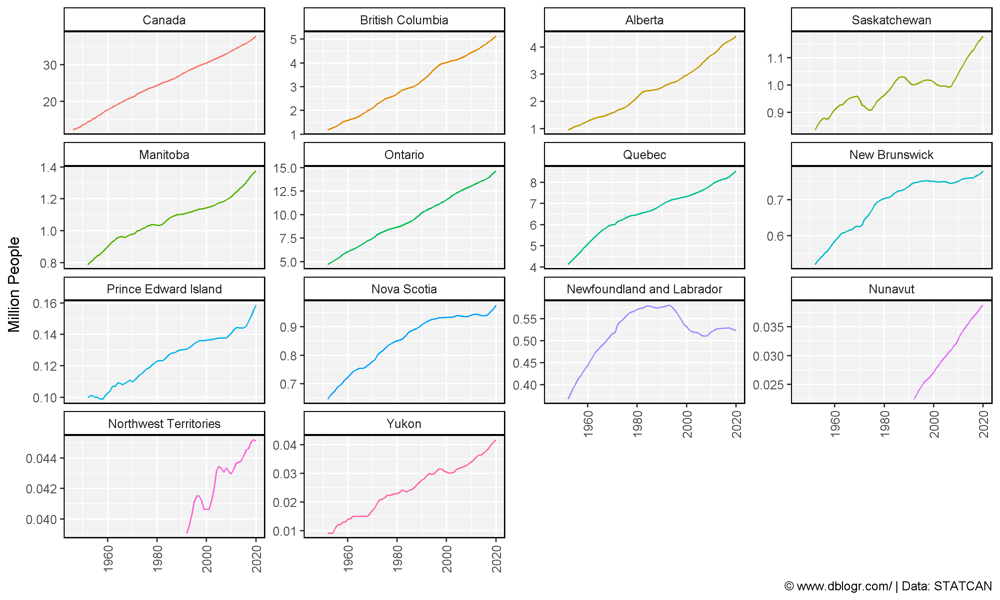

---

# Create Plotting Functions

```{r}
ages <- c("0 to 4 years", "5 to 9 years", "10 to 14 years", "15 to 19 years",
          "20 to 24 years", "25 to 29 years", "30 to 34 years", "35 to 39 years",
          "40 to 44 years", "45 to 49 years", "50 to 54 years", "55 to 59 years",
          "60 to 64 years", "65 to 69 years", "70 to 74 years", "75 to 79 years",
          "80 to 84 years", "85 to 89 years", "90 to 94 years", "95 to 99 years" ,
          "100 years and over")
gg_PopDem_plot <- function(areas = "Saskatchewan", years = 2019, anim = F) {
  # Prep data
  xx <- agData_STATCAN_Population_AgeGender %>%
    #select(1:25) %>% 
    #gather(Group, Value, 5:ncol(.)) %>% 
    filter(Area %in% areas, Year %in% years, Age %in% ages) %>%
    mutate(Age = factor(Age, levels = ages),
           Value = Value / 1000)
  # Plot
  mp <- ggplot(xx, aes(y = Value, x = Age, fill = Sex)) + 
    geom_bar(data = xx %>% filter(Sex == "Males"), stat = "identity") +
    geom_bar(data = xx %>% filter(Sex == "Females"), 
             stat = "identity", aes(y = -Value)) +
    scale_fill_manual(values = c("deeppink3","darkblue"))
  if(anim == T) { mp <- mp + facet_grid(. ~ Area) }
  if(anim == F) { mp <- mp + facet_grid(. ~ Year) + labs(subtitle = paste(areas, collapse = " + ")) }
  mp + 
    theme_agData(legend.position = "bottom", rotx = T) +
    labs(x = NULL, y = "Thousand People",
         caption = "\xa9 www.dblogr.com/ | Data: STATCAN") +
    coord_cartesian(ylim = c(-max(xx$Value), max(xx$Value))) +
    coord_flip()
}
gg_PopDem_anim <- function(areas = c("Saskatchewan", "Alberta")) {
  gg_PopDem_plot(areas = areas, years = 1971:2019, anim = T) +
    # Here comes the gganimate specific bits
    labs(title = '{round(frame_time)}') +
    transition_time(Year) +
    ease_aes('linear')
}
```

---

# Canada

```{r}
mp <- gg_PopDem_plot("Canada", years = c(1971, 2019))
ggsave("PopDem_02.png", mp, width = 6, height = 4)
```

```{r echo = F}
ggsave("featured.png", mp, width = 6, height = 4)
```


---

```{r}
mp <- gg_PopDem_anim("Canada")
anim_save("PopDem_gif_02.gif", mp, width = 600, height = 400)
```

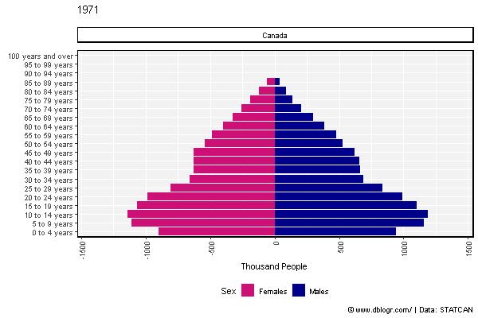

---

# Eastern Canada

```{r}
areas <- c("Ontario", "Quebec","New Brunswick", "Nova Scotia",
           "Prince Edward Island", "Newfoundland and Labrador")
mp <- gg_PopDem_plot(areas, years = c(1971, 2019))
ggsave("PopDem_03.png", mp, width = 6, height = 4)
```

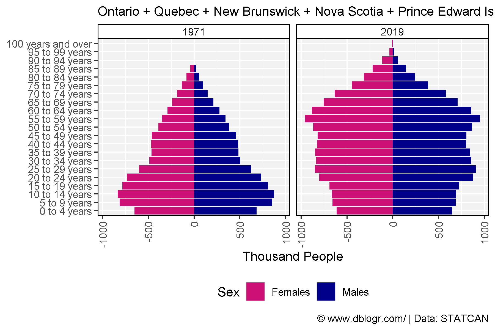

---

```{r}
mp <- gg_PopDem_anim(areas)
anim_save(paste0("PopDem_gif_03.gif"), mp, width = 600, height = 400)
```

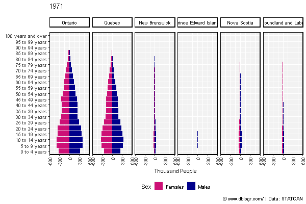

---

# Western Canada

```{r}
areas <- c("British Columbia", "Alberta","Saskatchewan", "Manitoba",
           "Yukon", "Northwest Territories", "Nunavut")
mp <- gg_PopDem_plot(areas, years = c(1975, 2019))
ggsave("PopDem_04.png", mp, width = 6, height = 4)
```

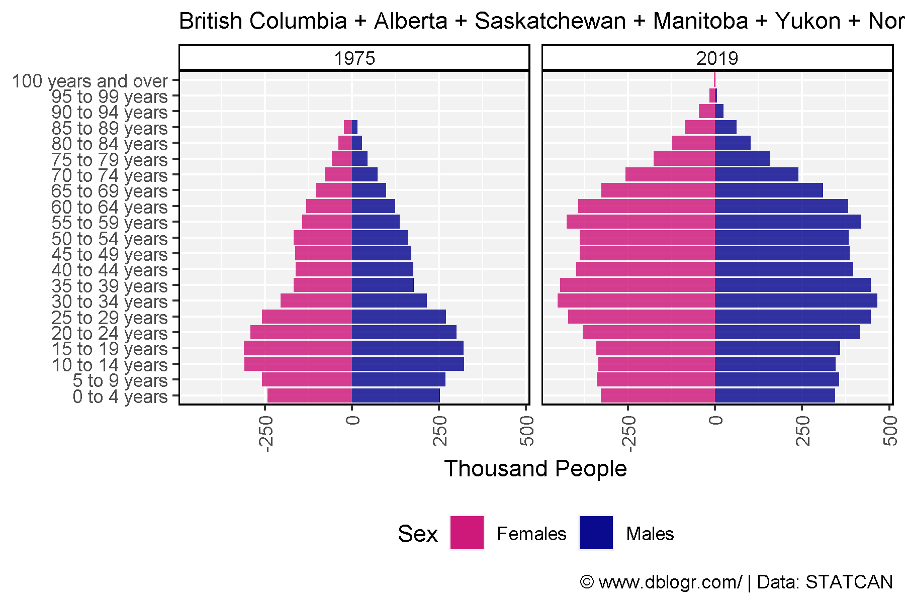

---

```{r}
mp <- gg_PopDem_anim(areas)
anim_save(paste0("PopDem_gif_04.gif"), mp, width = 600, height = 400)
```

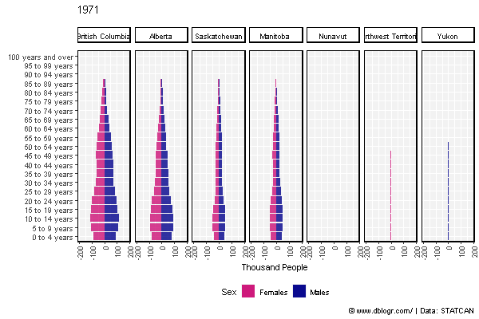

---

# British Columbia

```{r}
mp <- gg_PopDem_plot("British Columbia", years = c(1971, 2019))
ggsave("PopDem_05.png", mp, width = 6, height = 4)
```

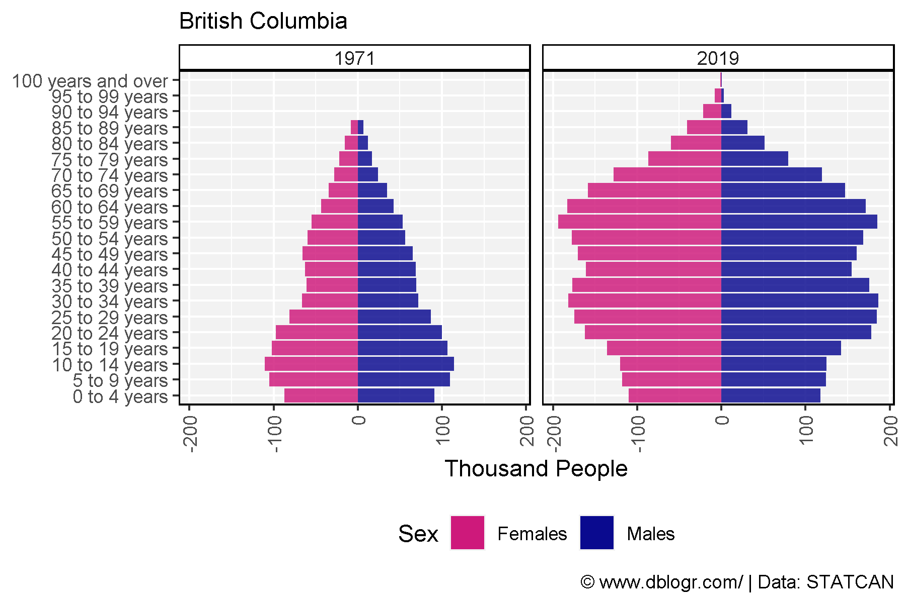

---

```{r}
mp <- gg_PopDem_anim("British Columbia")
anim_save(paste0("PopDem_gif_05.gif"), mp, width = 600, height = 400)
```

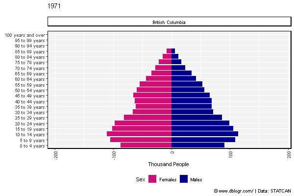

---

# Alberta

```{r}
mp <- gg_PopDem_plot("Alberta", years = c(1971, 2019))
ggsave("PopDem_06.png", mp, width = 6, height = 4)
```

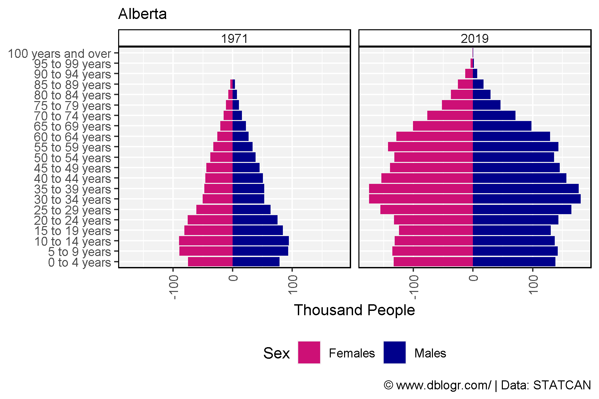

---

```{r}
mp <- gg_PopDem_anim("Alberta")
anim_save(paste0("PopDem_gif_06.gif"), mp, width = 600, height = 400)
```

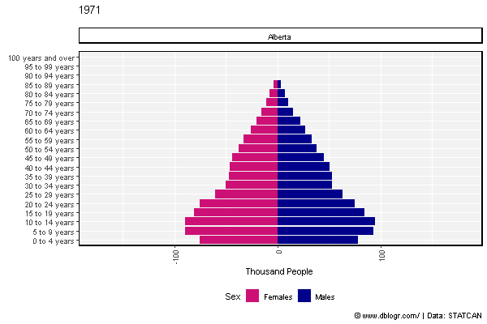

---

# Saskatchewan

```{r}
mp <- gg_PopDem_plot("Saskatchewan", years = c(1971, 2019))
ggsave("PopDem_07.png", mp, width = 6, height = 4)
```

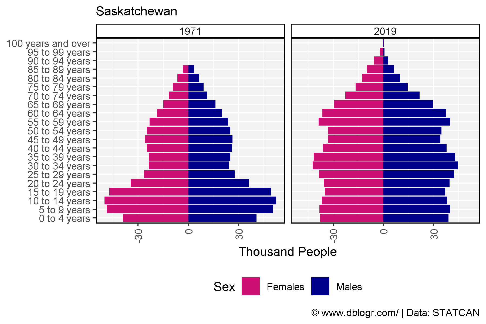

---

```{r}
mp <- gg_PopDem_anim("Saskatchewan")
anim_save(paste0("PopDem_gif_07.gif"), mp, width = 600, height = 400)
```


---

# Ontario

```{r}
mp <- gg_PopDem_plot("Ontario", years = c(1971, 2019))
ggsave("PopDem_08.png", mp, width = 6, height = 4)
```

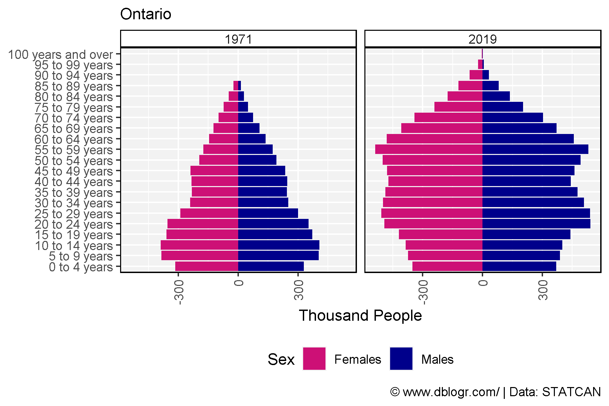

---

```{r}
mp <- gg_PopDem_anim("Saskatchewan")
anim_save(paste0("PopDem_gif_08.gif"), mp, width = 600, height = 400)
```

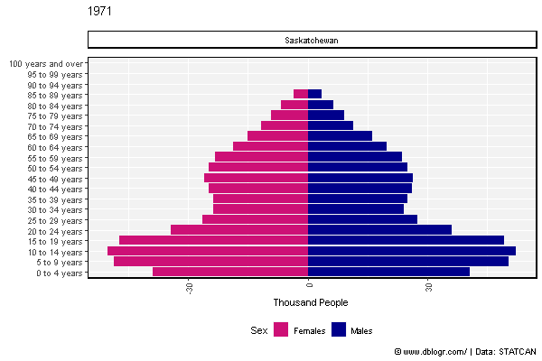

---

# Line Graphs

```{r}
# Prep data
ages <- c("0 to 4 years", "5 to 9 years", "10 to 14 years", "15 to 19 years",
            "20 to 24 years", "25 to 29 years", "30 to 34 years", "35 to 39 years",
            "40 to 44 years", "45 to 49 years", "50 to 54 years", "55 to 59 years",
            "60 to 64 years", "65 to 69 years", "70 to 74 years", "75 to 79 years",
            "80 to 84 years", "85 to 89 years", "90 to 94 years", "95 to 99 years" ,
            "100 years and over")
xx <- agData_STATCAN_Population_AgeGender %>% 
  filter(Area == "Canada", Sex %in% c("Males","Females"), Age %in% ages) %>%
  mutate(Age = factor(Age, levels = ages))
# Plot
mp <- ggplot(xx, aes(x = Year, y = Value / 1000000, color = Sex)) +
  geom_line(size = 1) +
  facet_wrap(Age ~ ., scales = "free_y", ncol = 6) +
  scale_color_manual(values = c("deeppink3","darkblue")) +
  theme_agData(legend.position = "bottom") +
  labs(y = "Million", x = NULL,
       caption = "\xa9 www.dblogr.com/ | Data: STATCAN")
ggsave("PopDem_09.png", mp, width = 12, height = 6)
```


---

```{r}
xx <- agData_STATCAN_Population_AgeGender %>% 
  filter(Area == "Canada", Sex %in% c("Males","Females"), Age %in% ages) %>%
  mutate(Age = factor(Age, levels = ages))
# Plot
mp <- ggplot(xx, aes(x = Year, y = Value, color = Sex, group = Sex)) +
  geom_line(size = 1) +
  scale_color_manual(values = c("deeppink3","darkblue")) +
  theme_agData(legend.position = "bottom") +
  labs(y = "Million", x = NULL,
       caption = "\xa9 www.dblogr.com/ | Data: STATCAN") +
  # Here comes the gganimate specific bits
  labs(title = '{closest_state}') +
  transition_states(Age, transition_length = 1, state_length = 1) +
  ease_aes('linear')
anim_save("PopDem_gif_09.gif", mp, width = 600, height = 400)
```


---

```{r}
# Prep data
xx <- agData_STATCAN_Population_Dynamics %>% 
  filter(Measurement %in% c("Births", "Deaths", "Immigrants", "Emigrants"))
# Plot
mp <- ggplot(xx, aes(x = Year, y = Value / 1000, color = Measurement)) +
  geom_line() +
  facet_wrap(Area ~., ncol = 5, scales = "free_y") +
  theme_agData(legend.position = "bottom", rotx = T) +
  labs(y = "Thousand People", x = NULL,
       caption = "\xa9 www.dblogr.com/ | Data: STATCAN")
ggsave("PopDem_10.png", mp, width = 12, height = 6)
```

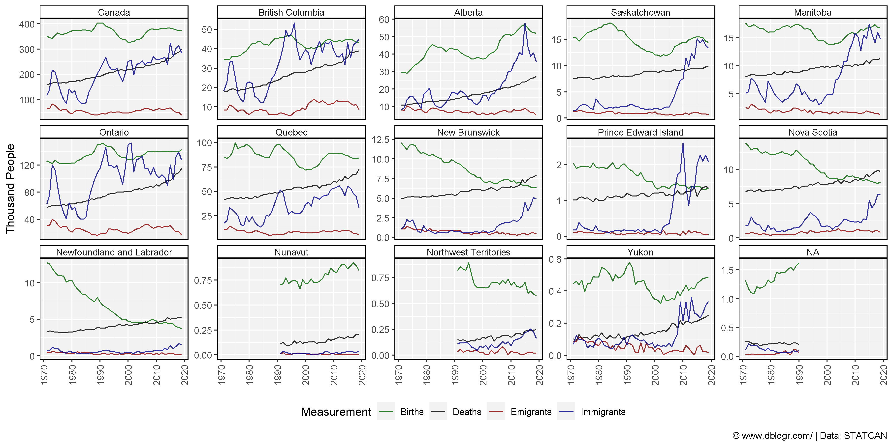

---

```{r}
# Prep data
x1 <- agData_STATCAN_Population %>% 
  filter(Month ==1) %>%
  select(Area, Year, Population=Value)
x2 <- agData_STATCAN_Population_Dynamics %>%
  filter(Measurement == "Immigrants") %>%
  select(Area, Year, Immigrants=Value)
areas <- c("Quebec", "Ontario", "British Columbia", "Alberta", "Saskatchewan", "Manitoba")
xx <- left_join(x1, x2, by = c("Area", "Year")) %>%
  filter(Area %in% areas, !is.na(Immigrants)) %>%
  mutate(Value = 1000000 * Immigrants / Population,
         Wing = plyr::mapvalues(Area, areas, c("Left","Left","Left","Right","Right","Right")))
# Plot
mp <- ggplot(xx, aes(x = Year, y = Value, color = Area)) +
  geom_line(alpha = 0.5) + 
  geom_smooth(se = F) +
  facet_grid(. ~ Wing) +
  scale_x_continuous(breaks = seq(1975, 2015, 10)) +
  theme_agData() +
  labs(title = "Immigration Rates", x = NULL,
       y = "Immigrants per Million People",
       caption = "\xa9 www.dblogr.com/ | Data: STATCAN")
ggsave("PopDem_11.png", mp, width = 8, height = 4)
```

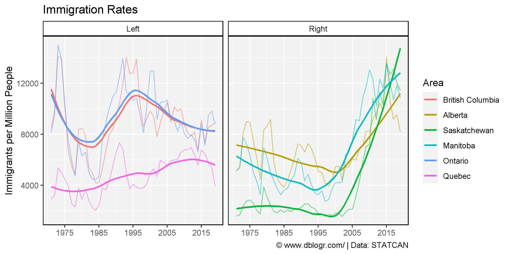

---

&copy; Derek Michael Wright [www.dblogr.com/](https://dblogr.com/)