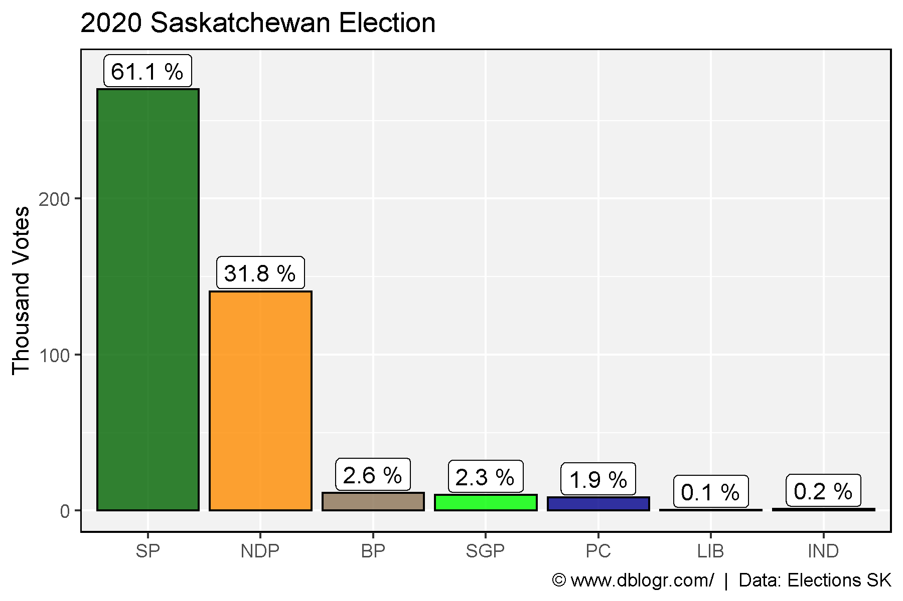
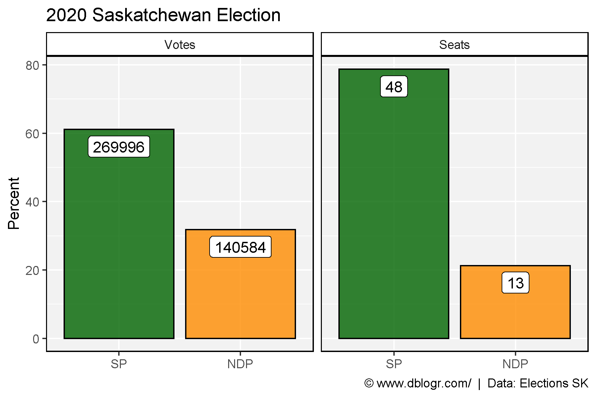
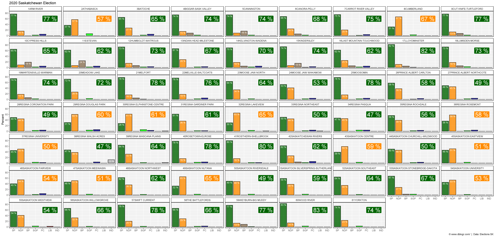
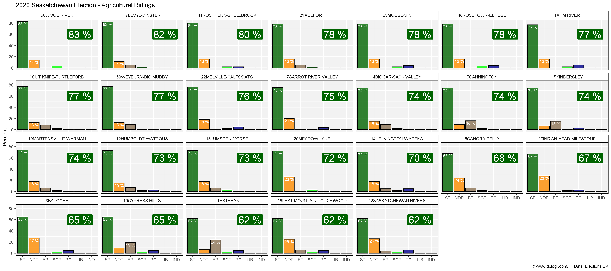
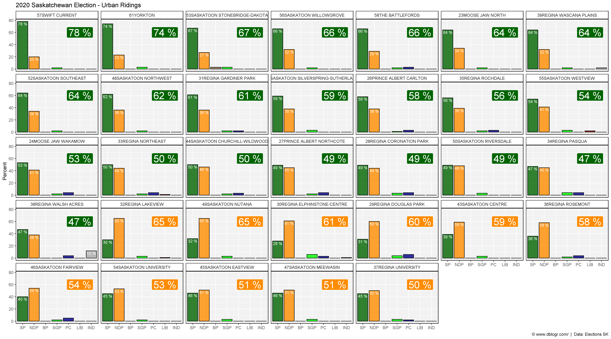
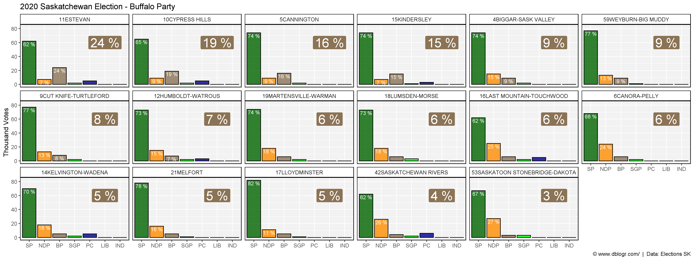
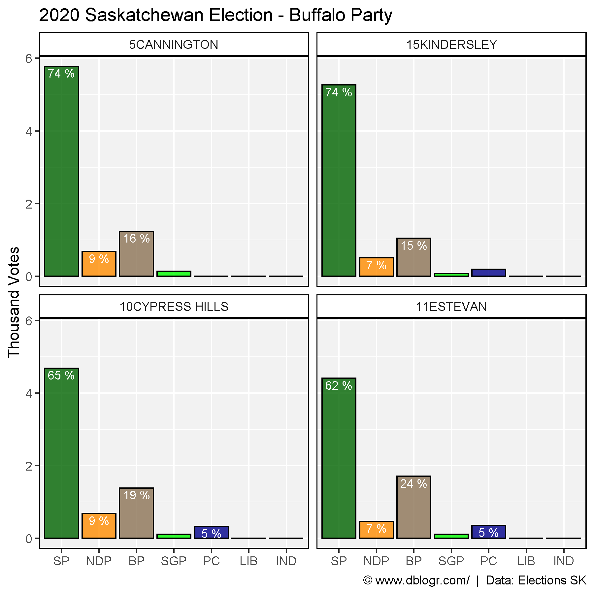

```{r setup, include=FALSE}
knitr::opts_chunk$set(echo = T, message = F, warning = F)
```

---

# Introduction

The [2020 Saskatchewan provincial election](https://en.wikipedia.org/wiki/2020_Saskatchewan_general_election) was won by the [**Saskatchewan Party**](https://en.wikipedia.org/wiki/Saskatchewan_Party) who won 48 (+2) of the 61 seats. Second place went to the [**NDP**](https://en.wikipedia.org/wiki/Saskatchewan_New_Democratic_Party) who won 13 seats. Surpringly, third place went to the newly formed [**Buffalo Party**](https://en.wikipedia.org/wiki/Buffalo_Party_of_Saskatchewan) who beat out the [**Green Party**](https://en.wikipedia.org/wiki/Green_Party_of_Saskatchewan) despite only running candidates in 17 ridings and even came in second in 4 rural ridings, beating out the NDP. Hilariously, the [**Liberal Party**](https://en.wikipedia.org/wiki/Saskatchewan_Liberal_Party) only ran 3 candidates and only received a total of 355 votes throughout the province.

---

# Data Source

https://results.elections.sk.ca/

```{r echo = F}
downloadthis::download_link(
  link = "https://github.com/derekmichaelwright/dblogr/blob/master/content/dblogr/saskatchewan_2020_election/saskatchewan_2020_election_data.csv",
  button_label = "saskatchewan_2020_election_data.csv",
  button_type = "success",
  has_icon = TRUE,
  icon = "fa fa-save",
  self_contained = FALSE
)
```

---

# Prep data

```{r}
# devtools::install_github("derekmichaelwright/agData")
library(agData) # Loads: tidyverse, ggpubr, ggbeeswarm, ggrepel
# Prep data
parties <- c("SP", "NDP", "BP", "SGP", "PC", "LIB", "IND")
cols <- c("darkgreen", "darkorange", "burlywood4", "green", "darkblue", "darkred", "darkgrey")
dd <- read.csv("saskatchewan_2020_election_data.csv") %>% 
  mutate(IND = ifelse(is.na(IND), 0 , IND),
         Total = SP + NDP + BP + SGP + PC + LIB + IND)
```

---

# Total Votes

```{r}
# Prep data
xx <- dd %>% 
  select(Constituency, BP, NDP, PC, SGP, LIB, SP, IND) %>%
  gather(Party, Votes, BP, NDP, PC, SGP, LIB, SP, IND) %>%
  mutate(Party = factor(Party, levels = parties)) %>%
  group_by(Party) %>%
  summarise(Votes = sum(Votes, na.rm = T)) %>%
  ungroup() %>%
  mutate(Percent = round(100 * Votes / sum(Votes), 1))
# Plot
mp <- ggplot(xx, aes(x = Party, y = Votes / 1000, fill = Party)) +
  geom_bar(stat = "identity", color = "black", alpha = 0.8) +
  geom_label(aes(label = paste(Percent, "%")), fill = "white", nudge_y = 12) +
  scale_fill_manual(values = cols) +
  theme_agData(legend.position = "none") +
  labs(title = "2020 Saskatchewan Election", 
       y = "Thousand Votes", x = NULL,
       caption = "\xa9 www.dblogr.com/  |  Data: Elections SK")
ggsave("saskatchewan_2020_election_01.png", mp, width = 6, height = 4)
```

```{r echo = F}
ggsave("featured.png", mp, width = 6, height = 4)
```



---

# Votes vs Seats

```{r}
# Prep data
xw <- dd %>% 
  select(Constituency, BP, NDP, PC, SGP, LIB, SP, IND) %>%
  gather(Party, Votes, BP, NDP, PC, SGP, LIB, SP, IND) %>%
  group_by(Constituency) %>%
  top_n(1) %>% ungroup()
xw <- as.data.frame(table(xw$Party)) %>% rename(Party=1, Seats=2)
xx <- xx %>% 
  rename(PercentVotes=Percent) %>%
  left_join(xw, by = "Party") %>% 
  filter(!is.na(Seats)) %>%
  mutate(PercentSeats = round(100 * Seats / sum(Seats), 1))
x1 <- xx %>% select(-PercentVotes, -PercentSeats) %>%
  gather(Measurement, Value, 2:3) %>% 
  mutate(Measurement = factor(Measurement, levels = c("Votes", "Seats")))
x2 <- xx %>% select(-Votes, -Seats) %>%
  rename(Votes=PercentVotes, Seats=PercentSeats) %>%
  gather(Measurement, Percent, 2:3)  %>% 
  mutate(Measurement = factor(Measurement, levels = c("Votes", "Seats")))
xx <- left_join(x1, x2, by = c("Party","Measurement"))
# Plot
mp <- ggplot(xx, aes(x = Party, y = Percent, fill = Party)) +
  geom_bar(stat = "identity", color = "black", alpha = 0.8) +
  geom_label(aes(label = Value), fill = "white", nudge_y = -5) +
  facet_wrap(Measurement ~ .) +
  scale_fill_manual(values = cols) +
  theme_agData(legend.position = "none") +
  labs(title = "2020 Saskatchewan Election", x = NULL,
       caption = "\xa9 www.dblogr.com/  |  Data: Elections SK")
ggsave("saskatchewan_2020_election_02.png", mp, width = 6, height = 4)
```



---

# Constituency

```{r}
pdf("saskatchewan_2020_election_districts.pdf", width = 6, height = 4)
districts <- unique(xx$Constituency)
for(i in districts) {
  xi <- xx %>% filter(Constituency == i)
  xw <- xi %>% group_by(Constituency) %>% top_n(1)
  mymax <- max(xi$Votes)
  print(ggplot(xi, aes(x = Party, y = Votes / 1000, fill = Party)) +
          geom_bar(stat = "identity", color = "black", alpha = 0.8) +
          geom_text(aes(label = Label), color = "white", size = 5, vjust = 1.25) +
          geom_label(data = xw, aes(label = Label), x = 6, y = mymax-(mymax/5), color = "white", size = 5) +
          facet_wrap(Constituency ~ .) +
          scale_fill_manual(values = cols) +
          theme_agData(legend.position = "none") +
          labs(title = "2020 Saskatchewan Election", 
               y = "Thousand Votes", x = NULL,
               caption = "\xa9 www.dblogr.com/  |  Data: Elections SK")
  )
}
dev.off()
```

```{r echo = F}
downloadthis::download_link(
  link = "https://github.com/derekmichaelwright/dblogr/blob/master/content/dblogr/saskatchewan_2020_election/saskatchewan_2020_election_districts.pdf",
  button_label = "saskatchewan_2020_election_districts.pdf",
  button_type = "success",
  has_icon = TRUE,
  icon = "fa fa-file-pdf",
  self_contained = FALSE
)
```

```{r}
# Prep data
xx <- dd %>%
  mutate(Constituency = factor(Constituency, levels = Constituency)) %>% 
  select(Constituency, Total, BP, NDP, PC, SGP, LIB, SP, IND) %>%
  gather(Party, Votes, BP, NDP, PC, SGP, LIB, SP, IND) %>%
  mutate(Party = factor(Party, levels = parties),
         Percent = round(100 * Votes / Total),
         Label = ifelse(Percent < 10, NA, paste(Percent, "%")))
xw <- xx %>% 
  group_by(Constituency) %>% 
  top_n(1)
# Plot
mp <- ggplot(xx, aes(x = Party, y = Percent, fill = Party)) +
  geom_bar(stat = "identity", color = "black", alpha = 0.8) +
  geom_text(aes(label = Label), color = "white", size = 3, vjust = 1.25) +
  geom_label(data = xw, aes(label = Label), x = 6, y = 60, color = "white", size = 7.5) +
  facet_wrap(Constituency ~ ., ncol = 9) +
  scale_fill_manual(values = cols) +
  theme_agData(legend.position = "none") +
  labs(title = "2020 Saskatchewan Election", x = NULL,
       caption = "\xa9 www.dblogr.com/  |  Data: Elections SK")
ggsave("saskatchewan_2020_election_03.png", mp, width = 25, height = 12)
```



---

# Rural Ridings

```{r}
# Prep data
xx <- dd %>% 
  filter(!grepl("REGINA|SASKATOON|PRINCE ALBERT|MOOSE JAW|BATTLEFORDS|SWIFT CURRENT|YORKTON|CUMBERLAND|ATHABASCA", Constituency)) %>%
  select(Constituency, Total, BP, NDP, PC, SGP, LIB,SP, IND) %>%
  gather(Party, Votes, BP, NDP, PC, SGP, LIB, SP, IND) %>%
  mutate(Party = factor(Party, levels = parties),
         Percent = round(100 * Votes / Total),
         Label = ifelse(Percent < 10, NA, paste(Percent, "%")))
xw <- xx %>% 
  group_by(Constituency) %>% 
  top_n(1) %>% 
  arrange(desc(Percent)) %>% 
  mutate(Constituency = factor(Constituency, levels = .$Constituency))
xx <- xx %>% 
  mutate(Constituency = factor(Constituency, levels = xw$Constituency))
# Plot
mp <- ggplot(xx, aes(x = Party, y = Percent, fill = Party)) +
  geom_bar(stat = "identity", color = "black", alpha = 0.8) +
  geom_text(aes(label = Label), color = "white", size = 3, vjust = 1.25) +
  geom_label(data = xw, aes(label = Label), x = 6, y = 60, color = "white", size = 7.5) +
  facet_wrap(Constituency ~ ., ncol = 7) +
  scale_fill_manual(values = cols) +
  theme_agData(legend.position = "none") +
  labs(title = "2020 Saskatchewan Election - Agricultural Ridings", x = NULL,
       caption = "\xa9 www.dblogr.com/  |  Data: Elections SK")
ggsave("saskatchewan_2020_election_04.png", mp, width = 18, height = 8)
```



---

# Urban Ridings

```{r}
# Prep data
xx <- dd %>% 
  filter(grepl("REGINA|SASKATOON|PRINCE ALBERT|MOOSE JAW|BATTLEFORDS|SWIFT CURRENT|YORKTON", Constituency)) %>%
  select(Constituency, Total, BP, NDP, PC, SGP, LIB,SP, IND) %>%
  gather(Party, Votes, BP, NDP, PC, SGP, LIB, SP, IND) %>%
  mutate(Party = factor(Party, levels = parties),
         Percent = round(100 * Votes / Total),
         Label = ifelse(Percent < 10, NA, paste(Percent, "%")))
xw <- xx %>% 
  group_by(Constituency) %>% 
  top_n(1) %>% 
  arrange(Party, desc(Percent)) %>% 
  ungroup() %>%
  filter(!duplicated(Constituency)) %>%
  mutate(Constituency = factor(Constituency, levels = .$Constituency))
xx <- xx %>% 
  mutate(Constituency = factor(Constituency, levels = xw$Constituency))
# Plot
mp <- ggplot(xx, aes(x = Party, y = Percent, fill = Party)) +
  geom_bar(stat = "identity", color = "black", alpha = 0.8) +
  geom_text(aes(label = Label), color = "white", size = 3, vjust = 1.25) +
  geom_label(data = xw, aes(label = Label), x = 6, y = 60, color = "white", size = 7.5) +
  facet_wrap(Constituency ~ ., ncol = 7) +
  scale_fill_manual(values = cols) +
  theme_agData(legend.position = "none") +
  labs(title = "2020 Saskatchewan Election - Urban Ridings", x = NULL,
       caption = "\xa9 www.dblogr.com/  |  Data: Elections SK")
ggsave("saskatchewan_2020_election_05.png", mp, width = 18, height = 10)
```



---

# Buffalo Party

```{r}
# Prep data
xx <- dd %>% 
  filter(BP > 0) %>%
  arrange(desc(BP)) %>%
  mutate(Constituency = factor(Constituency, levels = Constituency)) %>%
  select(Constituency, Total, BP, NDP, PC, SGP, LIB,SP, IND) %>%
  gather(Party, Votes, BP, NDP, PC, SGP, LIB, SP, IND) %>%
  mutate(Party = factor(Party, levels = parties),
         Percent = round(100 * Votes / Total),
         Label = paste(Percent, "%"))
xw <- xx %>% 
  filter(Party == "BP") %>%
  arrange(desc(Percent)) %>% 
  mutate(Constituency = factor(Constituency, levels = .$Constituency))
xx <- xx %>% 
  mutate(Constituency = factor(Constituency, levels = xw$Constituency),
         Label = ifelse(Percent < 7, "", Label))
# Plot
mp <- ggplot(xx, aes(x = Party, y = Percent, fill = Party)) +
  geom_bar(stat = "identity", color = "black", alpha = 0.8) +
  geom_text(aes(label = Label), color = "white", size = 3, vjust = 1.25) +
  geom_label(data = xw, aes(label = Label), x = 6, y = 60, color = "white", size = 7.5) +
  facet_wrap(Constituency ~ ., ncol = 6) +
  scale_fill_manual(values = cols) +
  theme_agData(legend.position = "none") +
  labs(title = "2020 Saskatchewan Election - Buffalo Party", 
       y = "Thousand Votes", x = NULL,
       caption = "\xa9 www.dblogr.com/  |  Data: Elections SK")
ggsave("saskatchewan_2020_election_06.png", mp, width = 16, height = 6)
```



```{r}
# Prep data
xx <- dd %>% 
  filter(grepl("CANNINGTON|KINDERSLEY|ESTEVAN|CYPRESS", Constituency)) %>%
  select(Constituency, Total, BP, NDP, PC, SGP, LIB,SP, IND) %>%
  gather(Party, Votes, BP, NDP, PC, SGP, LIB, SP, IND) %>%
  mutate(Party = factor(Party, levels = parties),
         Percent = round(100 * Votes / Total),
         Label = ifelse(Percent < 5, NA, paste(Percent, "%"))) %>%
  arrange(desc(Percent)) %>%
  mutate(Constituency = factor(Constituency, levels = unique(Constituency)))
# Plot
mp <- ggplot(xx, aes(x = Party, y = Votes / 1000, fill = Party)) +
  geom_bar(stat = "identity", color = "black", alpha = 0.8) +
  geom_text(aes(label = Label), color = "white", size = 3, vjust = 1.25) +
  facet_wrap(Constituency ~ ., ncol = 2) +
  scale_fill_manual(values = cols) +
  theme_agData(legend.position = "none") +
  labs(title = "2020 Saskatchewan Election - Buffalo Party", 
       y = "Thousand Votes", x = NULL,
       caption = "\xa9 www.dblogr.com/  |  Data: Elections SK")
ggsave("saskatchewan_2020_election_07.png", mp, width = 6, height = 6)
```



---

&copy; Derek Michael Wright [www.dblogr.com/](https://dblogr.com/)