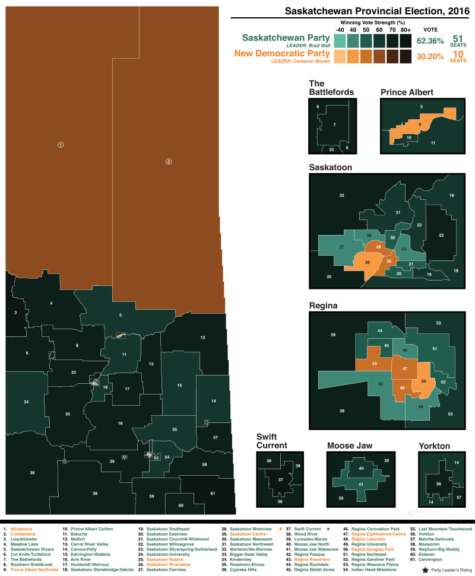
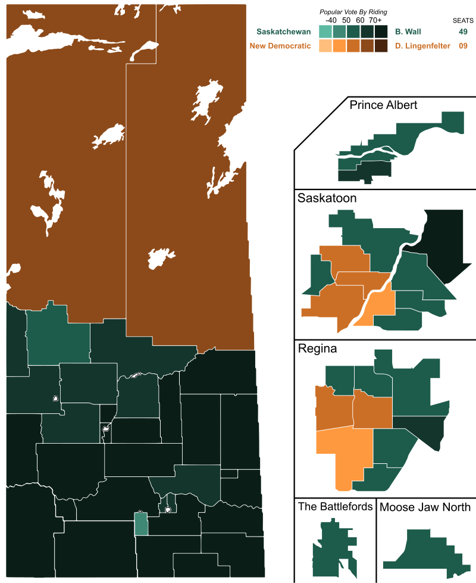
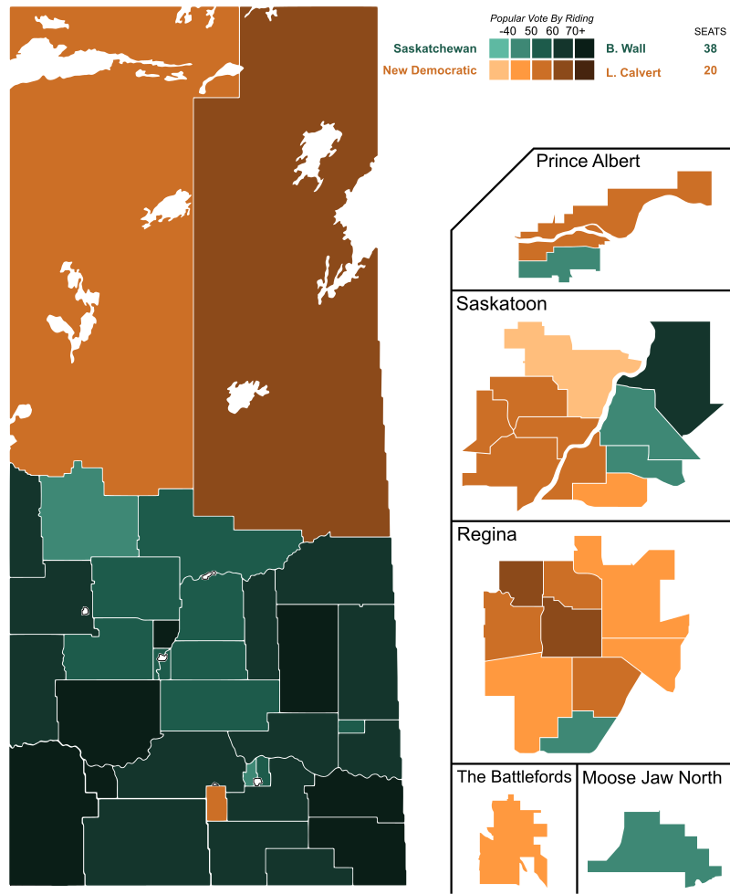
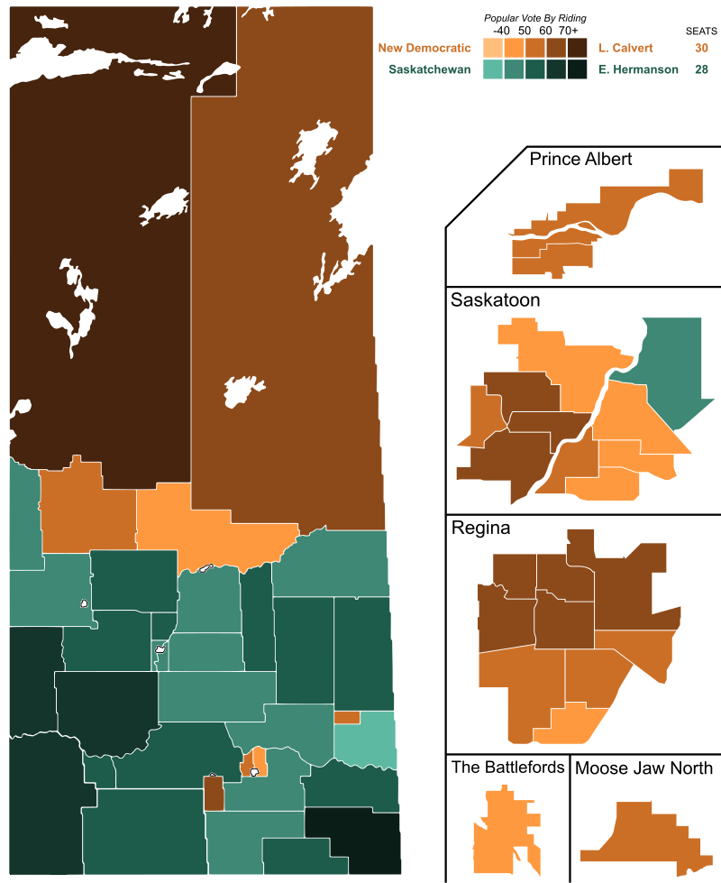
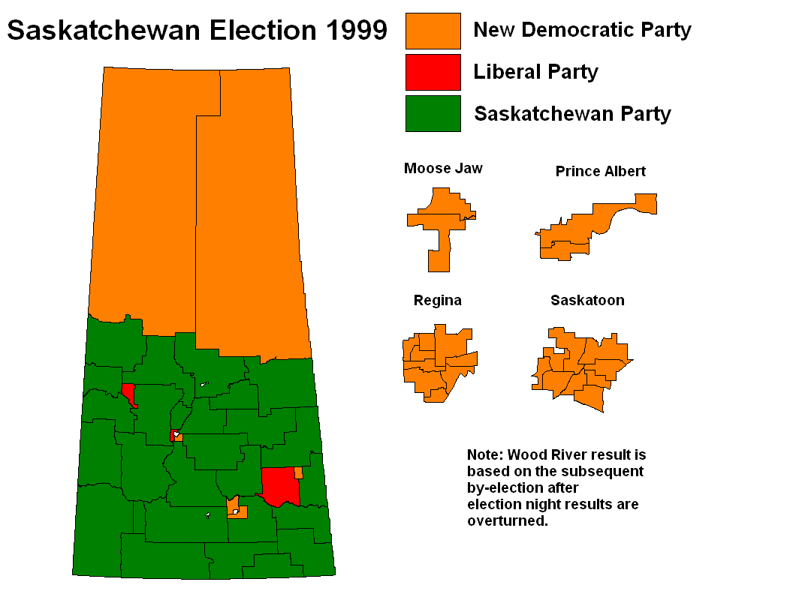
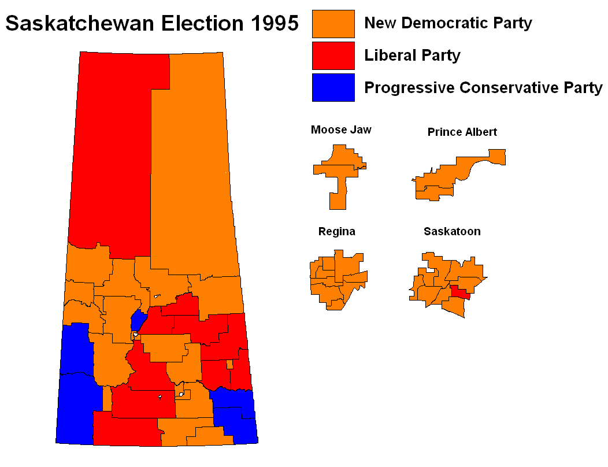
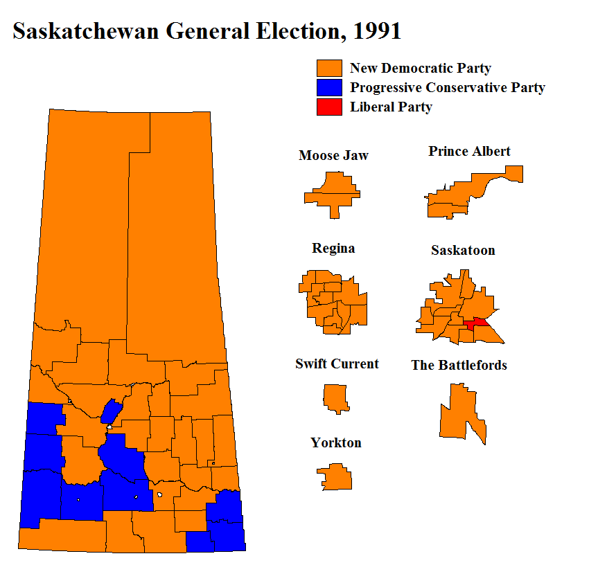

```{r setup, include=FALSE}
knitr::opts_chunk$set(echo = T, message = F, warning = F)
```

---

All images are from [Wikipedia](http://www.wikipedia.org/)

---

# Create an Animation

```{r}
library(magick)
# all images are in a folder called `maps`
fnames <- list.files("maps")
mp <- image_read(paste("maps", fnames, sep = "/")) %>% image_scale("x800")
image_write(image_animate(mp, fps = 1), "Saskatchewan_Provincial_Elections.gif")
```


---

## 2016



## 2011



## 2007



## 2003



## 1999



## 1995



## 1991



---

&copy; Derek Michael Wright 2020 [www.dblogr.com/](https://dblogr.com/)