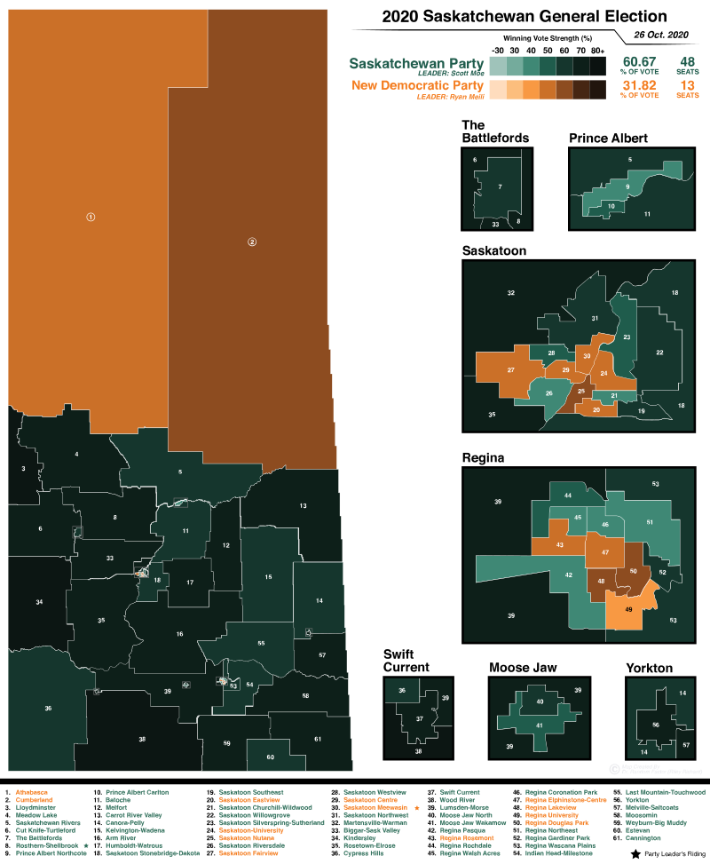

```{r setup, include=FALSE}
knitr::opts_chunk$set(echo = T, message = F, warning = F)
```

---

All images are from [Wikipedia](http://www.wikipedia.org/)

---

# Create an Animation

```{r}
library(magick)
# all images are in a folder called `maps`
fnames <- list.files("maps")
mp <- image_read(paste("maps", fnames, sep = "/")) %>% image_scale("x800")
image_write(image_animate(mp, fps = 1), "Saskatchewan_Provincial_Elections.gif")
```


---

## 2020



## 2016


## 2011


## 2007


## 2003


## 1999


## 1995


## 1991


---

&copy; Derek Michael Wright [www.dblogr.com/](https://dblogr.com/)