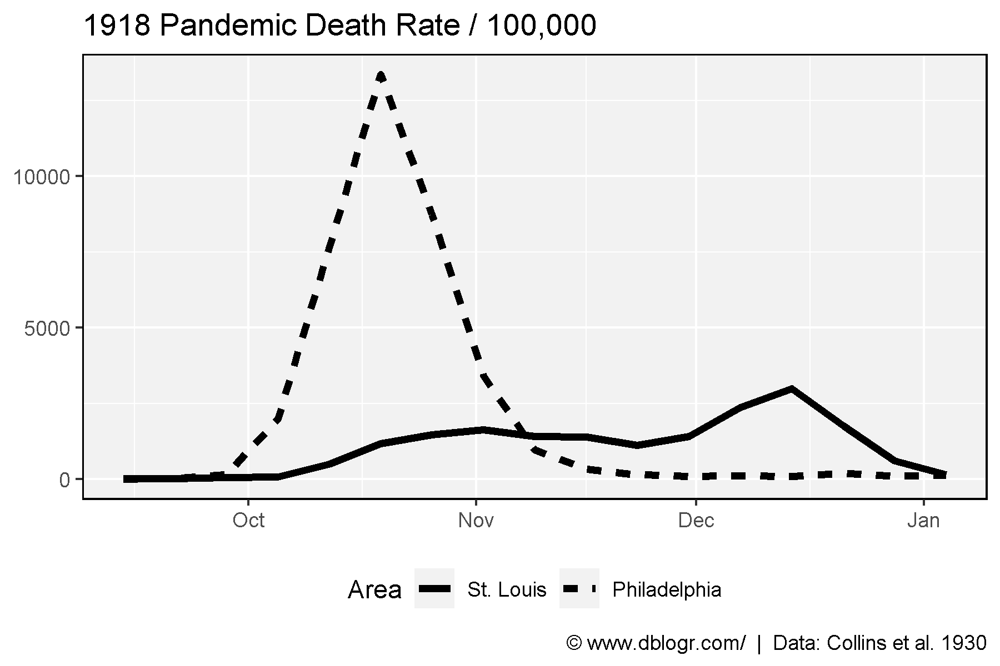
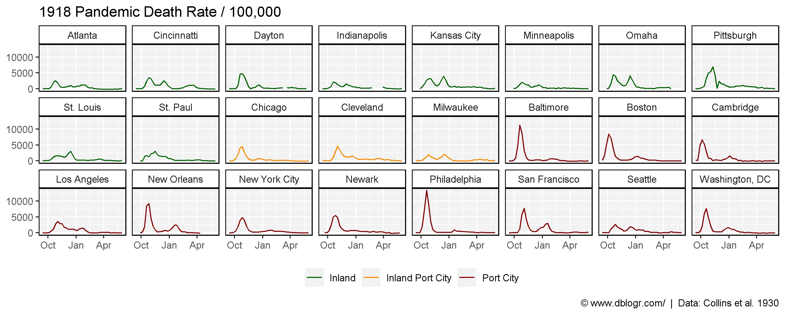
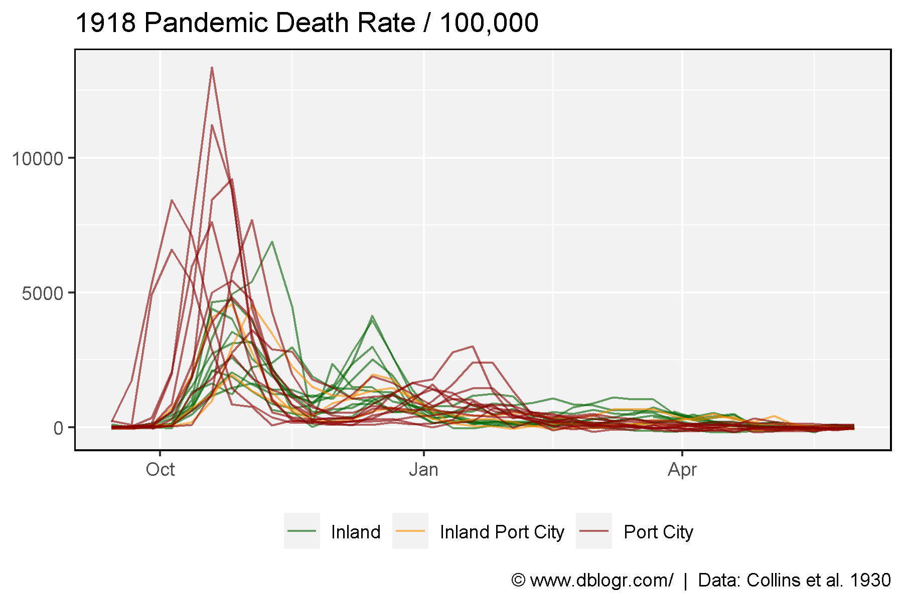
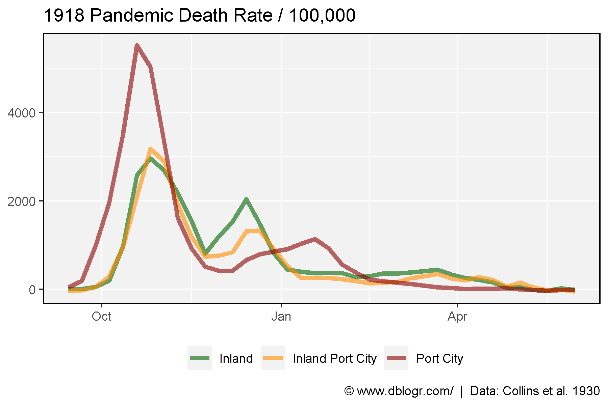

```{r setup, include=FALSE}
knitr::opts_chunk$set(echo = TRUE, message = F, warning = F)
```

---

# Data Source

Hatchett, R.J., Mecher, C.E. & Lipsitch, M., (2007) **Public health interventions and epidemic intensity during the 1918 influenza pandemic**. *Proceedings of the National Academy of Sciences*. 104(18): 7582-7587.

https://www.pnas.org/content/104/18/7582?__ac_lkid=f639-efd2-f4de-3e717151efc501

```{r echo = F}
downloadthis::download_link(
  link = "https://github.com/derekmichaelwright/dblogr/blob/master/content/dblogr/spanish_flu/pnas_0610941104_10941Table11.xls",
  button_label = "pnas_0610941104_10941Table11.xls",
  button_type = "success",
  has_icon = TRUE,
  icon = "fa fa-save",
  self_contained = FALSE
)
downloadthis::download_link(
  link = "https://github.com/derekmichaelwright/dblogr/blob/master/content/dblogr/spanish_flu/city_info.csv",
  button_label = "city_info.csv",
  button_type = "success",
  has_icon = TRUE,
  icon = "fa fa-save",
  self_contained = FALSE
)
```

---

# Prepare Data

```{r}
# devtools::install_github("derekmichaelwright/agData")
library(agData) # Loads: tidyverse, ggpubr, ggbeeswarm, ggrepel
library(readxl)
# Prep data
yy <- read.csv("city_info.csv") %>% arrange(Type, Area)
dd <- read_xls("pnas_0610941104_10941Table11.xls", range = "A2:AM27", col_names = F)[-2,] %>%
  t() %>% as.data.frame()
colnames(dd) <- dd[1,]
dd <- dd %>% slice(-1) %>%
  mutate(City = as.Date(as.numeric(City), origin = "1899-12-30")) %>%
  gather(Area, Value, 2:ncol(.)) %>%
  mutate(Value = as.numeric(Value)) %>%
  rename(Date = City) %>%
  left_join(yy, "Area") %>% 
  mutate(Area = factor(Area, levels = yy$Area))
```

---

# Flatten the Curve

```{r}
# Prep data
xx <- dd %>% filter(Date < "1919-01-11")
xx %>% 
  group_by(Area) %>% 
  summarise(Sum = sum(Value, na.rm = T)) %>% 
  arrange(Sum)
xx <- xx %>% filter(Area %in% c("Philadelphia", "St. Louis"))
# Plot
mp <- ggplot(xx, aes(x = Date, y = Value, lty = Area)) +
  geom_line(size = 1.5) +
  theme_agData(legend.position = "bottom") +
  labs(title = "1918 Pandemic Death Rate / 100,000", y = NULL, x = NULL,
       caption = "\xa9 www.dblogr.com/  |  Data: Collins et al. 1930")
ggsave("spanish_flu_01.png", mp, width = 6, height = 4)
```

```{r echo = F}
ggsave("featured.png", mp, width = 6, height = 4)
```



```{r}
# Prep data
colors <- c("darkgreen","darkorange","darkred")
# Plot
mp <- ggplot(dd, aes(x = Date, y = Value, color = Type)) +
  geom_line() +
  facet_wrap(Area ~ ., nrow = 3) +
  scale_color_manual(name = NULL, values = colors) +
  theme_agData(legend.position = "bottom") +
  labs(title = "1918 Pandemic Death Rate / 100,000", y = NULL, x = NULL,
       caption = "\xa9 www.dblogr.com/  |  Data: Collins et al. 1930")
ggsave("spanish_flu_02.png", mp, width = 10, height = 4)
```



---

```{r}
# Plot
mp <- ggplot(dd, aes(x = Date, y = Value, color = Type, group = Area)) +
  geom_line(alpha = 0.6) +
  scale_color_manual(name = NULL, values = colors) +
  theme_agData(legend.position = "bottom") +
  labs(title = "1918 Pandemic Death Rate / 100,000", y = NULL, x = NULL,
       caption = "\xa9 www.dblogr.com/  |  Data: Collins et al. 1930")
ggsave("spanish_flu_03.png", mp, width = 6, height = 4)
```



---

```{r}
# Prep data
xx <- dd %>% group_by(Date, Type) %>%
  summarise(Value = mean(Value, na.rm = T))
# Plot
mp <- ggplot(xx, aes(x = Date, y = Value, color = Type)) +
  geom_line(size = 1.5, alpha = 0.6) +
  scale_color_manual(name = NULL, values = colors) +
  theme_agData(legend.position = "bottom") +
  labs(title = "1918 Pandemic Death Rate / 100,000", y = NULL, x = NULL,
       caption = "\xa9 www.dblogr.com/  |  Data: Collins et al. 1930")
ggsave("spanish_flu_04.png", mp, width = 6, height = 4)
```



---

&copy; Derek Michael Wright 2020 [www.dblogr.com/](https://dblogr.netlify.com/)