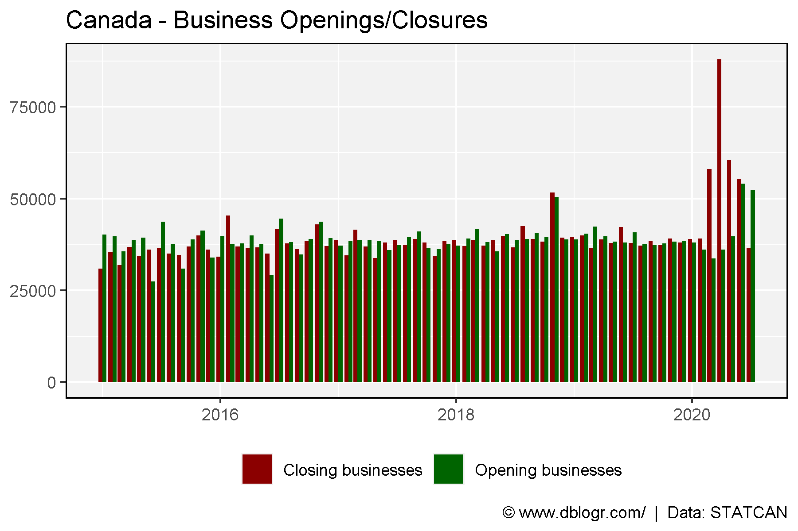
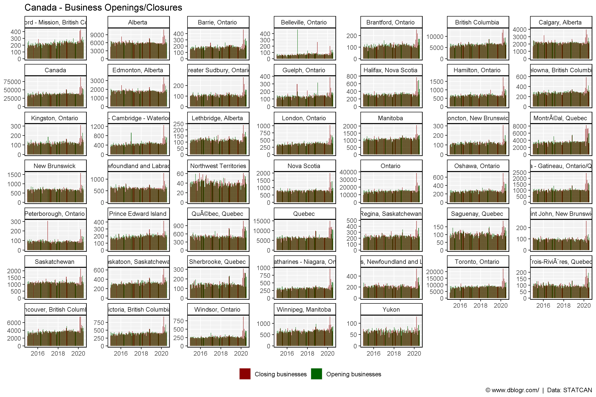
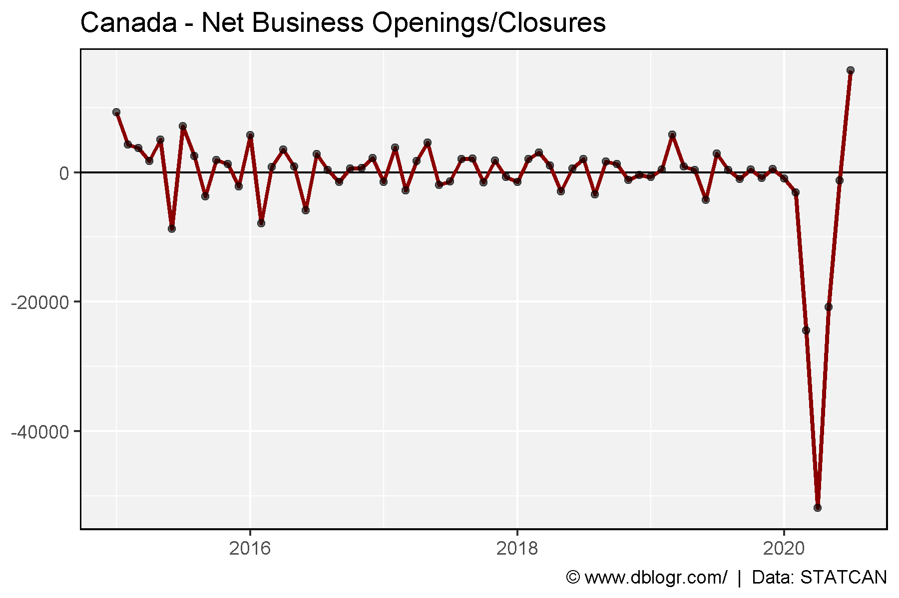
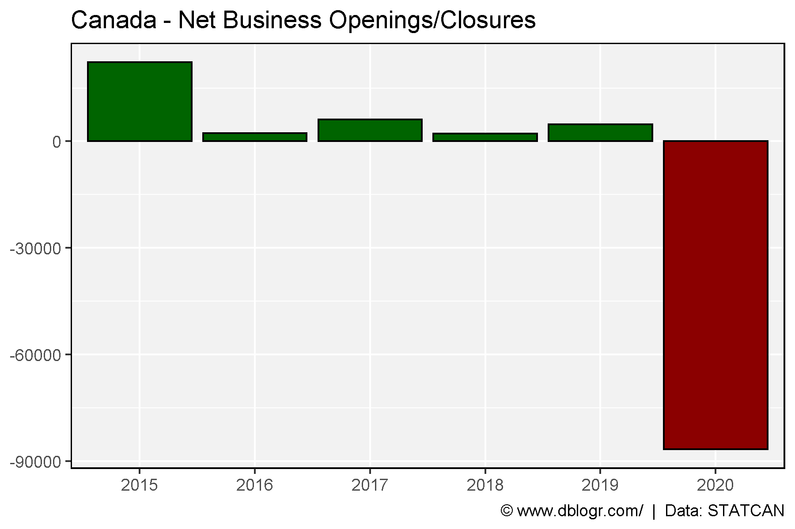
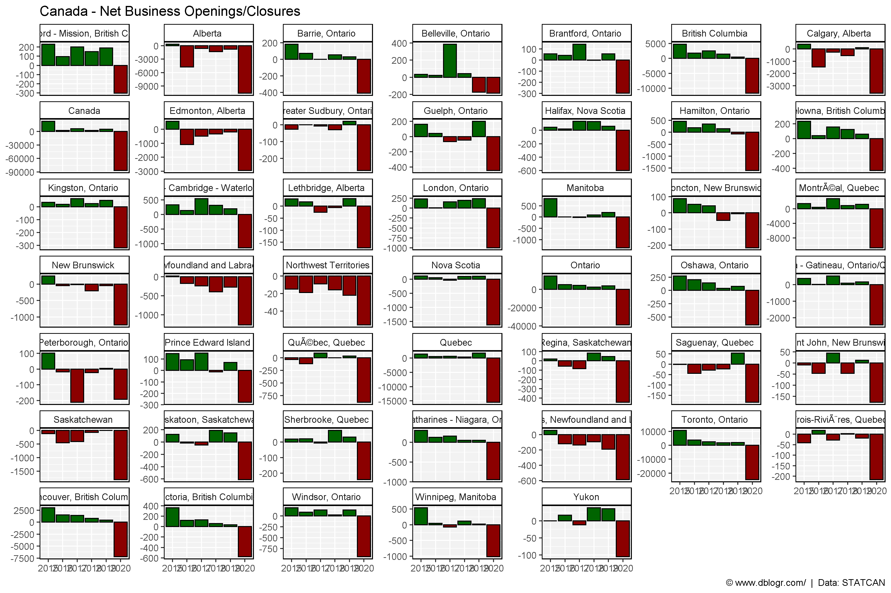

```{r setup, include=FALSE}
knitr::opts_chunk$set(echo = TRUE, message = F, warning = F)
```

---

# Prep Data

STATCAN data Tables: 3310027001

https://www150.statcan.gc.ca/n1/pub/11-626-x/11-626-x2020014-eng.htm

[*Download Data*](https://github.com/derekmichaelwright/htmls/blob/master/scripts/dblogr/economics_of_canada/economics_of_canada_data.xlsx?raw=true)


```{r}
# devtools::install_github("derekmichaelwright/agData")
library(agData) # Loads: tidyverse, ggpubr, ggbeeswarm, ggrepel
```

```{r}
# Prep data
dd <- read.csv("3310027001_databaseLoadingData.csv") %>%
  rename(Measurement=Business.dynamics.measure) %>%
  filter(Measurement %in% c("Opening businesses","Closing businesses"),
         !is.na(VALUE)) %>%
  mutate(Date = as.Date(paste0(ï..REF_DATE,"-01"), format = "%Y-%m-%d")) %>%
  select(Area=GEO, Date, Measurement, VALUE) %>%
  spread(Measurement, VALUE) %>%
  mutate(Difference = `Opening businesses` - `Closing businesses`,
         Area = gsub("Â", "", Area))
xx <- dd %>% 
  select(Area, Date, `Opening businesses`, `Closing businesses`) %>%
  gather(Measurement, Value, `Opening businesses`, `Closing businesses`)
```

# Business Closures

```{r}
# Prep data
xc <- xx %>% filter(Area == "Canada")
# Plot
mp <- ggplot(xc, aes(x = Date, y = Value, fill = Measurement)) +
  geom_bar(stat = "identity", position = "dodge") +
  scale_fill_manual(name = NULL, values = c("darkred", "darkgreen")) +
  theme_agData(legend.position = "bottom") +
  labs(title = "Canada - Business Openings/Closures", y = NULL, x = NULL,
       caption = "\xa9 www.dblogr.com/  |  Data: STATCAN")
ggsave("Unemployment_Canada_01.png", mp, width = 6, height = 4)
```



---

```{r}
# Plot
mp <- ggplot(xx, aes(x = Date, y = Value, fill = Measurement)) +
  geom_bar(stat = "identity", position = "dodge") +
  facet_wrap(Area ~ ., scales = "free_y") +
  scale_fill_manual(name = NULL, values = c("darkred", "darkgreen")) +
  theme_agData(legend.position = "bottom") +
  labs(title = "Canada - Business Openings/Closures", y = NULL, x = NULL,
       caption = "\xa9 www.dblogr.com/  |  Data: STATCAN")
ggsave("Unemployment_Canada_02.png", mp, width = 12, height = 8)
```



```{r}
# Prep data
xc <- dd %>% filter(Area == "Canada") %>% 
  mutate(Date = as.POSIXct(Date))
# Plot
mp <- ggplot(xc, aes(x = Date, y = Difference)) +
  geom_hline(yintercept = 0) +
  geom_line(size = 1, color = "darkred") + 
  geom_point(alpha = 0.6) +
  theme_agData(legend.position = "bottom") +
  labs(title = "Canada - Net Business Openings/Closures", y = NULL, x = NULL,
       caption = "\xa9 www.dblogr.com/  |  Data: STATCAN")
ggsave("Unemployment_Canada_03.png", mp, width = 6, height = 4)
```

```{r echo = F}
ggsave("featured.png", mp, width = 6, height = 4)
```



---

```{r}
sum(dd %>% filter(Area == "Canada", Date > "2020-01-01") %>% pull(Difference))
```

```{r}
# Prep data
xx <- dd %>% 
  separate(Date, c("Year","Month","Day")) %>% 
  group_by(Area, Year) %>%
  summarise(Businesses = sum(Difference)) %>%
  ungroup() %>% 
  mutate(Pos = ifelse(Businesses > 0, "Yes", "No"))
xc <- xx %>% filter(Area == "Canada")
# Plot
mp <- ggplot(xc, aes(x = Year, y = Businesses, fill = Pos)) +
  geom_bar(stat = "identity", color = "black") + 
  scale_fill_manual(values = c("darkred","darkgreen")) +
  theme_agData(legend.position = "none") +
  labs(title = "Canada - Net Business Openings/Closures", y = NULL, x = NULL,
       caption = "\xa9 www.dblogr.com/  |  Data: STATCAN")
ggsave("Unemployment_Canada_04.png", mp, width = 6, height = 4)
```



---

```{r}
# Plot
mp <- ggplot(xx, aes(x = Year, y = Businesses, fill = Pos)) +
  geom_bar(stat = "identity", color = "black") + 
  facet_wrap(Area ~ ., scales = "free_y") +
  scale_fill_manual(values = c("darkred","darkgreen")) +
  theme_agData(legend.position = "none") +
  labs(title = "Canada - Net Business Openings/Closures", y = NULL, x = NULL,
       caption = "\xa9 www.dblogr.com/  |  Data: STATCAN")
ggsave("Unemployment_Canada_05.png", mp, width = 12, height = 8)
```



---

&copy; Derek Michael Wright 2020 [www.dblogr.com/](https://dblogr.com/)