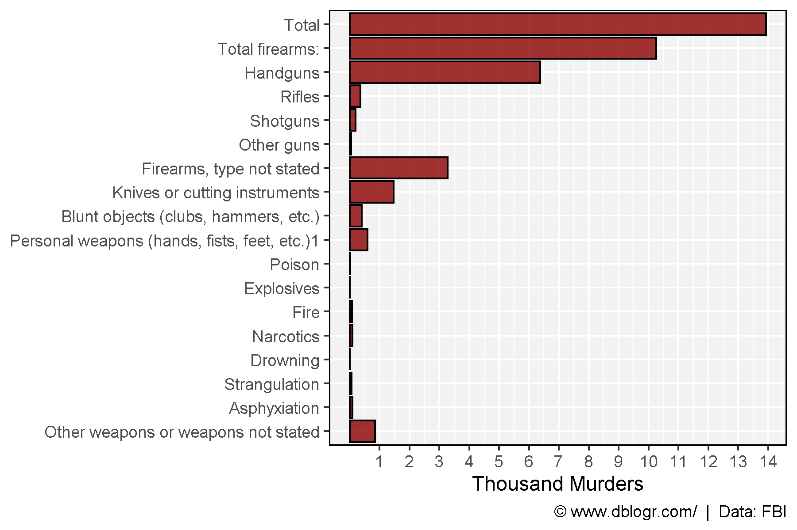
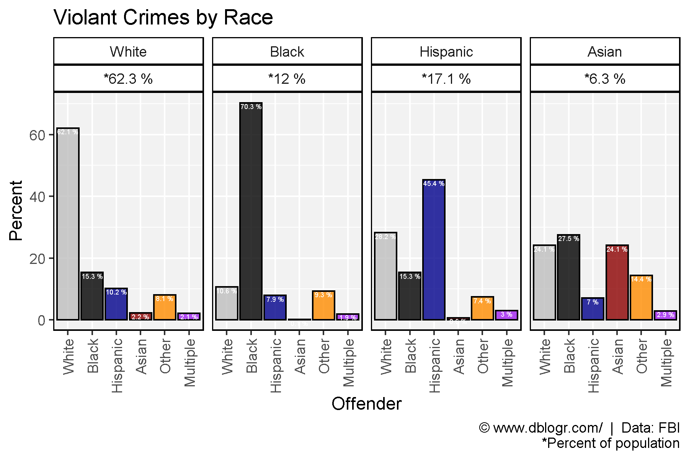
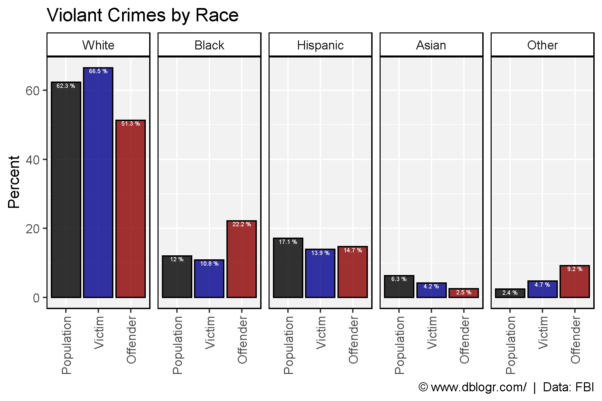
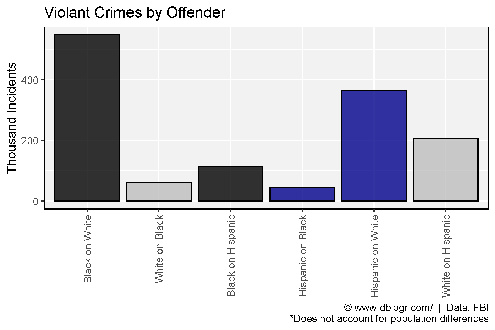

```{r setup, include=FALSE}
knitr::opts_chunk$set(echo = T, message = F, warning = F)
```

---

# Data

https://ucr.fbi.gov/crime-in-the-u.s/2018/crime-in-the-u.s.-2018

https://ucr.fbi.gov/crime-in-the-u.s/2019/crime-in-the-u.s.-2019/topic-pages/tables/expanded-homicide-data-table-8.xls

[**< Download Data >**](https://github.com/derekmichaelwright/dblogr/blob/master/content/dblogr/usa_crime/usa_crime_data.xlsx)

---

# Prepare data

```{r}
# devtools::install_github("derekmichaelwright/agData")
library(agData) # Loads: tidyverse, ggpubr, ggbeeswarm, ggrepel
library(readxl)
```

```{r}
# Prep data
xx <- read_xlsx("usa_crime_data.xlsx", "Murders") %>% 
  gather(Year, Value, 2:ncol(.)) %>%
  mutate(Weapons = factor(Weapons, levels = rev(unique(Weapons))),
         #Year = as.numeric(substr(Year, 2, 5)),
         Value = as.numeric(gsub(",", "", Value))) %>%
  filter(Year == 2019)
# Plot
mp <- ggplot(xx, aes(x = Weapons, y = Value / 1000)) +
  geom_bar(stat = "identity", color = "black", fill = "darkred", alpha = 0.8) +
  scale_y_continuous(breaks = 1:14) +
  coord_flip() +
  theme_agData() +
  labs(x = NULL, y = "Thousand Murders",
       caption = "\xa9 www.dblogr.com/  |  Data: FBI")
ggsave("usa_crime_01.png", width = 6, height = 4)
```

```{r echo = F}
ggsave("featured.png", mp, width = 6, height = 4)
```



---

```{r}
# Prep data 
colors <- c("grey",  "Black", "darkblue", "darkred", "darkorange", "purple" )
races  <- c("White", "Black", "Hispanic", "Asian",  "Other",      "Multiple")
y1 <- read_xlsx("usa_crime_data.xlsx", "Race2") %>%
  select(Victim=Race, PopulationPercent)
y2 <- read_xlsx("usa_crime_data.xlsx", "Race0")
xx <- read_xlsx("usa_crime_data.xlsx", "Race1") %>%
  left_join(y1, by = "Victim") %>%
  left_join(y2, by = "Victim") %>%
  mutate(Offender = factor(Offender, levels = races),
         Victim   = factor(Victim,   levels = races),
         Incidents = Percent * ViolentIncidents / 100)
# Plot
mp <- ggplot(xx, aes(x = Offender, y = Percent, fill = Offender)) +
  geom_bar(stat = "identity", color = "black", alpha = 0.8) +
  geom_text(aes(label = paste(Percent, "%")), vjust = 1.1, size = 1.5, color = "white") +
  facet_grid(. ~ Victim + paste0("*", PopulationPercent, " %")) +
  scale_fill_manual(values = colors) +
  theme_agData(legend.position = "none", rotx = T) +
  labs(title = "Violant Crimes by Victim",
       caption = "\xa9 www.dblogr.com/  |  Data: FBI\n*Percent of population")
ggsave("usa_crime_02.png", mp, width = 6, height = 4)
```



```{r}
# Prep data
y1 <- y1 %>% rename(Offender=Victim)
x1 <- xx %>% filter(Offender %in% races[1:4]) %>%
  select(-PopulationPercent) %>%
  left_join(y1, by = "Offender") %>%
  mutate(Offender = factor(Offender, levels = races))
# Plot
mp <- ggplot(x1, aes(x = Victim, y = Incidents / 1000, fill = Victim)) +
  geom_bar(stat = "identity", color = "black", alpha = 0.8) +
  facet_grid(. ~ Offender + paste0("*", PopulationPercent, " %")) +
  scale_fill_manual(values = colors) +
  theme_agData(legend.position = "none", rotx = T) +
  labs(title = "Violant Crimes by Offender", y = "Thousand Incidents",
       caption = "\xa9 www.dblogr.com/  |  Data: FBI\n*Percent of population")
ggsave("usa_crime_03.png", mp, width = 6, height = 4)
```



---

```{r}
# Prep data
crimes <- c("Black on White", "White on Black", 
            "Black on Hispanic", "Hispanic on Black", 
            "Hispanic on White", "White on Hispanic" )
x2 <- x1 %>% 
  mutate(Crime = paste(Offender,"on", Victim)) %>%
  filter(Crime %in% crimes) %>%
  mutate(Crime = factor(Crime, levels = crimes))
# Plot
mp <- ggplot(x2, aes(x = Crime, y = Incidents / 1000, fill = Offender)) +
  geom_bar(stat = "identity", color = "black", alpha = 0.8) +
  scale_fill_manual(values = colors) +
  theme_agData(legend.position = "none", rotx = T) +
  labs(title = "Violant Crimes by Offender", y = "Thousand Incidents", x = NULL,
       caption = "\xa9 www.dblogr.com/  |  Data: FBI\n*Does not account for population differences")
ggsave("usa_crime_04.png", mp, width = 6, height = 4)
```



---

```{r}
# Prep data
crimes <- c("Black on Asian", "Asian on Black", 
            "White on Asian", "Asian on White", 
            "Hispanic on Asian", "Asian on Hispanic" )
x2 <- x1 %>% 
  mutate(Crime = paste(Offender,"on", Victim)) %>%
  filter(Crime %in% crimes) %>%
  mutate(Crime = factor(Crime, levels = crimes))
# Plot
mp <- ggplot(x2, aes(x = Crime, y = Incidents / 1000, fill = Offender)) +
  geom_bar(stat = "identity", color = "black", alpha = 0.8) +
  scale_fill_manual(values = colors) +
  theme_agData(legend.position = "none", rotx = T) +
  labs(title = "Violant Crimes by Offender", y = "Thousand Incidents", x = NULL,
       caption = "\xa9 www.dblogr.com/  |  Data: FBI\n*Does not account for population differences")
ggsave("usa_crime_05.png", mp, width = 6, height = 4)
```


---

```{r}
# Prep data 
colors <- c("Black", "darkblue", "darkred")
races  <- c("White", "Black", "Hispanic", "Asian", "Other")
xx <- read_xlsx("usa_crime_data.xlsx", "Race2") %>%
  select(Race, Offender=OffenderPercent, 
         Victim=VictimPercent, Population=PopulationPercent) %>%
  gather(Trait, Value, 2:ncol(.)) %>%
  mutate(Trait = factor(Trait, levels = c("Population", "Victim", "Offender")),
         Race = factor(Race, levels = races),
         Value = round(Value, 1))
# Plot 
mp <- ggplot(xx, aes(x = Trait, y = Value, fill = Trait)) +
  geom_bar(stat = "identity", color = "black", alpha = 0.8) +
  geom_text(aes(label = paste(Value, "%")), vjust = 1.1, size = 1.5, color = "white") +
  facet_grid(. ~ Race) +
  scale_fill_manual(values = colors) +
  theme_agData(legend.position = "none", rotx = T) +
  labs(title = "Violant Crimes by Race", y = "Percent", x = NULL,
       caption = "\xa9 www.dblogr.com/  |  Data: FBI")
ggsave("usa_crime_06.png", mp, width = 6, height = 4)
```


---

&copy; Derek Michael Wright [www.dblogr.com/](https://dblogr.com/)