```{r setup, include=FALSE}
knitr::opts_chunk$set(echo = TRUE, message = F, warning = F)
```

---

# Data Source

https://www.cdc.gov/nchs/nvss/vsrr/covid19/excess_deaths.htm#dashboard

https://www.census.gov/data/tables/time-series/demo/popest/2010s-state-total.html

```{r echo = F}
downloadthis::download_link(
  link = "https://github.com/derekmichaelwright/dblogr/blob/master/content/dblogr/usa_deaths/usa_deaths_data.csv",
  button_label = "usa_deaths_data.csv",
  button_type = "success",
  has_icon = TRUE,
  icon = "fa fa-save",
  self_contained = FALSE
)
downloadthis::download_link(
  link = "https://github.com/derekmichaelwright/dblogr/blob/master/content/dblogr/usa_deaths/usa_population.csv",
  button_label = "usa_population.csv",
  button_type = "success",
  has_icon = TRUE,
  icon = "fa fa-save",
  self_contained = FALSE
)
```

---

# Prepare Data

```{r echo = F}
dd <- read.csv("https://data.cdc.gov/api/views/y5bj-9g5w/rows.csv?accessType=DOWNLOAD&bom=true&format=true%20target=")
write.csv(dd, "usa_deaths_data.csv", row.names = F)
```

```{r}
# devtools::install_github("derekmichaelwright/agData")
library(agData) # Loads: tidyverse, ggpubr, ggbeeswarm, ggrepel
# Prep data
ages <- c("Under 25 years", "25-44 years", "45-64 years", "65-74 years", "75-84 years", "85 years and older")
pp <- read.csv("usa_population.csv") %>% 
  select(Area, Population=X2019) %>%
  mutate(Population = as.numeric(gsub(",","",Population)))
dd <- read.csv("usa_deaths_data.csv") %>%
  rename(Area=1, Date=Week.Ending.Date) %>%
  mutate(Date = as.Date(Date, format = "%m/%d/%Y"),
         JulianDate = lubridate::yday(Date),
         Age.Group = factor(Age.Group, levels = ages),
         Year = as.numeric(substr(Date, 1, 4)),
         YearGroup = ifelse(Year<2020, "pre-2020", Year),
         YearGroup = factor(YearGroup, levels = c("pre-2020", "2020", "2021")))
```

---

# Deaths

```{r}
# Create plotting function
deathPlot1 <- function(area = "United States") {
  # Prep data
  vv <- as.Date(c("2015-01-01","2016-01-01","2017-01-01",
                  "2018-01-01","2019-01-01","2020-01-01","2021-01-01"))
  xx <- dd %>% filter(Area == area) %>% 
    group_by(Date) %>% 
    summarise(Value = sum(Number.of.Deaths))
  # Plot
  ggplot(xx, aes(x = Date, y = Value)) +
    geom_line(color = "darkred", size = 1, alpha = 0.8) +
    geom_vline(xintercept = vv, lty = 2, alpha = 0.5) +
    scale_x_date(date_breaks = "1 year", date_labels = "%Y", minor_breaks = "1 year") +
    theme_agData() +
    labs(title = area, y = "Weekly Deaths", x = NULL,
         caption = "\xa9 www.dblogr.com/  |  Data: CDC\n*Recent data may be incomplete")
}
```

---

## United States

```{r}
mp <- deathPlot1(area = "United States")
ggsave("usa_deaths_1_01.png", mp, width = 8, height = 4)
```

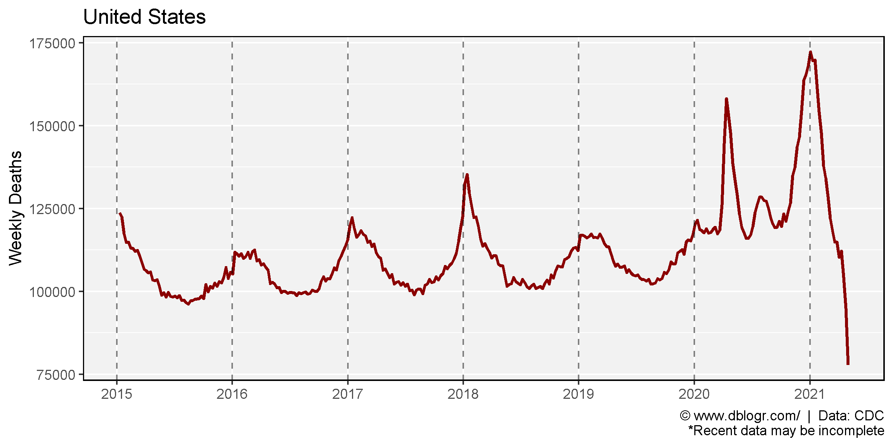

---

# Deaths Vs. Previous Years

```{r}
# Create plotting function
deathPlot2 <- function(areas = "United States") {
  # Prep data
  xx <- dd %>% filter(Area %in% areas) %>%
    mutate(Area = factor(Area, levels = areas)) %>%
    group_by(Area, Year, YearGroup, Date, JulianDate) %>% 
    summarise(Value = sum(Number.of.Deaths))
  # Plot
  ggplot(xx, aes(x = JulianDate, y = Value, group = Year, color = YearGroup, alpha = YearGroup)) +
    geom_line(size = 1, alpha = 0.8) +
    facet_wrap(Area ~ ., scales = "free_y", ncol = 5) +
    scale_color_manual(name = NULL, values = c("darkgreen","darkred", "darkorange")) +
    scale_alpha_manual(name = NULL, values = c(0.5,1,1)) +
    theme_agData(legend.position = "bottom") +
    labs(y = "Deaths Per Week",
         caption = "\xa9 www.dblogr.com/  |  Data: STATCAN")
}
```

---

## United States

```{r}
mp <- deathPlot2(areas = "United States")
ggsave("usa_deaths_2_01.png", mp, width = 6, height = 4)
```

```{r}
ggsave("featured.png", mp, width = 6, height = 4)
```

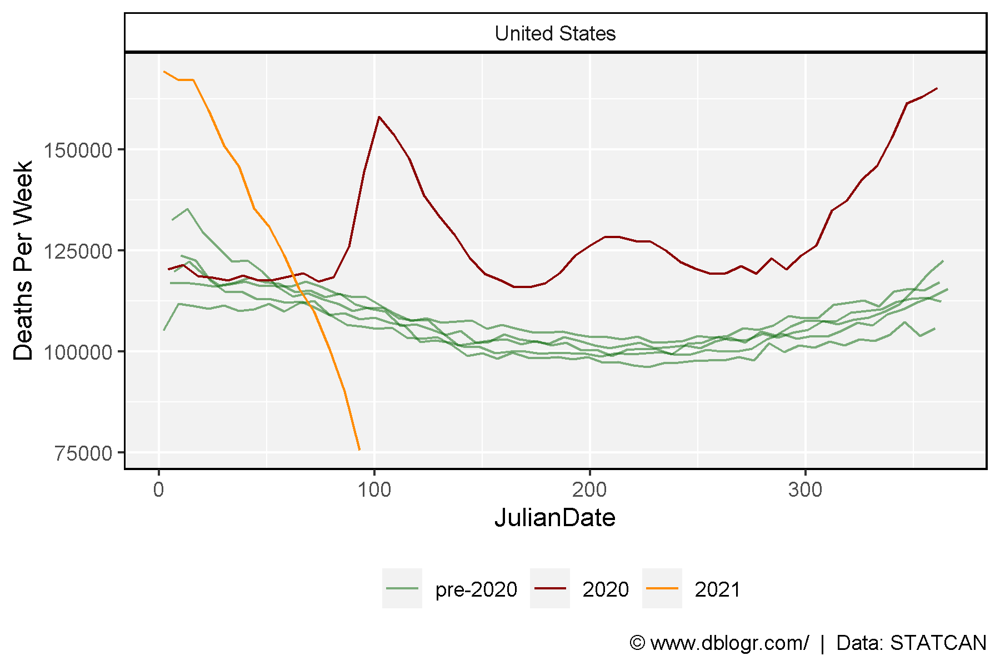

---

## New York

```{r}
mp <- deathPlot2(areas = "New York")
ggsave("usa_deaths_2_02.png", mp, width = 6, height = 4)
```

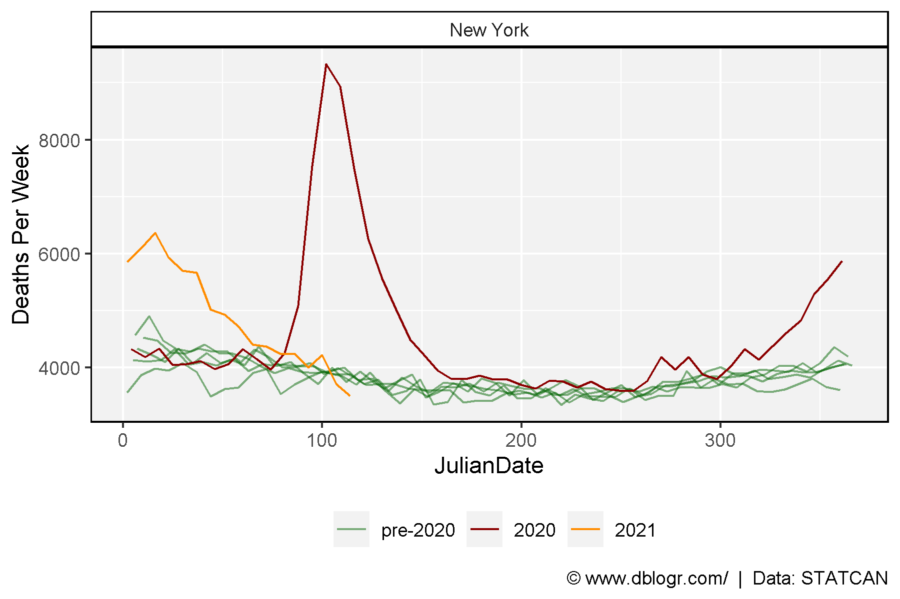

---

## New Jersey

```{r}
mp <- deathPlot2(areas = "New Jersey")
ggsave("usa_deaths_2_03.png", mp, width = 6, height = 4)
```

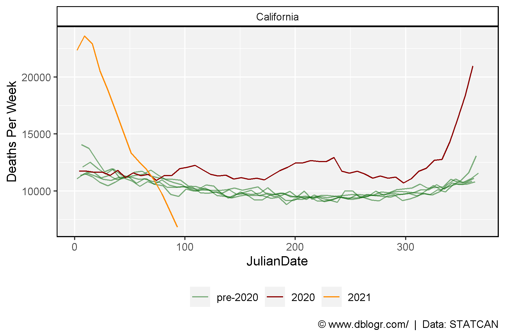

---

## California

```{r}
mp <- deathPlot2(areas = "California")
ggsave("usa_deaths_2_04.png", mp, width = 6, height = 4)
```

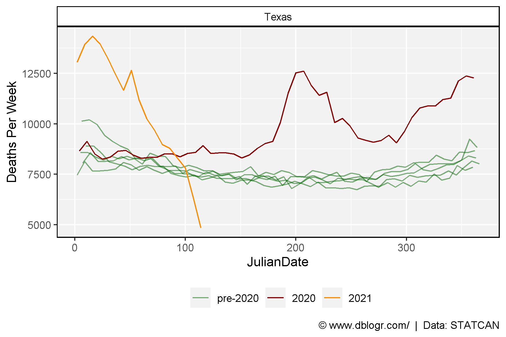

---

## Texas

```{r}
mp <- deathPlot2(areas = "Texas")
ggsave("usa_deaths_2_05.png", mp, width = 6, height = 4)
```

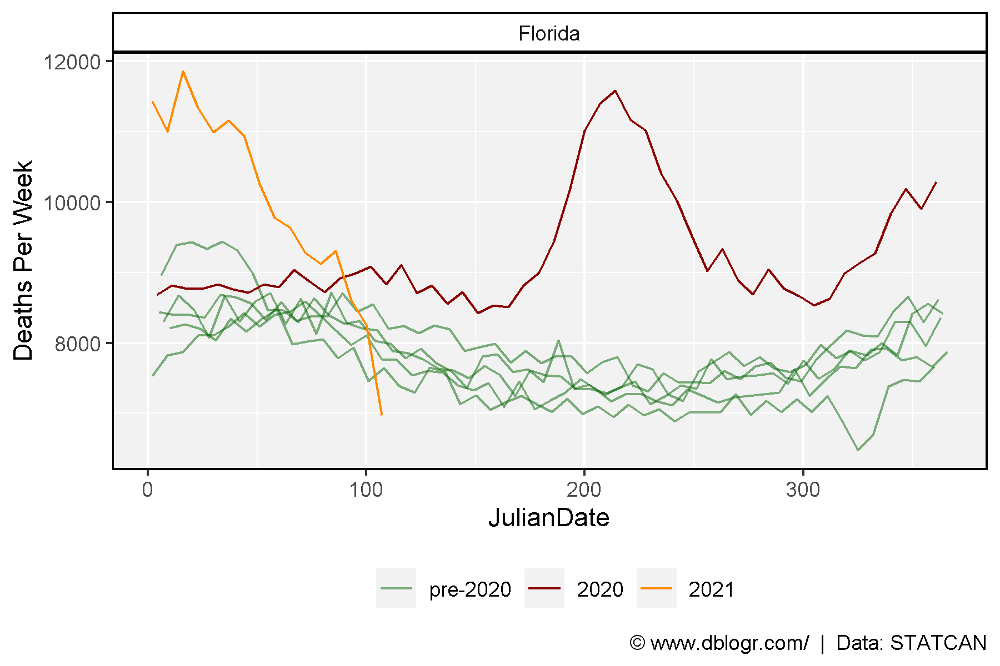

---

## Florida

```{r}
mp <- deathPlot2(areas = "Florida")
ggsave("usa_deaths_2_06.png", mp, width = 6, height = 4)
```

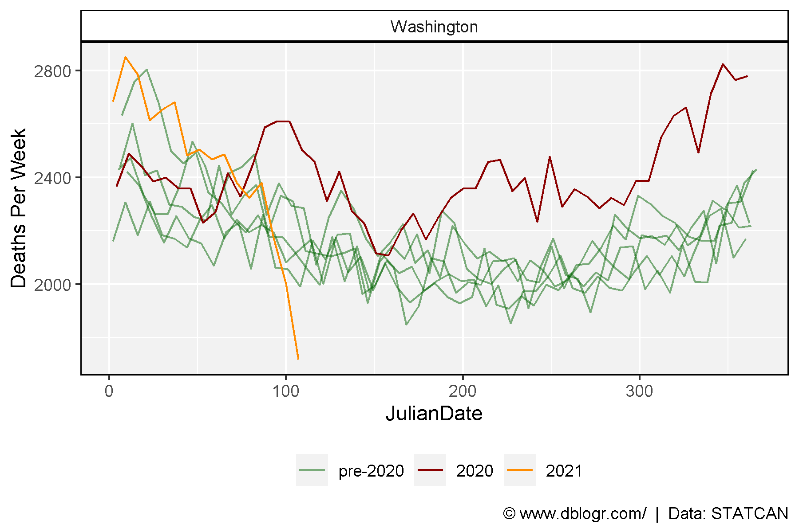

---

## Washington

```{r}
mp <- deathPlot2(areas = "Washington")
ggsave("usa_deaths_2_07.png", mp, width = 6, height = 4)
```

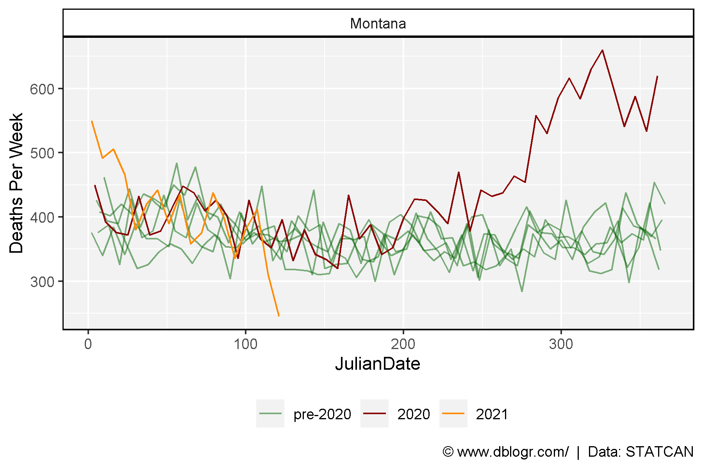

---

## Montana

```{r}
mp <- deathPlot2(areas = "Montana")
ggsave("usa_deaths_2_08.png", mp, width = 6, height = 4)
```

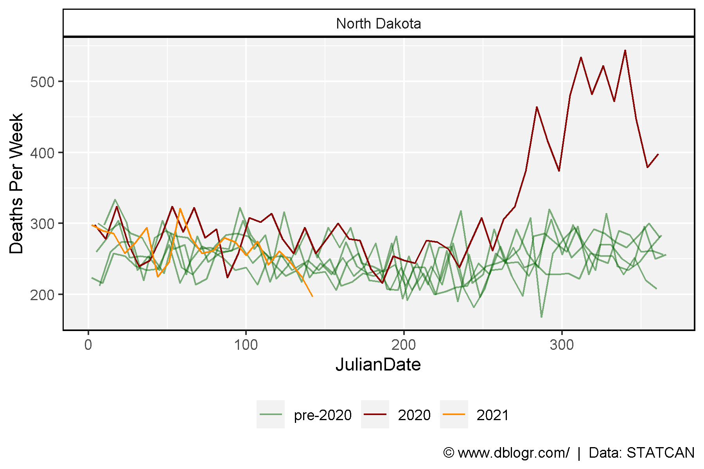

---

## North Dakota

```{r}
mp <- deathPlot2(areas = "North Dakota")
ggsave("usa_deaths_2_09.png", mp, width = 6, height = 4)
```

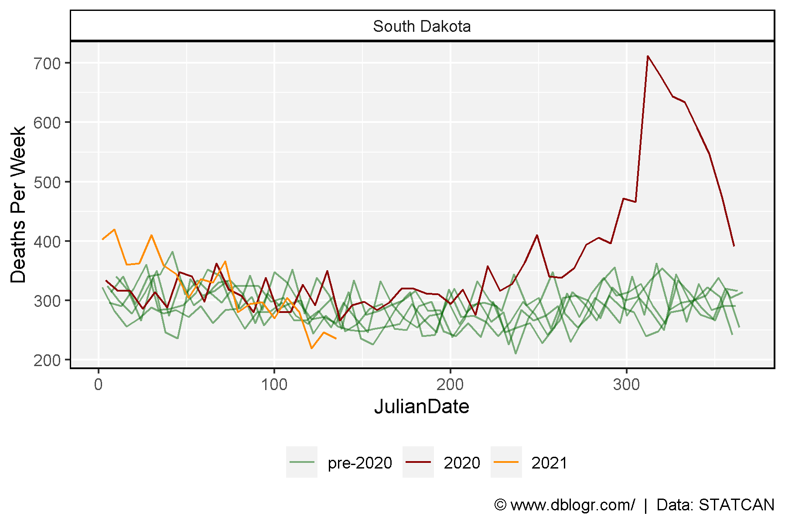

---

## South Dakota

```{r}
mp <- deathPlot2(areas = "South Dakota")
ggsave("usa_deaths_2_10.png", mp, width = 6, height = 4)
```

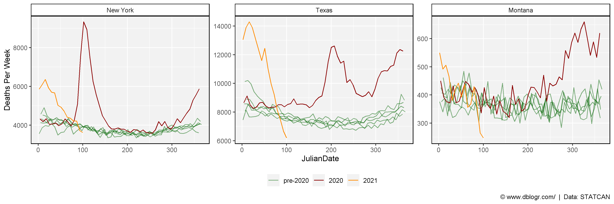

---

## Selected States

```{r}
mp <- deathPlot2(areas = c("New York", "Texas", "Montana"))
ggsave("usa_deaths_2_11.png", mp, width = 12, height = 4)
```

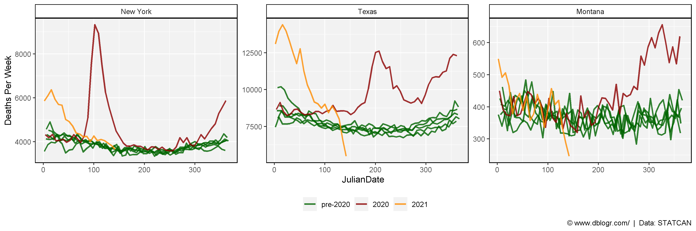

---

# Deaths by Age Group

```{r}
# Plotting function
deathPlot3 <- function(area) {
  xx <- dd %>% 
    filter(Type == "Unweighted", Area == area)
  # Plot
  ggplot(xx, aes(x = JulianDate, y = Number.of.Deaths)) +
    geom_line(aes(group = Year, color = YearGroup), alpha = 0.8) +
    facet_grid(Area ~ Age.Group) +
    scale_color_manual(values = c("darkgreen", "darkred", "darkorange")) +
    theme_agData(legend.position = "bottom") +
    labs(x = "Julian Day", y = "Weekly Deaths", 
         caption = "\xa9 www.dblogr.com/  |  Data: CDC")
}
```

---

## United States

```{r}
mp <- deathPlot3(area = "United States")
ggsave("usa_deaths_3_01.png", mp, width = 12, height = 4)
```

```{r}
ggsave("featured.png", mp, width = 12, height = 4)
```


---

## New York

```{r}
mp <- deathPlot3(area = "New York")
ggsave("usa_deaths_3_02.png", mp, width = 12, height = 4)
```

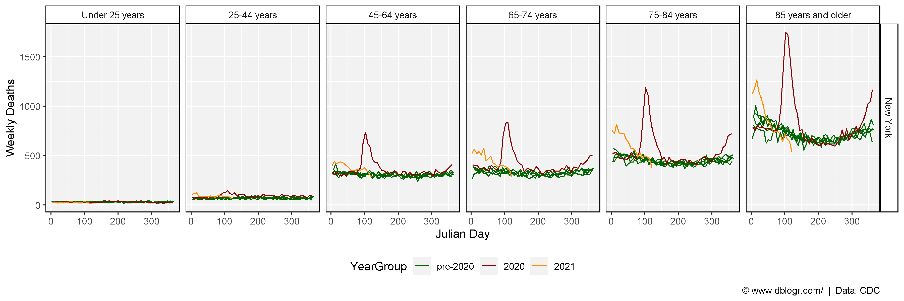

---

## New Jersey

```{r}
mp <- deathPlot3(area = "New Jersey")
ggsave("usa_deaths_3_03.png", mp, width = 12, height = 4)
```

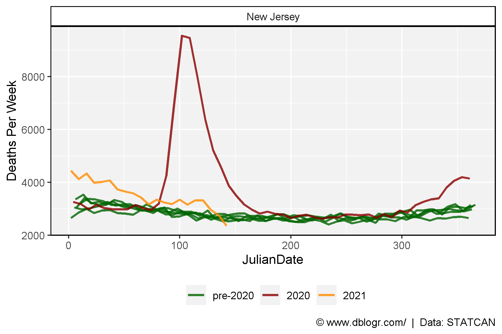

---

## California

```{r}
mp <- deathPlot3(area = "California")
ggsave("usa_deaths_3_04.png", mp, width = 12, height = 4)
```

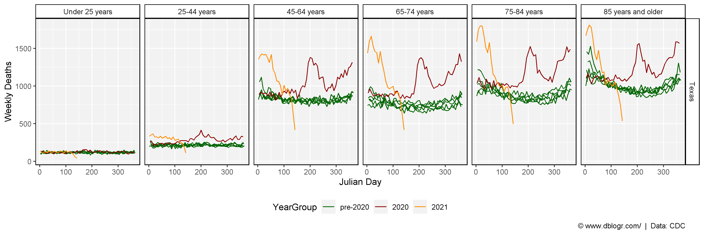

---

## Texas

```{r}
mp <- deathPlot3(area = "Texas")
ggsave("usa_deaths_3_05.png", mp, width = 12, height = 4)
```

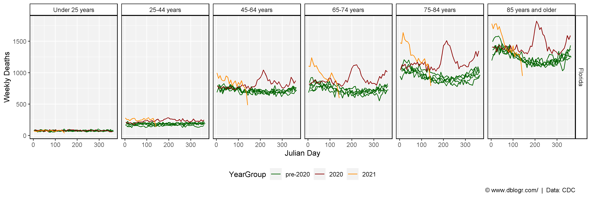

---

## Florida

```{r}
mp <- deathPlot3(area = "Florida")
ggsave("usa_deaths_3_06.png", mp, width = 12, height = 4)
```

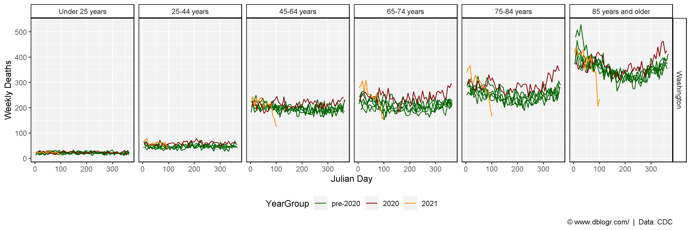

---

## Washington

```{r}
mp <- deathPlot3(area = "Washington")
ggsave("usa_deaths_3_07.png", mp, width = 12, height = 4)
```

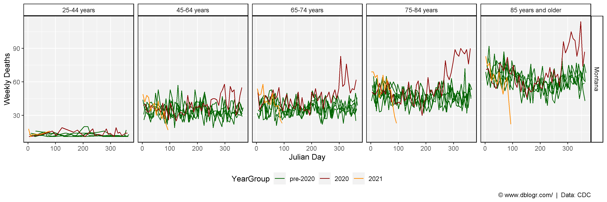

---

## Montana

```{r}
mp <- deathPlot3(area = "Montana")
ggsave("usa_deaths_3_08.png", mp, width = 12, height = 4)
```

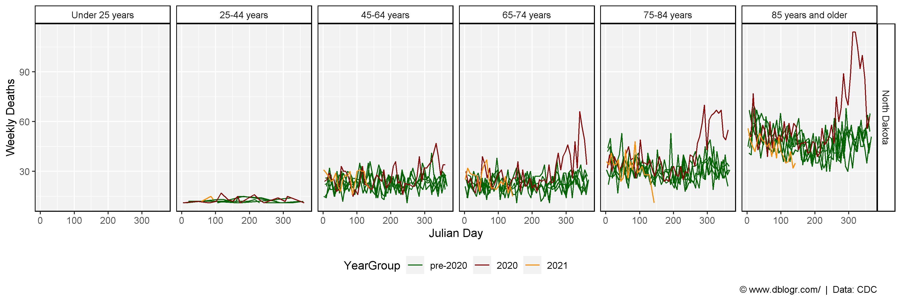

---

## North Dakota

```{r}
mp <- deathPlot3(area = "North Dakota")
ggsave("usa_deaths_3_09.png", mp, width = 12, height = 4)
```

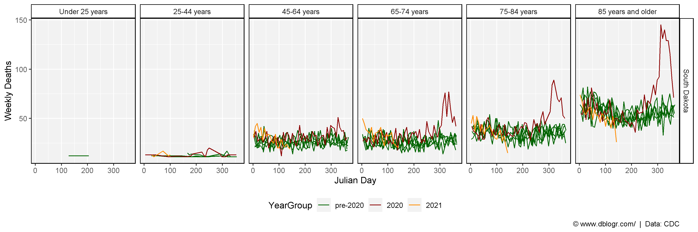

---

## South Dakota

```{r}
mp <- deathPlot3(area = "South Dakota")
ggsave("usa_deaths_3_10.png", mp, width = 12, height = 4)
```

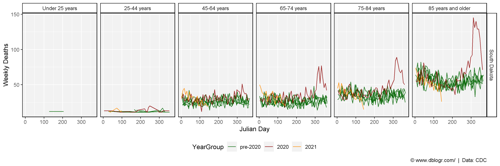

---

# Death Rates

```{r}
# Prep data
xx <- dd %>% 
  filter(Year > 2019, Type == "Unweighted") %>%
  group_by(Area, State.Abbreviation, Date) %>%
  summarise(Number.of.Deaths = sum(Number.of.Deaths, na.rm = T)) %>%
  ungroup() %>% 
  left_join(pp, by = "Area") %>%
  mutate(Death.Rate = 1000000 * Number.of.Deaths / Population)
# Plot
mp <- ggplot(xx, aes(x = Date, y = Death.Rate)) +
  geom_line(color = "darkred", alpha = 0.8) +
  facet_wrap(Area ~ .) +
  scale_color_manual(values = agData_Colors) +
  theme_agData() +
  labs(x = NULL, y = "Deaths per million people per week", 
       caption = "\xa9 www.dblogr.com/  |  Data: CDC")
ggsave("usa_deaths_4_01.png", mp, width = 12, height = 12)
```

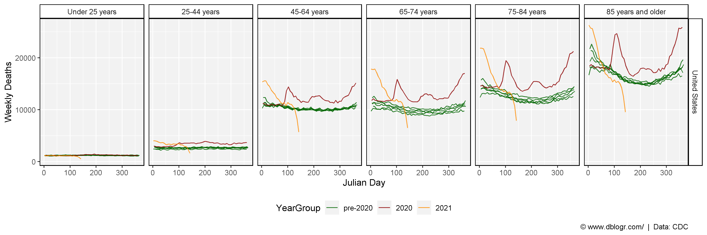

---

## North vs South Dakota

```{r}
# Prep data
x1 <- xx %>% filter(State.Abbreviation %in% c("SD","ND"))
# Plot
mp <- ggplot(x1, aes(x = Date, y = Death.Rate, color = Area)) +
  geom_line() +
  scale_color_manual(values = c("darkblue","steelblue")) +
  theme_agData(legend.position = "bottom") +
  labs(x = NULL, y = "Deaths per million people per week", 
       caption = "\xa9 www.dblogr.com/  |  Data: CDC")
ggsave("usa_deaths_4_02.png", mp, width = 6, height = 4)
```

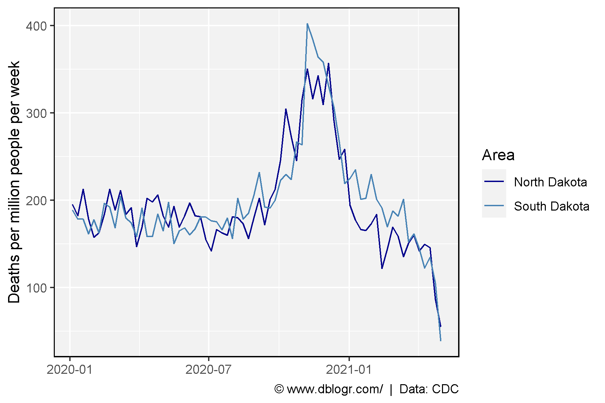

---

## California vs Texas

```{r}
# Prep data
x1 <- xx %>% filter(State.Abbreviation %in% c("CA","TX"))
# Plot
mp <- ggplot(x1, aes(x = Date, y = Death.Rate, color = Area)) +
  geom_line() +
  scale_color_manual(values = c("darkred","darkblue")) +
  theme_agData(legend.position = "bottom") +
  labs(x = NULL, y = "Deaths per million people per week", 
       caption = "\xa9 www.dblogr.com/  |  Data: CDC")
ggsave("usa_deaths_4_03.png", mp, width = 6, height = 4)
```

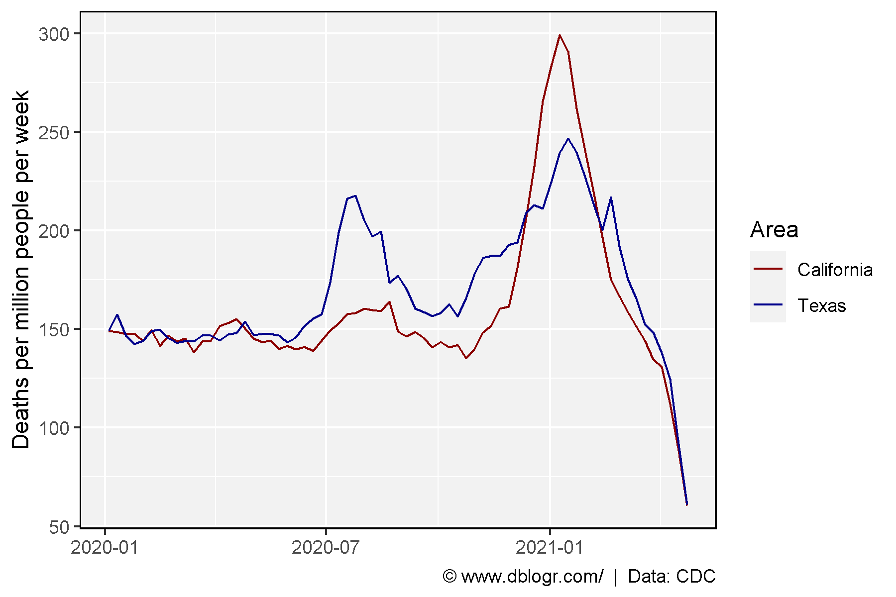

---

## New York vs New Jersey vs Florida

```{r}
# Prep data
colors <- c("darkred", "darkblue", "steelblue")
x1 <- xx %>% filter(State.Abbreviation %in% c("FL","NY","NJ"))
# Plot
mp <- ggplot(x1, aes(x = Date, y = Death.Rate, color = Area)) +
  geom_line() +
  scale_color_manual(values = colors) +
  theme_agData(legend.position = "bottom") +
  labs(x = NULL, y = "Deaths per million people per week", 
       caption = "\xa9 www.dblogr.com/  |  Data: CDC")
ggsave("usa_deaths_4_04.png", mp, width = 6, height = 4)
```

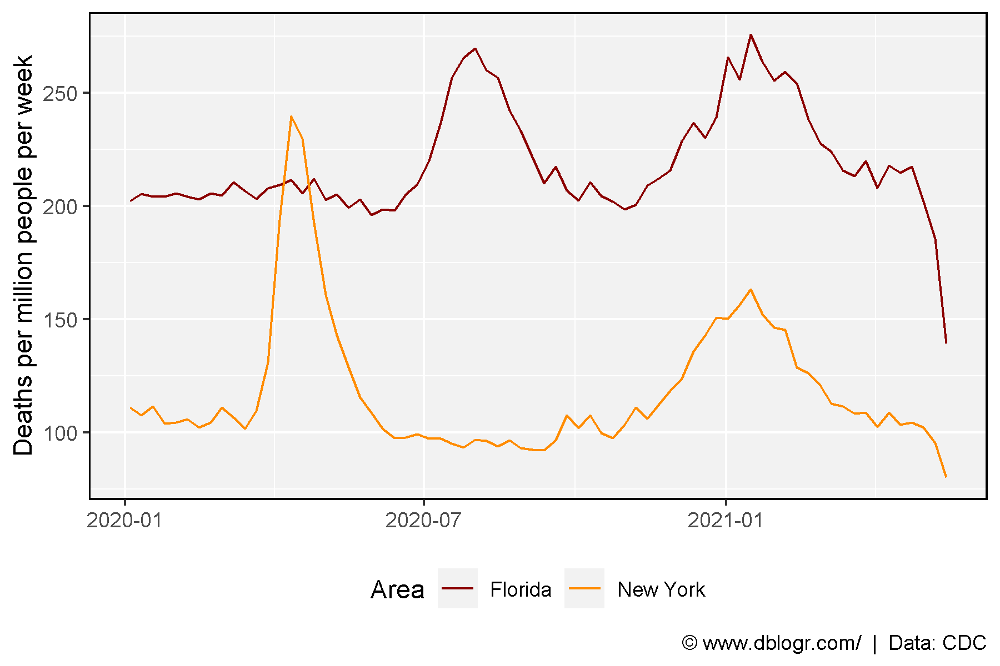

---

```{r}
# Prep data
xx <- dd %>% 
  filter(Type == "Unweighted",
         State.Abbreviation %in% c("FL","NY","NJ")) %>%
  group_by(Area, State.Abbreviation, Date) %>%
  summarise(Number.of.Deaths = sum(Number.of.Deaths, na.rm = T)) %>%
  ungroup() %>% 
  left_join(pp, by = "Area") %>%
  mutate(Death.Rate = 1000000 * Number.of.Deaths / Population)
# Plot
mp <- ggplot(xx, aes(x = Date, y = Death.Rate, color = Area)) +
  geom_line() +
  scale_color_manual(values = colors) +
  theme_agData(legend.position = "bottom") +
  labs(x = NULL, y = "Deaths per million people per week", 
       caption = "\xa9 www.dblogr.com/  |  Data: CDC")
ggsave("usa_deaths_4_05.png", mp, width = 6, height = 4)
```

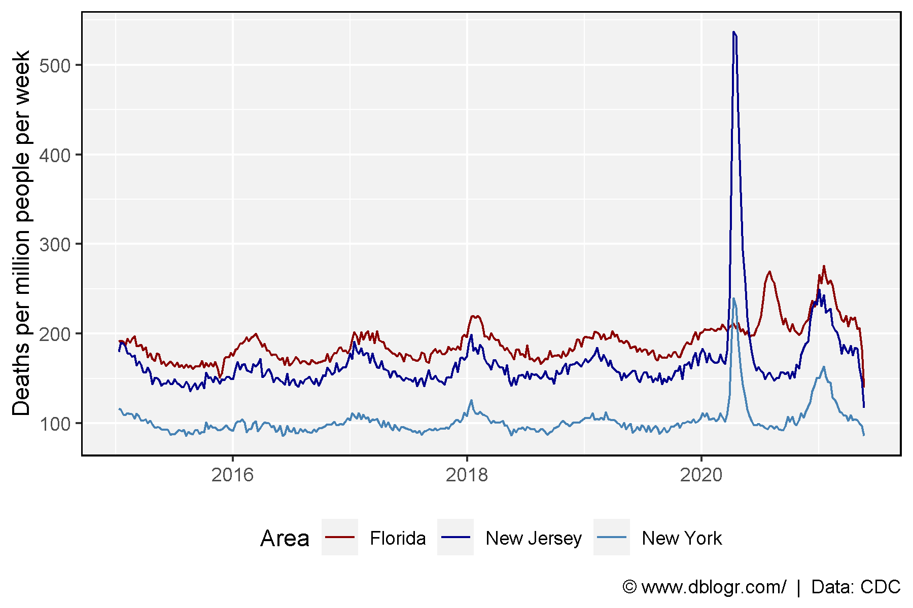

---

# All States

```{r}
# Prep data
xx <- dd %>% 
  filter(Type == "Unweighted") %>%
  group_by(Area, State.Abbreviation, Date) %>%
  summarise(Number.of.Deaths = sum(Number.of.Deaths, na.rm = T)) %>%
  ungroup() %>% 
  left_join(pp, by = "Area") %>%
  mutate(Death.Rate = 1000000 * Number.of.Deaths / Population)
# Plot
mp <- ggplot(xx, aes(x = Date, y = Death.Rate, group = Area)) +
  geom_line(color = "darkred", alpha = 0.4, size = 0.5) +
  scale_color_manual(values = colors) +
  theme_agData(legend.position = "bottom") +
  labs(x = NULL, y = "Deaths per million people per week", 
       caption = "\xa9 www.dblogr.com/  |  Data: CDC")
ggsave("usa_deaths_4_06.png", mp, width = 6, height = 4)
```

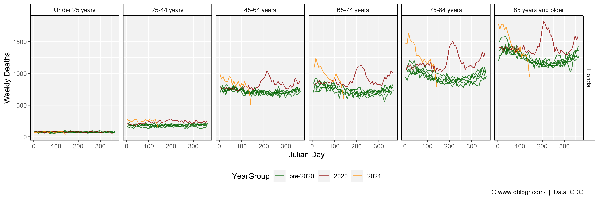

---

&copy; Derek Michael Wright 2020 [www.dblogr.com/](https://dblogr.netlify.com/)