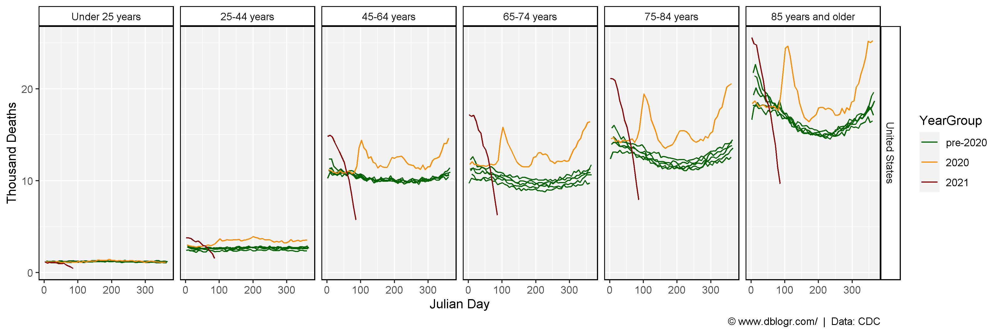
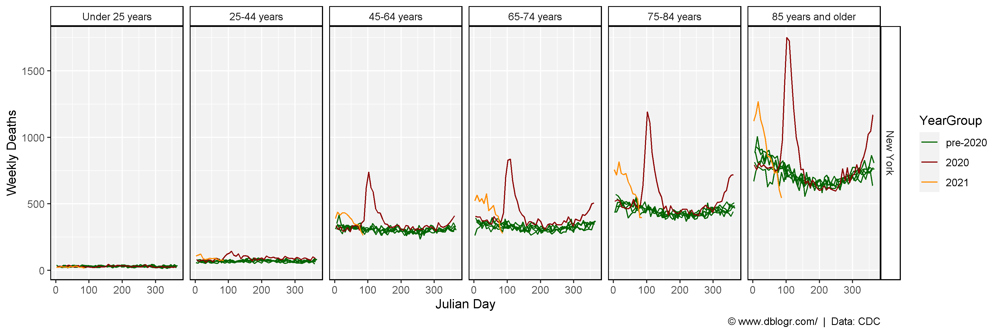
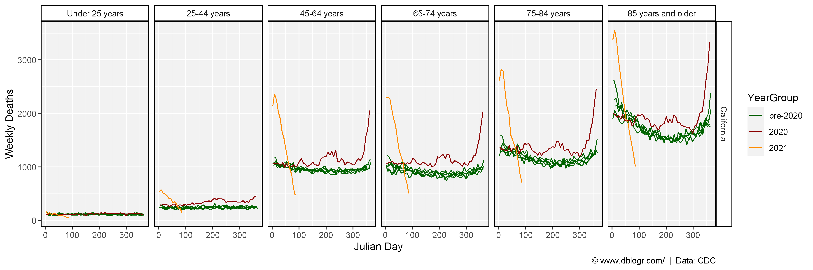
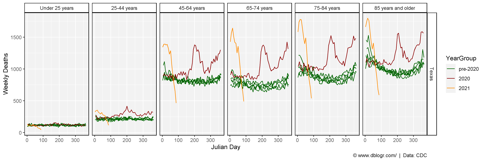
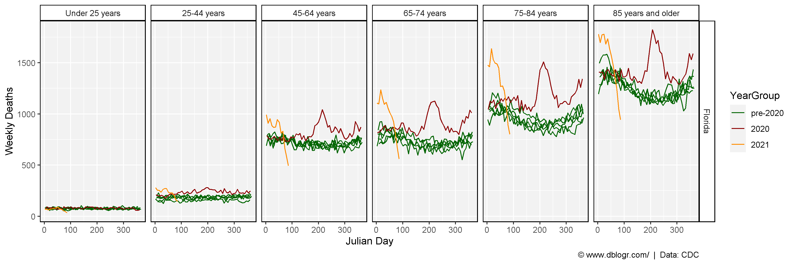
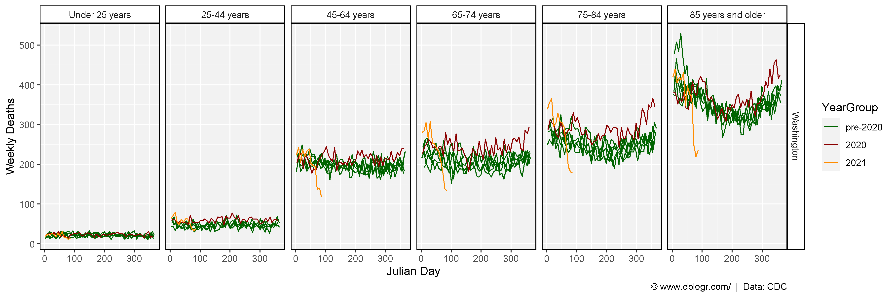
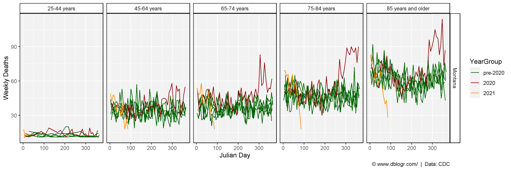
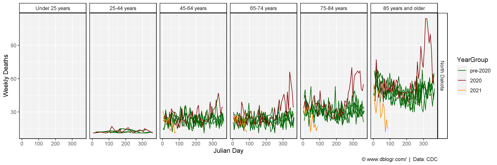
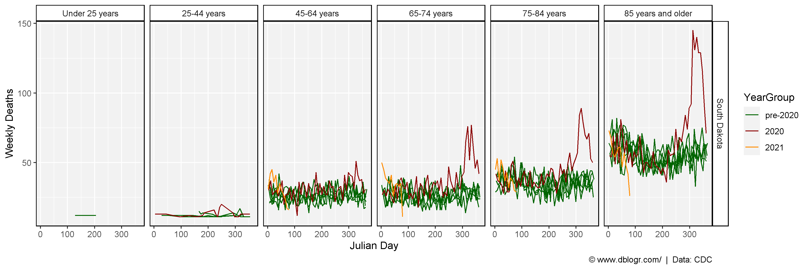

```{r setup, include=FALSE}
knitr::opts_chunk$set(echo = TRUE, message = F, warning = F)
```

---

# Introduction

https://www.cdc.gov/nchs/nvss/vsrr/covid19/excess_deaths.htm#dashboard

```{r}
# devtools::install_github("derekmichaelwright/agData")
library(agData) # Loads: tidyverse, ggpubr, ggbeeswarm, ggrepel
```

---

# Prepare Data

```{r}
# Prep data
ages <- c("Under 25 years", "25-44 years", "45-64 years", "65-74 years", "75-84 years", "85 years and older")
dd <- read.csv("https://data.cdc.gov/api/views/y5bj-9g5w/rows.csv?accessType=DOWNLOAD&bom=true&format=true%20target=") %>%
  rename(Area=1, Date=Week.Ending.Date) %>%
  mutate(Date = as.Date(Date, format = "%m/%d/%Y"),
         JulianDate = lubridate::yday(Date),
         Age.Group = factor(Age.Group, levels = ages),
         Year = as.numeric(substr(Date, 1, 4))
         )
```

```{r}
# Plotting function
deathPlot <- function(area) {
  xx <- dd %>% 
    filter(Type == "Unweighted", Area == area) %>%
    mutate(YearGroup = ifelse(Year<2020, "pre-2020", Year),
           YearGroup = factor(YearGroup, levels = c("pre-2020", "2020", "2021")))
  # Plot
  ggplot(xx, aes(x = JulianDate, y = Number.of.Deaths)) +
    geom_line(aes(group = Year, color = YearGroup)) +
    facet_grid(Area ~ Age.Group) +
    scale_color_manual(values = c("darkgreen", "darkred", "darkorange")) +
    theme_agData() +
    labs(x = "Julian Day", y = "Weekly Deaths", 
         caption = "\xa9 www.dblogr.com/  |  Data: CDC")
}
```

---

# United States

```{r}
mp <- deathPlot(area = "United States")
ggsave("usa_deaths_01.png", mp, width = 12, height = 4)
```

```{r}
ggsave("featured.png", mp, width = 12, height = 4)
```



---

# New York

```{r}
mp <- deathPlot(area = "New York")
ggsave("usa_deaths_02.png", mp, width = 12, height = 4)
```



---

# California

```{r}
mp <- deathPlot(area = "California")
ggsave("usa_deaths_03.png", mp, width = 12, height = 4)
```



---

# Texas

```{r}
mp <- deathPlot(area = "Texas")
ggsave("usa_deaths_04.png", mp, width = 12, height = 4)
```



---

# Florida

```{r}
mp <- deathPlot(area = "Florida")
ggsave("usa_deaths_05.png", mp, width = 12, height = 4)
```



---

# Washington

```{r}
mp <- deathPlot(area = "Washington")
ggsave("usa_deaths_06.png", mp, width = 12, height = 4)
```



---

# Montana

```{r}
mp <- deathPlot(area = "Montana")
ggsave("usa_deaths_07.png", mp, width = 12, height = 4)
```



---

# North Dakota

```{r}
mp <- deathPlot(area = "North Dakota")
ggsave("usa_deaths_08.png", mp, width = 12, height = 4)
```



---

# South Dakota

```{r}
mp <- deathPlot(area = "South Dakota")
ggsave("usa_deaths_09.png", mp, width = 12, height = 4)
```



---

&copy; Derek Michael Wright 2020 [www.dblogr.com/](https://dblogr.netlify.com/)