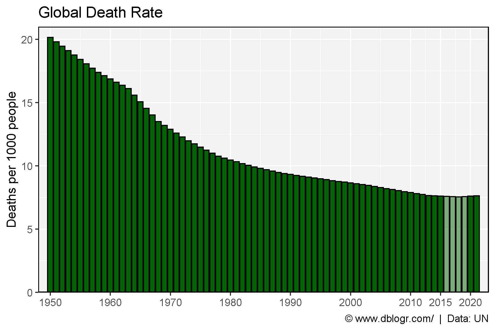
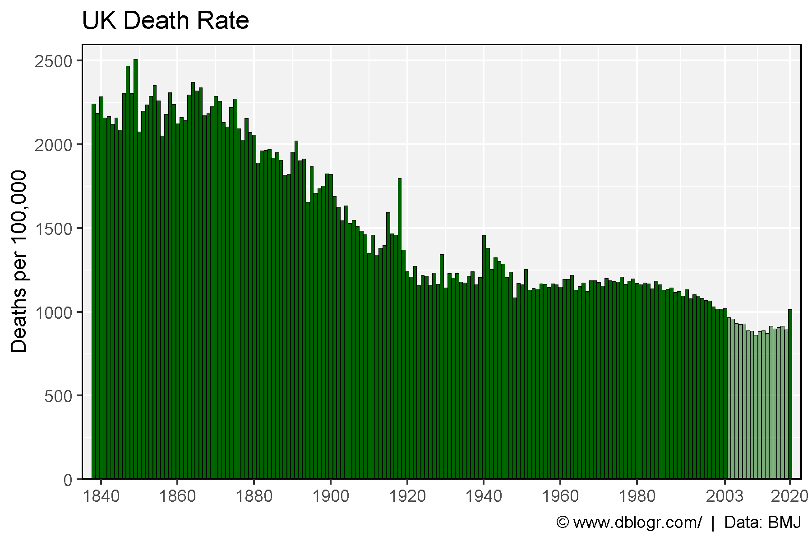
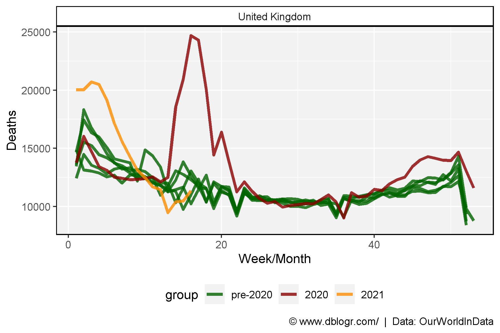
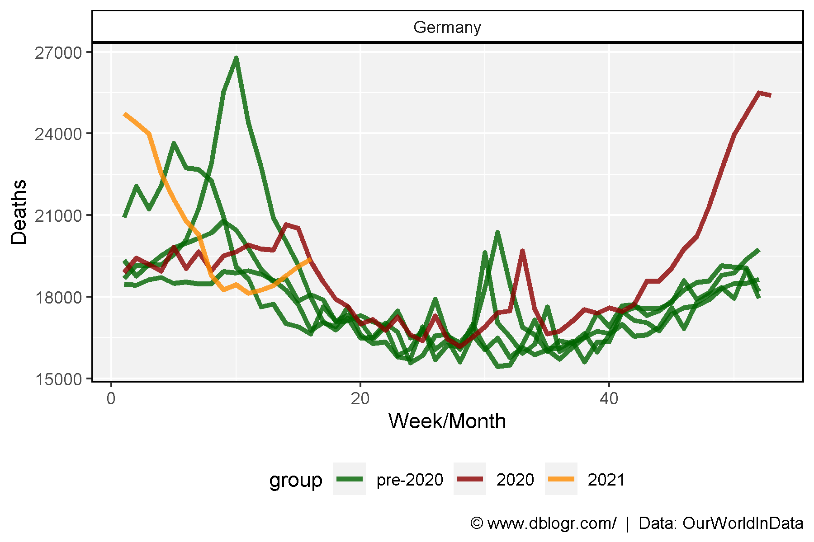
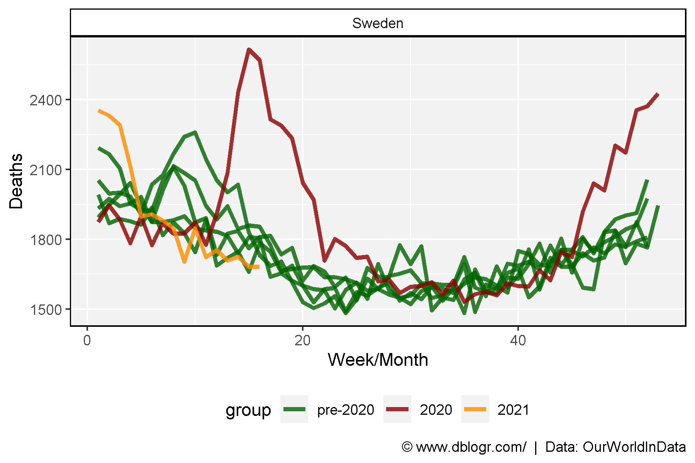
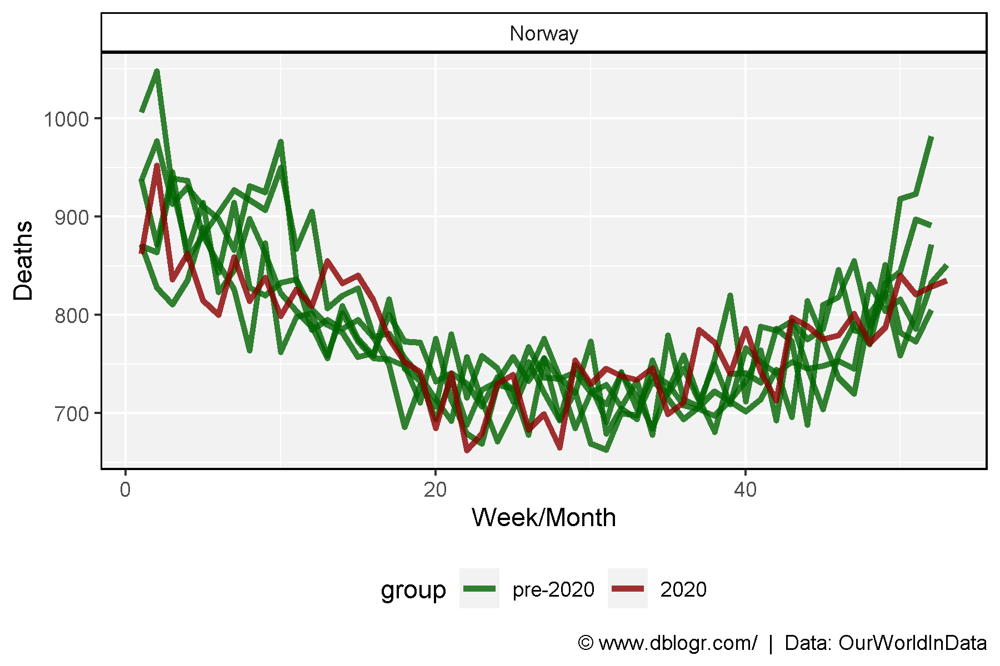
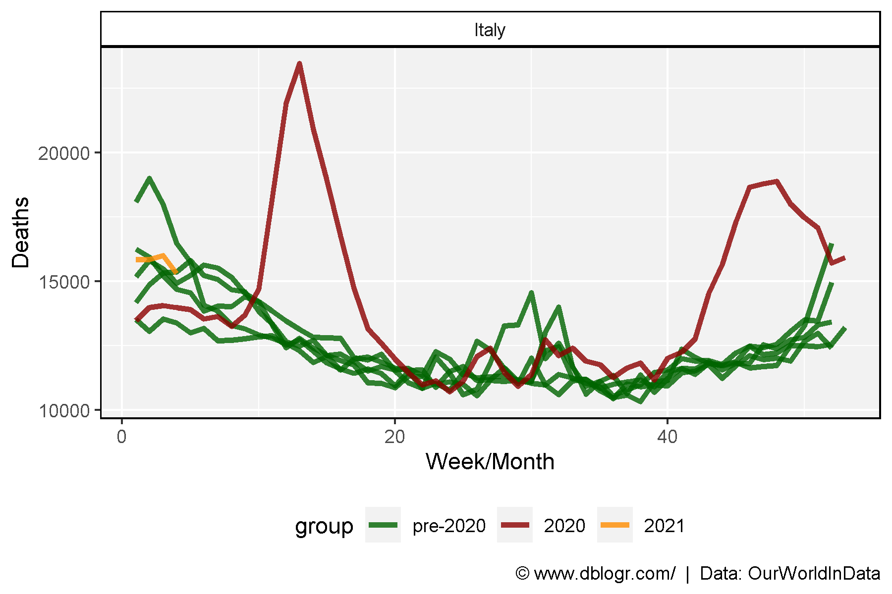
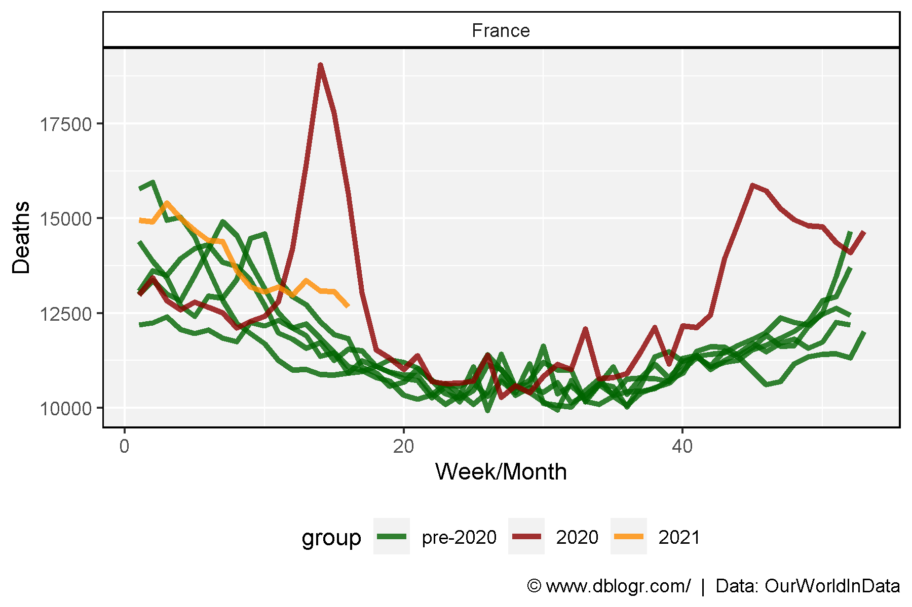
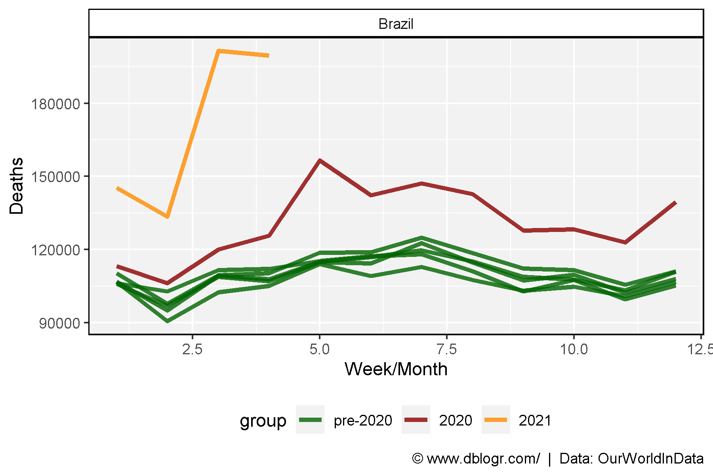
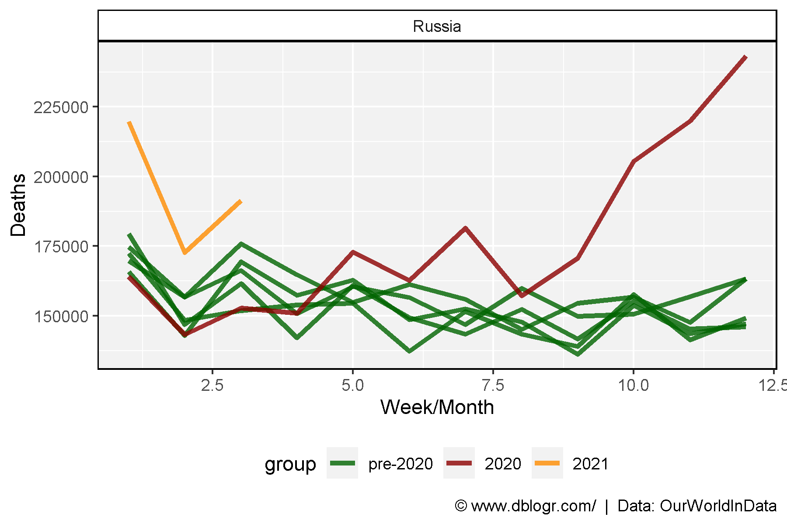

```{r setup, include=FALSE}
knitr::opts_chunk$set(echo = TRUE, message = F, warning = F)
```

---

# Data Sources

https://www.macrotrends.net/countries/WLD/world/death-rate

https://www.bmj.com/content/373/bmj.n896

https://ourworldindata.org/excess-mortality-covid

```{r echo = F}
downloadthis::download_link(
  link = "https://github.com/derekmichaelwright/dblogr/blob/master/content/dblogr/world_deaths/deaths_world_data.csv",
  button_label = "deaths_world_data.csv",
  button_type = "success",
  has_icon = TRUE,
  icon = "fa fa-save",
  self_contained = FALSE
)
downloadthis::download_link(
  link = "https://github.com/derekmichaelwright/dblogr/blob/master/content/dblogr/world_deaths/deaths_uk_data.csv",
  button_label = "deaths_uk_data.csv",
  button_type = "success",
  has_icon = TRUE,
  icon = "fa fa-save",
  self_contained = FALSE
)
downloadthis::download_link(
  link = "https://github.com/derekmichaelwright/dblogr/blob/master/content/dblogr/world_deaths/world_mortality.csv",
  button_label = "world_mortality.csv",
  button_type = "success",
  has_icon = TRUE,
  icon = "fa fa-save",
  self_contained = FALSE
)
```

---

# Perpare Data

```{r echo = F}
xx <- read.csv("https://raw.githubusercontent.com/akarlinsky/world_mortality/main/world_mortality.csv")
write.csv(xx, "world_mortality.csv", row.names = F)
```

```{r}
# devtools::install_github("derekmichaelwright/agData")
library(agData) # Loads: tidyverse, ggpubr, ggbeeswarm, ggrepel
# d1 = World
d1 <- read.csv("deaths_world_data.csv")
xx <- d1 %>% filter(Year == 2020) %>% pull(Death.Rate)
d1 <- d1 %>% mutate(Group = ifelse(Death.Rate >= xx, "higher", "Lower"))
# d2 = UK
d2 <- read.csv("deaths_uk_data.csv") %>%
  rename(Death.Rate = Crude.mortaity.rate..per.100.000.population.) %>%
  mutate(Death.Rate = as.numeric(gsub(",", "", Death.Rate)))
xx <- d2 %>% filter(Year == 2020) %>% pull(Death.Rate)
d2 <- d2 %>% mutate(Group = ifelse(Death.Rate >= xx, "higher", "Lower"))
# d3 = Weekly deaths
d3 <- read.csv("world_mortality.csv") %>%
  rename(area=1) %>% filter(year != 0) %>%
  mutate(group = ifelse(year < 2020, "pre-2020", year),
         group = factor(group, levels = c("pre-2020","2020","2021")),
         year = factor(year))
```

---

# World

```{r}
# Plot
mp <- ggplot(d1, aes(x = Year, y = Death.Rate, fill = Group)) +
  geom_bar(stat = "identity", color = "black") +
  scale_fill_manual(values = c("darkgreen", alpha("darkgreen",0.5))) +
  scale_x_continuous(breaks = c(seq(1950, 2010, 10), 2015, 2020)) +
  coord_cartesian(expand = 0, ylim = c(0,21), xlim = c(1948,2023)) +
  theme_agData(legend.position = "none") +
  labs(title = "Global Death Rate",
       y = "Deaths per 1000 people", x = NULL,
       caption = "\xa9 www.dblogr.com/  |  Data: UN")
ggsave("world_deaths_01.png", mp, width = 6, height = 4)
```



---

# UK

```{r}
# Plot
mp <- ggplot(d2, aes(x = Year, y = Death.Rate, fill = Group)) +
  geom_bar(stat = "identity", color = "black", size = 0.1) +
  scale_fill_manual(values = c("darkgreen", alpha("darkgreen",0.5))) +
  scale_x_continuous(breaks = c(seq(1840, 1980, 20), 2003, 2020)) +
  coord_cartesian(expand = 0, ylim = c(0,2600), xlim = c(1835,2023)) +
  theme_agData(legend.position = "none") +
  labs(title = "UK Death Rate", y = "Deaths per 100,000", x = NULL,
       caption = "\xa9 www.dblogr.com/  |  Data: BMJ")
ggsave("world_deaths_02.png", mp, width = 6, height = 4)
```

```{r}
ggsave("featured.png", mp, width = 6, height = 4)
```



---

# Weekly Deaths

```{r}
# Create plotting function
deathPlot <- function(Area = "Germany") {
  # Prep data
  xi <- d3 %>% filter(area == Area)
  # Plot
  ggplot(xi, aes(x = time, y = deaths, group = year, color = group)) +
    geom_line(size = 1.25, alpha = 0.8) +
    facet_wrap(area ~ .) +
    scale_color_manual(values = c("darkgreen", "darkred", "darkorange")) +
    theme_agData(legend.position = "bottom") +
    labs(y = "Deaths", x = "Week/Month",
         caption = "\xa9 www.dblogr.com/  |  Data: OurWorldInData")
}
```

## UK

```{r}
mp <- deathPlot(Area = "United Kingdom")
ggsave("world_deaths_03.png", mp, width = 6, height = 4)
```



---

## Germany

```{r}
mp <- deathPlot(Area = "Germany")
ggsave("world_deaths_04.png", mp, width = 6, height = 4)
```



---

## Sweden

```{r}
mp <- deathPlot(Area = "Sweden")
ggsave("world_deaths_05.png", mp, width = 6, height = 4)
```



---

## Norway

```{r}
mp <- deathPlot(Area = "Norway")
ggsave("world_deaths_06.png", mp, width = 6, height = 4)
```



---

## Italy

```{r}
mp <- deathPlot(Area = "Italy")
ggsave("world_deaths_07.png", mp, width = 6, height = 4)
```



---

## France

```{r}
mp <- deathPlot(Area = "France")
ggsave("world_deaths_08.png", mp, width = 6, height = 4)
```



---

## Brazil

```{r}
mp <- deathPlot(Area = "Brazil")
ggsave("world_deaths_09.png", mp, width = 6, height = 4)
```



---

## Russia

```{r}
mp <- deathPlot(Area = "Russia")
ggsave("world_deaths_10.png", mp, width = 6, height = 4)
```



---

&copy; Derek Michael Wright 2020 [www.dblogr.com/](https://dblogr.netlify.com/)