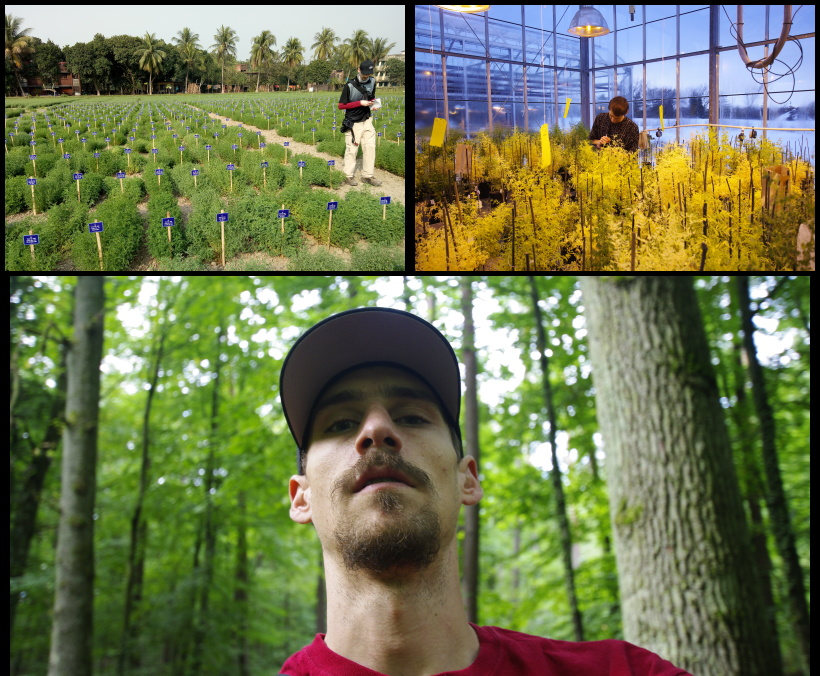
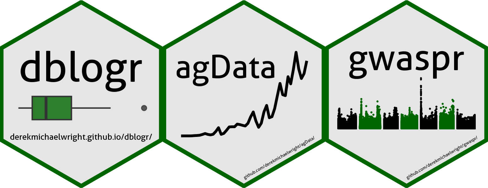
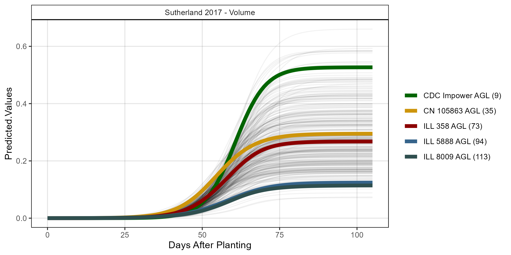
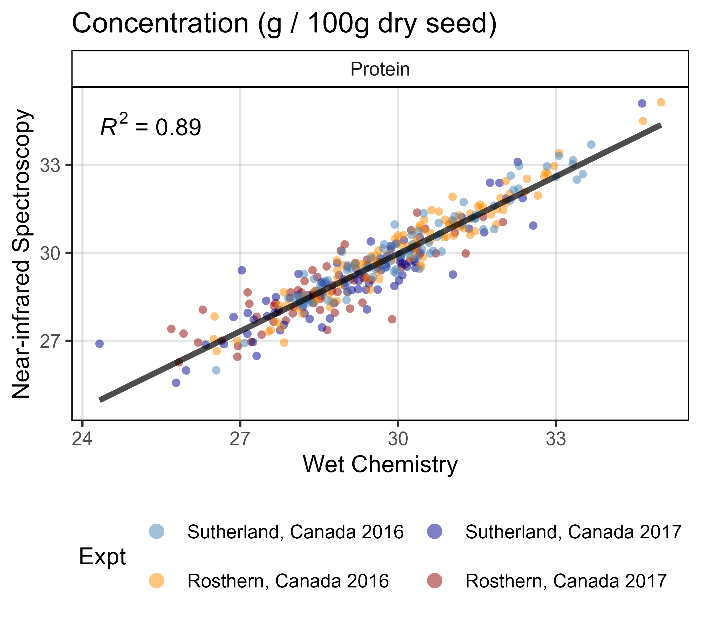
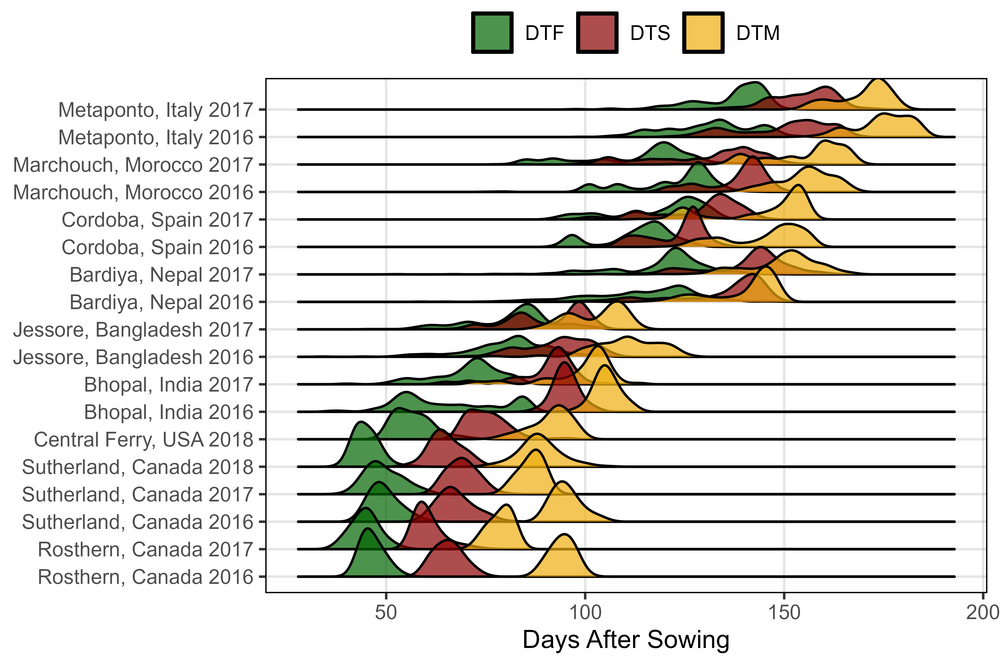
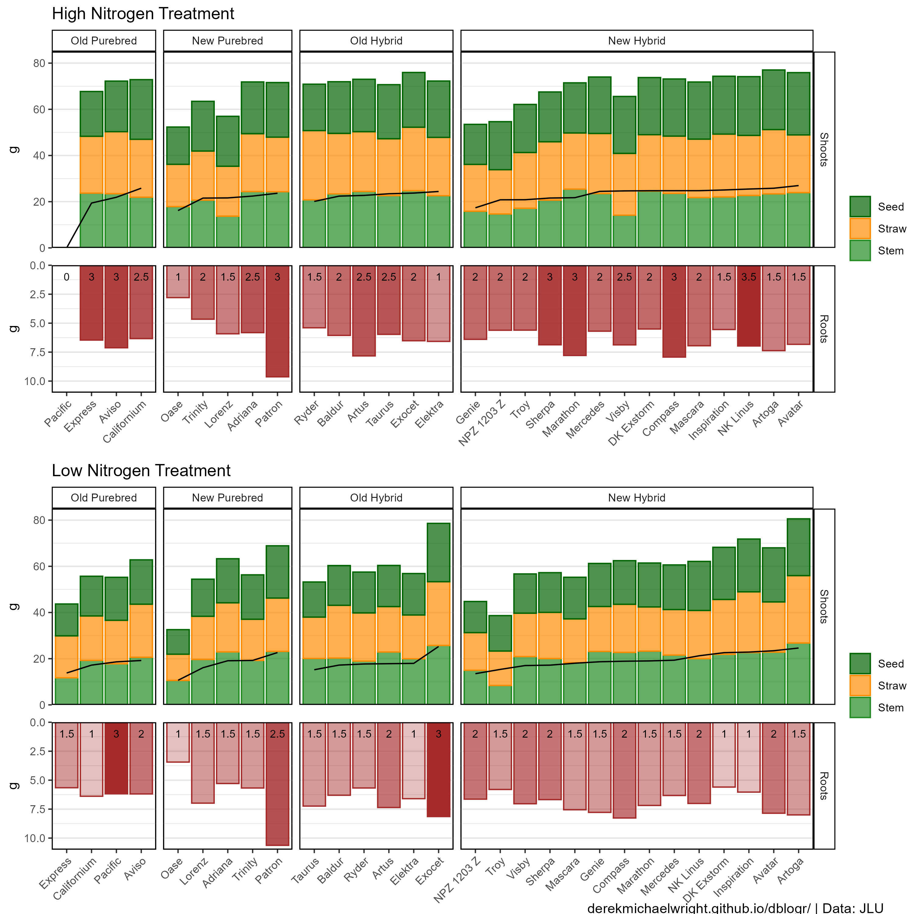

---
output:
  pagedown::html_resume: 
    self_contained: yes
---

Aside
====================================

{width=100%}

View CV as:  <i class="fas fa-file-pdf"></i> [PDF](https://derekmichaelwright.github.io/dblogr/cv.wright.derek.pdf){target="_blank"} <i class="fa fa-globe"></i> [HTML](https://derekmichaelwright.github.io/dblogr/cv){target="_blank"}

### <i class="fa fa-flask"></i> Skills {#skills}

- <i class="fa fa-camera"></i> &nbsp; Photography
- <i class="fas fa-dna"></i> &nbsp; Biology &Genomics
- <i class="fa fa-line-chart"></i> &nbsp; Data Analytics & Visualization
- <i class="fab fa-r-project"></i> &nbsp; The R Project

### <i class="fa fa-address-card"></i> Contact {#contact}

- <i class="fa fa-phone"></i> &nbsp; +1 306-220-0645
- <i class="fa fa-envelope"></i> &nbsp; wrightmderek@gmail.com
- <i class="fa fa-envelope-o"></i> &nbsp; derek.wright@usask.ca
- <i class="fa fa-twitter-square"></i> &nbsp; [@DerekMWright](https://twitter.com/DerekMWright){target="_blank"}
- <i class="fa fa-github"></i> &nbsp; [github.com/derekmichaelwright](https://github.com/derekmichaelwright){target="_blank"}

### <i class="fa fa-globe"></i> Website

[derekmichaelwright.github.io/dblogr/](https://derekmichaelwright.github.io/dblogr/){target="_blank"}

{width=80%}

Main
================================================================================

Derek Michael Wright {#title}
--------------------------------------------------------------------------------

I graduated with a **BSc in Biology** from the [*University of Regina*](https://www.uregina.ca/){target="_blank"} in 2012, followed by a **MSc in Agrobiotechnology** from [*Justus-Liebig-Universität Gießen*](https://www.uni-giessen.de/){target="_blank"} (*University of Giessen, Germany*) in 2015. I now work in the Plant Sciences department at the [*University of Saskatchewan*](https://www.usask.ca/){target="_blank"} and have been involved in four research projects ([**AGILE**](https://knowpulse.usask.ca/study/2675314){target="_blank"}, [**EVOLVES**](https://knowpulse.usask.ca/study/2691111){target="_blank"}, [**P2IRC**](https://p2irc.usask.ca/index.php){target="_blank"} & [**ACTIVATE**](https://activating-crops.usask.ca/){target="_blank"}) with **lentil** (*Lens culinaris*). 

I have done extensive work with a lentil diversity panel, NAM and inter-specific RIL populations. I am very fluent in <i class="fab fa-r-project"></i> and have plenty of experience with data analysis such as modeling, PCA, GxE, GWAS and QTL analyses. I have recently been working with data acquisition from UAV and seed imaging systems and can handle data wrangling and visualization of large, high-throughput data sets.

Research Experience & Education {data-icon=graduation-cap data-concise=true}
--------------------------------------------------------------------------------

### University of Saskatchewan

Research Assistant

Saskatoon, Saskatchewan, Canada

Current - 2015

::: concise
  * Coordinate field trials
  * Seed setup
  * Post-harvest processing
  * Data collection & analysis
  * Presentations
  * Collaborations
:::

### Cargil Specialty Seeds and Oils

Research Assistant (Internship)

Aberdeen, Saskatchewan, Canada

2015 

::: concise
  * Data collection & analysis
  * Pathology (blackleg)
:::  

### M.Sc. in Agrobiotechnology

University of Giessen

Giessen, Hesse, Germany

2015 - 2013

::: concise
  * Biotechnology and Genomics
  * Molecular Phytopathology
  * Plant Microbe Interactions
  * Plant Protection and Bioengeneering
  * Microbial-Food-Biotechnology
  * Applied Statistics and Bioinformatics
  * Molecular Plant Breeding
  * Molecular Entomology
  * Tissue Culturing and Genetic Transformation
:::

### B.Sc. Biology

University of Regina

Regina, Saskatchewan, Canada

2012 - 2007

::: concise
  * Limnology
  * Environmental Microbiology
  * Global Biogeochemistry
  * Stable Isotope Ecology
  * Vertebrate Animal Biology
  * Advanced Plant Physiology
  * Molecular Genetics
  * Bacterial Genetics
:::

<i class="fab fa-r-project"></i> Packages {data-icon=code}
--------------------------------------------------------------------------------

### agData: an <i class="fab fa-r-project"></i> package containing agricultural data sets

[https://derekmichaelwright.github.io/agData/](https://derekmichaelwright.github.io/agData/){target="_blank"}
devtools::install_github("derekmichaelwright/agData")

N/A

N/A

### gwaspr: an <i class="fab fa-r-project"></i> package for plotting GWAS results

[https://derekmichaelwright.github.io/gwaspr/](https://derekmichaelwright.github.io/gwaspr/){target="_blank"}
devtools::install_github("derekmichaelwright/gwaspr")

N/A

N/A

Publications {data-icon=file}
--------------------------------------------------------------------------------

### Disecting lentil crop growth across multi-environment trials using unoccupied aerial vehicles and genome-wide association studies

[*The Plant Phenome Journal*. 8(1): e70040.](https://doi.org/10.1002/ppj2.70040){target="_blank"}

N/A

2025

<i class="fa fa-github"></i> [github](https://github.com/derekmichaelwright/AGILE_LDP_UAV){target="_blank"} <i class="fab fa-r-project"></i> [Script](https://derekmichaelwright.github.io/AGILE_LDP_UAV/LDP_UAV_Vignette.html)

::: aside

:::

### Breeding potential of cultivated lentil for increased protein and amino acid concentrations in the Northern Great Plains

[*Crop Science*. 65(3): e70085.](doi.org/10.1002/csc2.70085){target="_blank"}

N/A

2025

<i class="fa fa-github"></i> [github](https://github.com/derekmichaelwright/AGILE_LDP_Protein){target="_blank"} <i class="fab fa-r-project"></i> [Script](https://derekmichaelwright.github.io/AGILE_LDP_Protein/LDP_Protein_Vignette.html)

::: aside
 

:::

### Grazing preferences of three species of amoebae on cyanobacteria and green algae

[*The Journal of Eukaryotic Microbiology*. e13018: 1-14.](https://doi.org/10.1111/jeu.13018){target="_blank"}

N/A

2024

### Mass Spectrometry-Based Untargeted Metabolomics Reveals the Importance of Glycosylated Flavones in Patterned Lentil Seed Coats

[*Journal of Agricultural and Food Chemistry*. 71(7): 3541–3549.](https://pubs.acs.org/doi/full/10.1021/acs.jafc.2c07844){target="_blank"}

N/A

2023

### Focusing the GWAS *Lens* on days to flower using latent variable phenotypes derived from global multi-environment trials

[*The Plant Genome*. 16(1): e20269.](https://doi.org/10.1002/tpg2.20269){target="_blank"}

N/A

2022

<i class="fa fa-github"></i> [github](https://github.com/derekmichaelwright/AGILE_LDP_GWAS_Phenology){target="_blank"} <i class="fab fa-r-project"></i> [Script](https://derekmichaelwright.github.io/AGILE_LDP_GWAS_Phenology/GWAS_Phenology_Vignette.html)

::: aside

:::

### Strategic Identification of New Genetic Diversity to Expand Lentil (Lens culinaris Medik.) Production (Using Nepal as an Example)

[*Agronomy*. 11(10): 1933.](https://doi.org/10.3390/agronomy11101933){target="_blank"}

N/A

2021

<i class="fa fa-github"></i> [github](https://github.com/derekmichaelwright/AGILE_LDP_Nepal){target="_blank"} <i class="fab fa-r-project"></i> [Script](https://derekmichaelwright.github.io/AGILE_LDP_Nepal/Phenology_Vignette.html)

### Genomic selection for lentil breeding: Empirical evidence

[*The Plant Genome*. 13(1):e20002.](https://doi.org/10.1002/tpg2.20002){target="_blank"}

N/A

2020

::: aside

:::

### Understanding photothermal interactions can help expand production range and increase genetic diversity of lentil (*Lens culinaris* Medik.)

[*Plants, People, Planet*. 3(2): 171-181.](https://doi.org/10.1002/ppp3.10158){target="_blank"}

N/A

2020

<i class="fa fa-github"></i> [github](https://github.com/derekmichaelwright/AGILE_LDP_Phenology){target="_blank"} <i class="fab fa-r-project"></i> [Script](https://derekmichaelwright.github.io/AGILE_LDP_Phenology/Phenology_Vignette.html)

### Influence of heterozygosity on nitrogen use efficiency in hybrid and purebred lines of *Brassica napus* (L.)

*University of Giessen MSc Thesis*

N/A

2015

<i class="fab fa-r-project"></i> [Script](https://derekmichaelwright.github.io/dblogr/publications/canola_nue/){target="_blank"}

::: aside

:::

### Investigating seed size, shape, color, and patterning in a lentil using high throughput imaging 

*unpublished*

N/A

N/A

