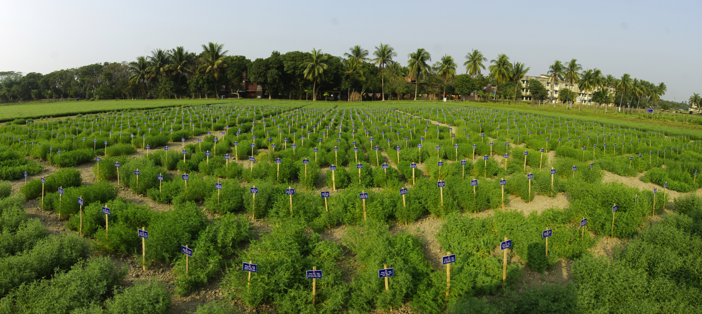
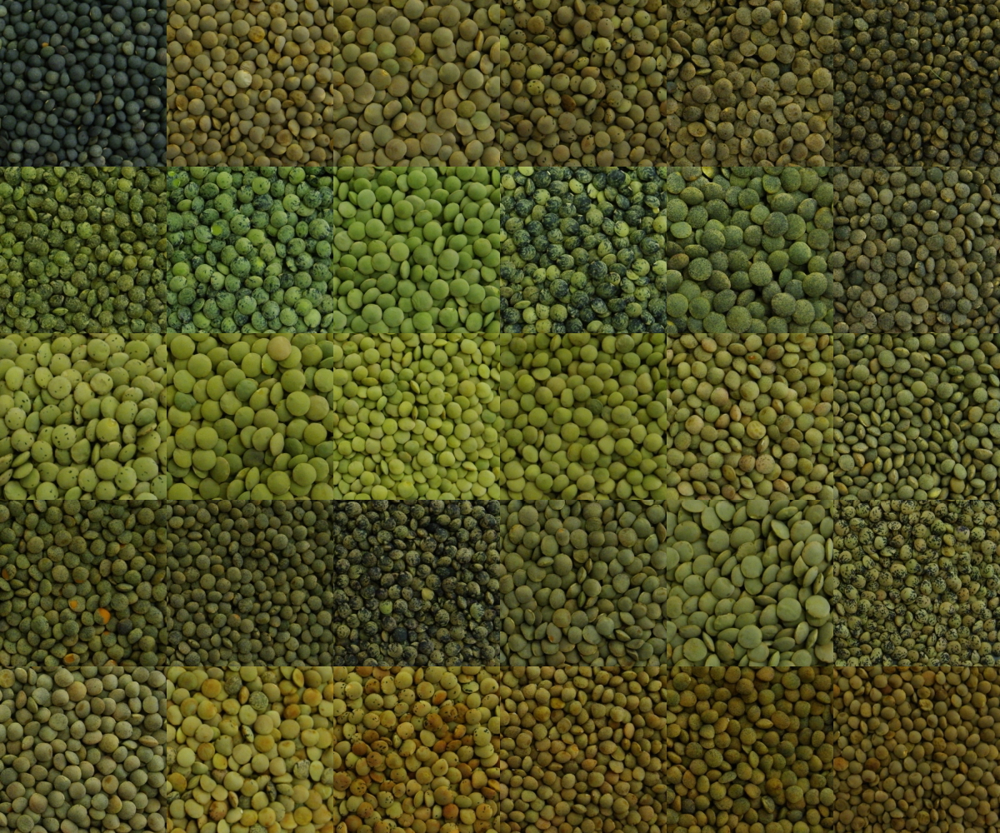

---
output:
  pagedown::html_resume: 
    self_contained: yes
---

Aside
====================================

{width=100%}

View CV as:  <i class="fas fa-file-pdf"></i> [PDF](https://www.dblogr.com/cv.wright.derek.pdf) <i class="fa fa-laptop"></i> [HTML](https://www.dblogr.com/cv)

<i class="fa fa-flask"></i> Skills {#skills}
--------------------------------------------------------------------------------

- <i class="fa fa-camera"></i> &nbsp; Photography
- <i class="fab fa-pagelines"></i> &nbsp; Biology
- <i class="fas fa-dna"></i> &nbsp; Genomics
- <i class="fa fa-table"></i> &nbsp; Data Analytics
- <i class="fa fa-line-chart"></i> &nbsp; Data Visualization
- <i class="fab fa-r-project"></i> &nbsp; The R Project

### <i class="fa fa-address-card"></i> Contact Info {#contact}

- <i class="fa fa-envelope"></i> &nbsp; wrightmderek@gmail.com
- <i class="fa fa-envelope-o"></i> &nbsp; derek.wright@usask.ca
- <i class="fa fa-phone"></i> &nbsp; +1 306-220-0645

### <i class="fa fa-cloud"></i> Social Media

- <i class="fa fa-twitter-square"></i> &nbsp; [@DerekMWright](https://twitter.com/DerekMWright)
- <i class="fa fa-github"></i> &nbsp; [github.com/derekmichaelwright](https://github.com/derekmichaelwright)
- <i class="fa fa-globe"></i> &nbsp; [www.dblogr.com/](https://www.dblogr.com/)

Main
================================================================================

Derek Michael Wright {#title}
--------------------------------------------------------------------------------

I graduated with a **BSc in Biology** from the [*University of Regina*](https://www.uregina.ca/) in 2012, followed by a **MSc in Agrobiotechnology** from [*Justus-Liebig-Universität Gießen*](https://www.uni-giessen.de/) (*University of Giessen, Germany*) in 2015. I now work in the Plant Sciences department at the [*University of Saskatchewan*](https://www.usask.ca/) and have been involved in three research projects ([**AGILE**](https://knowpulse.usask.ca/study/2675314), [**EVOLVES**](https://knowpulse.usask.ca/study/2691111) & [**P2IRC**](https://p2irc.usask.ca/index.php)) with **lentil** (*Lens culinaris*). 

I have done extensive work with a lentil diversity panel, NAM and inter-specific RIL populations. I am very fluent in <i class="fab fa-r-project"></i> and have plenty of experience with data analysis such as PCA, GWAS and QTL analysis. I have recently been working with data acquisition from UAV and seed imaging systems and can handle data wrangling and visualization of large, high-throughput data sets.

Research Experience & Education {data-icon=graduation-cap data-concise=true}
--------------------------------------------------------------------------------

### University of Saskatchewan

Research Assistant

Saskatoon, Saskatchewan, Canada

Current - 2015

::: concise
  * Coordinate field trials
  * Seed setup
  * Post-harvest processing
  * Data collection & analysis
  * Presentations
  * Collaborations
:::

### Cargil Specialty Seeds and Oils

Research Assistant (Internship)

Aberdeen, Saskatchewan, Canada

2015 

::: concise
  * Data collection & analysis
  * Pathology (blackleg)
:::  

### M.Sc. in Agrobiotechnology

University of Giessen

Giessen, Hesse, Germany

2015 - 2013

::: concise
  * Biotechnology and Genomics
  * Molecular Phytopathology
  * Plant Microbe Interactions
  * Plant Protection and Bioengeneering
  * Microbial-Food-Biotechnology
  * Applied Statistics and Bioinformatics
  * Risk Assessment, Bio-safety and Patent Law
  * Molecular Plant Breeding
  * Microbial Diagnostics
  * Plant Pathogens and Symbionts
  * Molecular Entomology
  * Tissue Culturing and Genetic Transformation
:::

### B.Sc. Biology

University of Regina

Regina, Saskatchewan, Canada

2012 - 2007

::: concise
  * Limnology
  * Environmental Microbiology
  * Global Biogeochemistry
  * Stable Isotope Ecology
  * Vertebrate Animal Biology
  * Advanced Plant Physiology
  * Molecular Genetics
  * Bacterial Genetics
:::

R Packages {data-icon=code}
--------------------------------------------------------------------------------

### agData: an R package containing agricultural data sets

https://derekmichaelwright.github.io/agData/
devtools::install_github("derekmichaelwright/agData")

N/A

N/A

### gwaspr: an R package for plotting GWAS results

https://derekmichaelwright.github.io/gwaspr/
devtools::install_github("derekmichaelwright/gwaspr")

N/A

N/A

Publications {data-icon=file}
--------------------------------------------------------------------------------

### Mass Spectrometry-Based Untargeted Metabolomics Reveals the Importance of Glycosylated Flavones in Patterned Lentil Seed Coats

[*Journal of Agricultural and Food Chemistry*. 71(7): 3541–3549](https://pubs.acs.org/doi/full/10.1021/acs.jafc.2c07844)

N/A

2023

Elessawy F, **Wright D**, *et al*.

::: aside
* data collection
:::

### Focusing the GWAS *Lens* on days to flower using latent variable phenotypes derived from global multi-environment trials

[*The Plant Genome*. e20269.](https://doi.org/10.1002/tpg2.20269)

N/A

2022 

Neupane S, **Wright D**, *et al*.

::: aside
* data collection
* data analysis
* data visualization
* manuscript writing
:::

### Strategic Identification of New Genetic Diversity to Expand Lentil (Lens culinaris Medik.) Production (Using Nepal as an Example)

[*Agronomy*. 11(10): 1933.](https://doi.org/10.3390/agronomy11101933)

N/A

2021 

Neupane S, Dhakal R, **Wright D**, *et al*.

::: aside
* data analysis
* data visualization
:::

### Genomic selection for lentil breeding: Empirical evidence

[*The Plant Genome*. 13(1):e20002.](https://doi.org/10.1002/tpg2.20002)

N/A

2020 

Haile TA, Heidecker T, **Wright D**, *et al*.

::: aside
* data visualization
:::

### Understanding photothermal interactions can help expand production range and increase genetic diversity of lentil (*Lens culinaris* Medik.)

[*Plants, People, Planet*. 3(2): 171-181.](https://doi.org/10.1002/ppp3.10158)

N/A

2020 

**Wright D**, *et al*.

::: aside
* data collection
* data analysis
* data visualization
* manuscript writing
:::

### Influence of heterozygosity on nitrogen use efficiency in hybrid and purebred lines of *Brassica napus* (L.)

*MSc Thesis*

N/A

2015 

**Wright D**

Unpublished Work {data-icon=file}
--------------------------------------------------------------------------------

### Dissecting lentil crop growth across multi-environment trials using unoccupied aerial vehicles and genome-wide association studies

N/A

N/A

N/A

::: aside
* data collection
* data analysis
* data visualization
* manuscript writing
:::

### Investigating seed size, shape, color, and patterning in a lentil diversity panel and inter-specific RIL populations 

N/A

N/A

N/A

### GWAS for disease resistance in a lentil diversity panel

N/A

N/A

N/A

::: aside
* data analysis
* data visualization
:::

Photography {data-icon=camera}
--------------------------------------------------------------------------------

### Saskatchewan Field Trials

N/A

N/A

N/A

### Bangladesh Field Trials

N/A

N/A

N/A

### Lentil Seed Diversity

N/A

N/A

N/A

