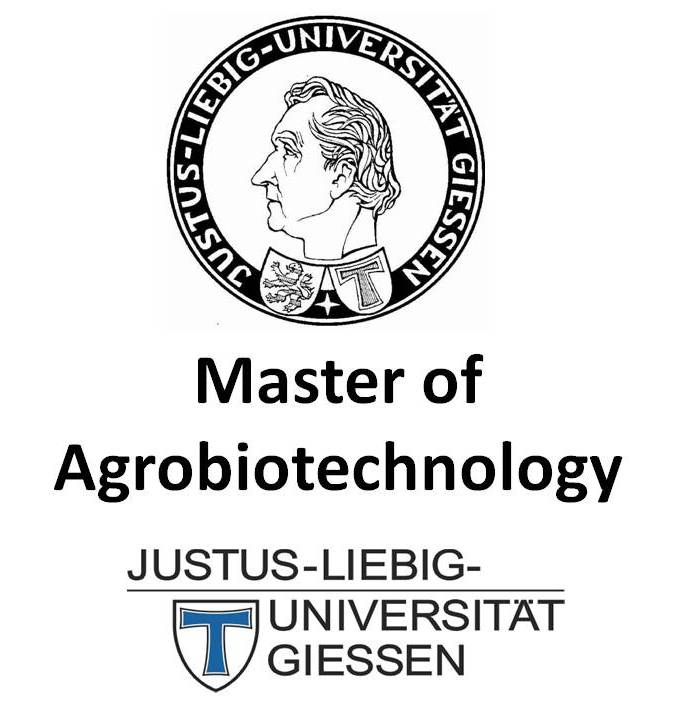

```{r setup, include=FALSE}
knitr::opts_chunk$set(echo = T, message = F, warning = F, out.width = "100%")
```

```{r echo = F}
library(shiny)
# https://derekmichaelwright.github.io/dblogr/home2
```

---

# `r icon("address-card")` About Me

<div class = "row"><div class = "col-md-6">

I was born in Regina, Saskatchewan and graduated with a **BSc in Biology** from the [*University of Regina*](https://www.uregina.ca/) in 2012, followed by a **MSc in Agrobiotechnology** from [*Justus-Liebig-Universität Gießen*](https://www.uni-giessen.de/) (*University of Giessen, Germany*) in 2015. I now work in the Plant Sciences department at the [*University of Saskatchewan*](https://www.usask.ca/) and have been involved in three research projects ([**AGILE**](https://knowpulse.usask.ca/study/2675314), [**EVOLVES**](https://knowpulse.usask.ca/study/2691111) & [**P2IRC**](https://p2irc.usask.ca/index.php)) with **lentil** (*Lens culinaris*). 

</div><div class = "col-md-6"></div></div>

<div class = "row"><div class = "col-md-6">

**My Curriculum Vitae (CV)**

- &nbsp; `r icon("file-pdf")` [cv/cv.derek.m.wright.pdf](https://github.com/derekmichaelwright/dblogr/raw/main/cv/cv.derek.m.wright.pdf) 
- `r icon("laptop")` [cv/cv.derek.m.wright](cv/cv.derek.m.wright/)
- `r icon("envelope")` derek.wright@usask.ca

</div><div class = "col-md-6">

**Social Media**

- `r icon("github")`  [github.com/derekmichaelwright](https://github.com/derekmichaelwright)
- `r icon("twitter")` [twitter.com/DerekMWright](https://twitter.com/DerekMWright)

</div></div>

---

# `r icon("newspaper")` Publications {.tabset .tabset-pills}

## LDP Phenology {.active}

<div class="box"><div class = "row"><div class = "col-md-6">

**Derek M. Wright**, Sandesh Neupane, Taryn Heidecker, Teketel A. Haile, Crystal Chan, Clarice J. Coyne, Rebecca J. McGee, Sripada Udupa, Fatima Henkrar, Eleonora Barilli, Diego Rubiales, Tania Gioia, Giuseppina Logozzo, Stefania Marzario, Reena Mehra, Ashutosh Sarker, Rajeev Dhakal, Babul Anwar, Debashish Sarker, Albert Vandenberg & Kirstin E. Bett 

[<u>**Understanding photothermal interactions can help expand production range and increase genetic diversity of lentil (*Lens culinaris* Medik.)**</u>](https://doi.org/10.1002/ppp3.10158). *Plants, People, Planet*. (**2020**) 00: 1-11. doi.org/10.1002/ppp3.10158

- `r icon("newspaper")` [*Plants, People, Planet*. (**2020**) 00: 1-11.](https://doi.org/10.1002/ppp3.10158)
- `r icon("github")` [Github Repository](https://github.com/derekmichaelwright/AGILE_LDP_Phenology)
- `r icon("save")` [Data](https://github.com/derekmichaelwright/AGILE_LDP_Phenology/tree/master/data)
- `r icon("chart-line")` [All Figures (HTML)](https://derekmichaelwright.github.io/AGILE_LDP_Phenology/README.html)
- &nbsp; `r icon("file-pdf")` [All Figures (pdf)](https://github.com/derekmichaelwright/AGILE_LDP_Phenology/blob/master/README.pdf)
- `r icon("r-project")` [R Script (HTML)](https://derekmichaelwright.github.io/AGILE_LDP_Phenology/Phenology_Vignette.html)
- `r icon("laptop-code")` [AGILE_LDP_Phenology (Shiny App)](https://derek-wright-usask.shinyapps.io/AGILE_LDP_Phenology/)
- `r icon("laptop-code")` [Predict DTF (Shiny App)](https://derek-wright-usask.shinyapps.io/AGILE_Predict_DTF/)

</div><div class = "col-md-6"></div></div></div>

## LDP GWAS Phenology

<div class="box"><div class = "row"><div class = "col-md-6">

Sandesh Neupane, **Derek M. Wright**, Jakob Butler, Raul O. Martinez, Jim L. Weller, Kirstin E. Bett

[<u>**Focusing the GWAS Lens on days to flower using latent variable phenotypes derived from global multi-environment trials**</u>](https://doi.org/10.1002/tpg2.20269). *The Plant Genome*. (**2022**) e20269. doi.org/10.1002/tpg2.20269

- `r icon("newspaper")` [*The Plant Genome*. (**2022**) e20269.](https://doi.org/10.1002/tpg2.20269)
- `r icon("github")` [Github Repository](https://github.com/derekmichaelwright/AGILE_LDP_GWAS_Phenology)
- `r icon("chart-line")` [All Figures (HTML)](https://derekmichaelwright.github.io/AGILE_LDP_GWAS_Phenology/README.html)
- &nbsp; `r icon("file-pdf")` [All Figures (pdf)](https://github.com/derekmichaelwright/AGILE_LDP_GWAS_Phenology/blob/master/README.pdf)
- `r icon("r-project")` [R Script (HTML)](https://derekmichaelwright.github.io/AGILE_LDP_GWAS_Phenology/GWAS_Phenology_Vignette.html)

</div><div class = "col-md-6"></div></div></div>

## Lentil UAV

<div class="box"><div class = "row"><div class = "col-md-6">

**Derek M Wright**, Sandesh Neupane, Tania Gioia, Steve Shirtlife & Kirstin E Bett 

<u>**Disecting lentil crop growth across multi-environment trials using unoccupied aerial vehicles and genome-wide association studies**</u>. *unpublished*.

- `r icon("newspaper")` *unpublished*
- `r icon("github")` [Github Repository](https://github.com/derekmichaelwright/AGILE_LDP_UAV)
- `r icon("chart-line")` [All Figures (HTML)](https://derekmichaelwright.github.io/AGILE_LDP_UAV/README.html)
- &nbsp;`r icon("file-pdf")` [All Figures (pdf)](https://github.com/derekmichaelwright/AGILE_LDP_UAV/blob/master/README.pdf)
- `r icon("r-project")` [R Script (HTML)](https://derekmichaelwright.github.io/AGILE_LDP_UAV/LDP_UAV_Vignette.html)
- `r icon("youtube")` [P2IRC Conference](https://www.youtube.com/watch?v=FkjKaGJG7Xc&list=PLNqTYnctRQrkNKbRPBt6Z3Wb81Vq-rAum&index=11)

</div><div class = "col-md-6"></div></div></div>

## LDP Nepal Phenology

<div class="box"><div class = "row"><div class = "col-md-6">

Sandesh Neupane, Rajeev Dhakal, **Derek M. Wright**, Deny K. Shrestha, Bishnu Dhakal & Kirstin E. Bett 

[<u>**Strategic Identification of New Genetic Diversity to Expand Lentil (*Lens culinaris* Medik.) Production (Using Nepal as an Example)**</u>](https://doi.org/10.3390/agronomy11101933). *Agronomy*. (**2021**) 11(10): 1933. doi.org/10.3390/agronomy11101933

- `r icon("newspaper")` [*Agronomy*. (**2021**) 11(10): 1933.](https://doi.org/10.3390/agronomy11101933)
- `r icon("github")` [Github Repository](https://github.com/derekmichaelwright/AGILE_LDP_GWAS_Phenology)
- `r icon("chart-line")` [All Figures (HTML)](https://derekmichaelwright.github.io/AGILE_LDP_GWAS_Phenology/README.html)
- &nbsp; `r icon("file-pdf")` [All Figures (pdf)](https://github.com/derekmichaelwright/AGILE_LDP_GWAS_Phenology/blob/master/README.pdf)
- `r icon("r-project")` [R Script (HTML)](https://derekmichaelwright.github.io/AGILE_LDP_Nepal/Phenology_Vignette.html)

</div><div class = "col-md-6"></div></div></div>

## Genomic Selection in Lentil

<div class="box"><div class = "row"><div class = "col-md-6">

Teketel A. Haile,  Taryn Heidecker,  **Derek M. Wright**,  Sandesh Neupane,  Larissa Ramsay,  Albert Vandenberg & Kirstin E. Bett

[<u>**Genomic selection for lentil breeding: Empirical evidence**</u>](https://doi.org/10.1002/tpg2.20002). *The Plant Genome*. (**2020**) 13(e20002): 1-15. doi.org/10.1002/tpg2.20002

- `r icon("newspaper")` [*The Plant Genome*. (**2020**) 13(e20002): 1-15.](https://doi.org/10.1002/tpg2.20002)

</div><div class = "col-md-6"></div></div></div>

## NEU in Canola

<div class="box"><div class = "row"><div class = "col-md-6">

**Derek M. Wright**

<u>**Influence of heterozygosity on nitrogen use efficiency in hybrid and purebred lines of *Brassica napus* (L.)**</u>. *University of Giessen*. (**2015**) MSc. Thesis.

- &nbsp; `r icon("file-pdf")` [MSc Thesis (MastersThesis.pdf)](publications/canola_nue/MastersThesis.pdf)
- `r icon("r-project")` [R Script (HTML)](publications/canola_nue/)

</div><div class = "col-md-6"></div></div></div>

# {-}

---

- Neupane *et al*. (**2022**) [Focusing the GWAS Lens on days to flower using latent variable phenotypes derived from global multi-environment trials](https://doi.org/10.1002/tpg2.20269). *The Plant Genome*. e20269. doi.org/10.1002/tpg2.20269
- Neupane *et al*. (**2021**) [Strategic Identification of New Genetic Diversity to Expand Lentil (*Lens culinaris* Medik.) Production (Using Nepal as an Example)](https://doi.org/10.3390/agronomy11101933). *Agronomy*. 11(10): 1933. doi.org/10.3390/agronomy11101933
- Wright, *et al*. (**2020**) [Understanding photothermal interactions can help expand production range and increase genetic diversity of lentil (*Lens culinaris* Medik.)](https://doi.org/10.1002/ppp3.10158). *Plants, People, Planet*. 00: 1-11. doi.org/10.1002/ppp3.10158
- Haile *et al*. (**2020**) [Genomic selection for lentil breeding: Empirical evidence](https://doi.org/10.1002/tpg2.20002). *The Plant Genome*. 13(e20002): 1-15. doi.org/10.1002/tpg2.20002
- Wright DM (**2015**) Influence of heterozygosity on nitrogen use efficiency in hybrid and purebred lines of *Brassica napus* (L.). *University of Giessen*. MSc. Thesis. 

---

# `r icon("laptop")` Academic {.tabset .tabset-pills}

## gwaspr

<div class="box"><div class = "row"><div class = "col-md-8">

### gwaspr

`gwaspr`: an `r icon("r-project")` package for plotting GWAS results from the `GAPIT` package

- `r icon("house")` https://derekmichaelwright.github.io/gwaspr/
- `r icon("github")` https://github.com/derekmichaelwright/gwaspr/
- Install: `devtools::install_github("derekmichaelwright/gwaspr")`

</div><div class = "col-md-4"></div></div></div>

## GWAS Tutorial

<div class="box"><div class = "row"><div class = "col-md-6">

### [<u>**GWAS Vignette with gwaspr**</u>](academic/gwas_tutorial)

An R tutorial on running genome-wide association studies (GWAS) with GAPIT and gwaspr

</div><div class = "col-md-6"></div></div></div>

## R Tutorial

<div class="box"><div class = "row"><div class = "col-md-6">

### [**R Tutorial**](academic/r_tutorial)

An introduction to R

</div><div class = "col-md-6"></div></div></div>

# {-}

---

# `r icon("r-project")` agData {.tabset .tabset-pills}

## agdata

<div class="box"><div class = "row"><div class = "col-md-8">

### agData

`agData`: An `r icon("r-project")` Package Containing Agricultural Data Sets

- `r icon("house")` https://derekmichaelwright.github.io/agData/
- `r icon("github")` https://github.com/derekmichaelwright/agData/
- Install: `devtools::install_github("derekmichaelwright/agData")`

</div><div class = "col-md-4"></div></div></div>

## Maps of Global Crop Production

<div class="box"><div class = "row"><div class = "col-md-6">

### [Maps of Global Crop Production](agdata/crops_world_maps)

Maps of crop production using FAO data

</div><div class = "col-md-6"></div></div></div>

## Maps of Canadian Crop Production

<div class="box"><div class = "row"><div class = "col-md-6">

### [Maps of Canadian Crop Production](agdata/crops_canada_maps)

Maps of crop production in Canada using STATCAN data

</div><div class = "col-md-6"></div></div></div>

## Saskatchewan Crop Production

<div class="box"><div class = "row"><div class = "col-md-6">

### [Saskatchewan Crop Production](agdata/crops_saskatchewan)

Graphs of crop production in Saskatchewan using STATCAN data

</div><div class = "col-md-6"></div></div></div>

# {-}

---

# `r icon("chart-line")` Blog {.tabset .tabset-pills}

## Population Demographics In Canada

<div class="box"><div class = "row"><div class = "col-md-6">

### [Population Demographics In Canada](blog/canada_population)

Graphs of population demographics in Canada using STATCAN data

</div><div class = "col-md-6"></div></div></div>

## Hex Stickers

<div class="box"><div class = "row"><div class = "col-md-6">

### [Hex Stickers](blog/hex_stickers)

Creation of hex stickers with R

</div><div class = "col-md-6"></div></div></div>

## cypher

<div class="box"><div class = "row"><div class = "col-md-8">

### cypher

`cypher`: an `r icon("r-project")` package for coding and decoding secret messages

- `r icon("house")` https://derekmichaelwright.github.io/cypher/
- `r icon("github")` https://github.com/derekmichaelwright/cypher/
- Install: `devtools::install_github("derekmichaelwright/cypher")`
- `r icon("code")` https://github.com/derekmichaelwright/cypher/blob/master/shinyapp/app.R

</div><div class = "col-md-4"></div></div></div>

# {-}

---


---
