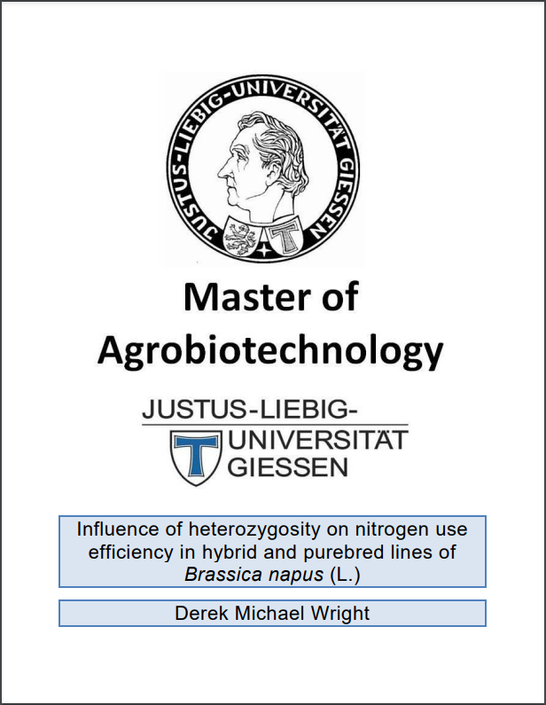
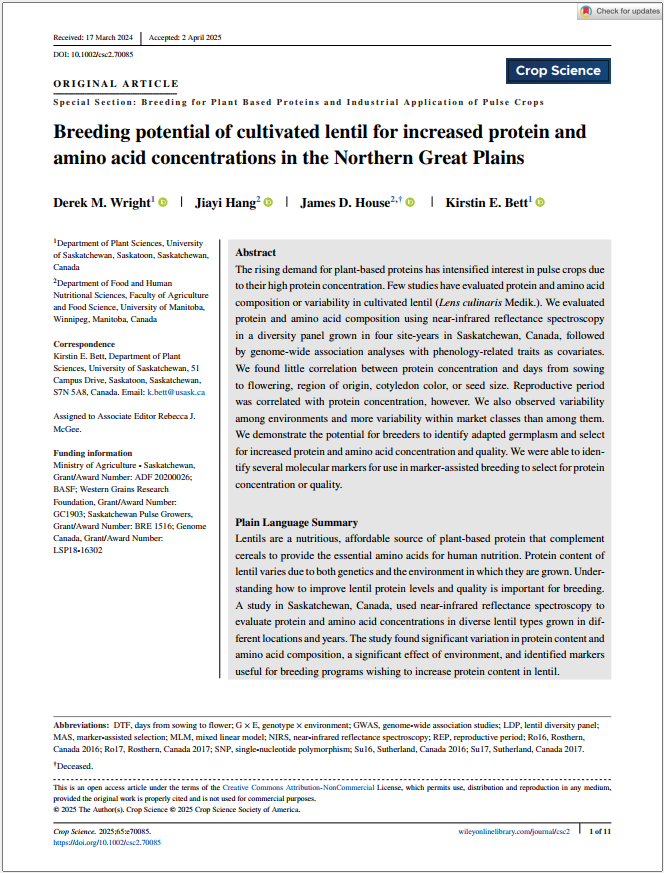
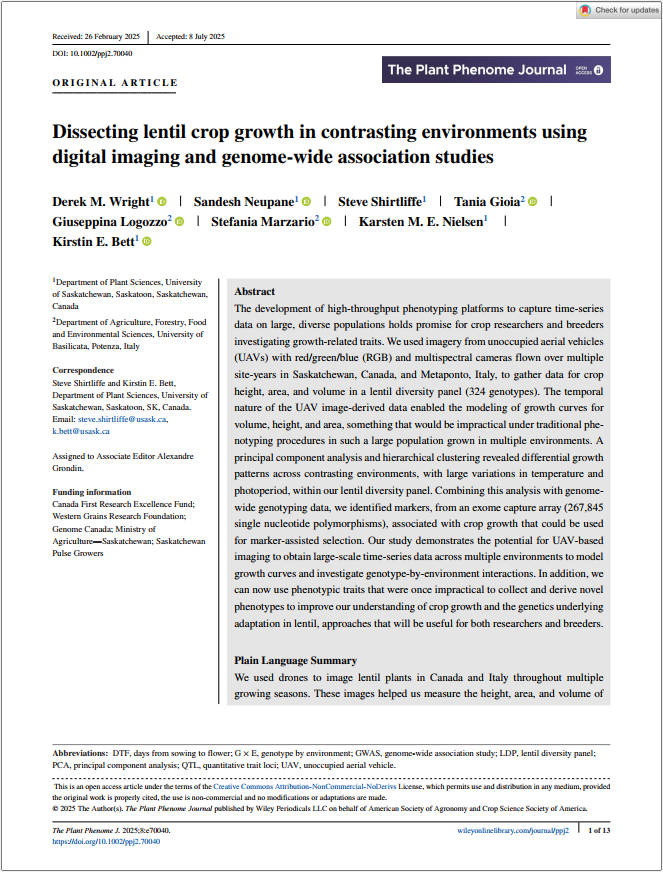
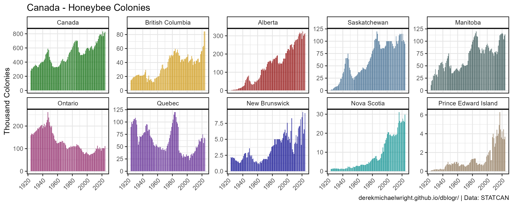
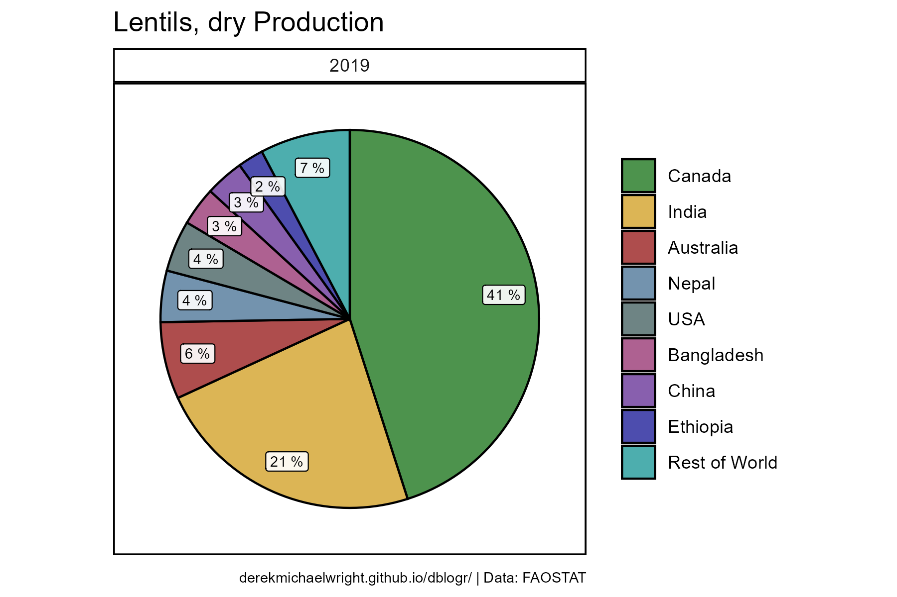
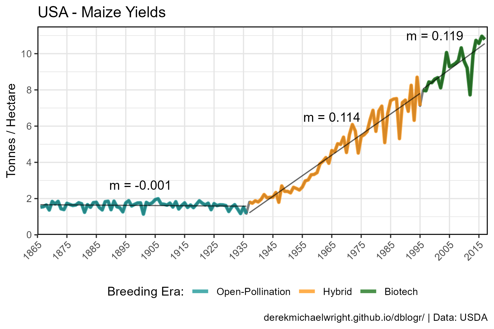
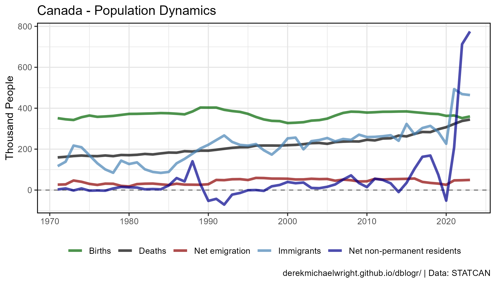

```{r setup, include=FALSE}
knitr::opts_chunk$set(echo = T, message = F, warning = F)
```

```{r echo = F}
library(shiny)
# https://derekmichaelwright.github.io/dblogr/home
```

**Welcome to the personal website for Derek Michael Wright**

# `r icon("address-card")` About Me

<div class="box">

<div class = "row"><div class = "col-md-6">

**Derek Michael Wright**

I was born in Regina, Saskatchewan and graduated with a **BSc in Biology** from the [*University of Regina*](https://www.uregina.ca/){target="_blank"} in 2012, followed by a **MSc in Agrobiotechnology** from [*Justus-Liebig-Universität Gießen*](https://www.uni-giessen.de/){target="_blank"} (*University of Giessen, Germany*) in 2015. I now work in the Plant Sciences department at the [*University of Saskatchewan*](https://www.usask.ca/){target="_blank"} and have been involved in three research projects ([**AGILE**](https://knowpulse.usask.ca/study/2675314){target="_blank"}, [**EVOLVES**](https://knowpulse.usask.ca/study/2691111){target="_blank"} & [**P2IRC**](https://p2irc.usask.ca/index.php){target="_blank"}) with **lentil** (*Lens culinaris*). 

</div><div class = "col-md-6"></div></div>

<br>

<div class = "row"><div class = "col-md-6">


**Socials**

- `r icon("github")`  [github.com/derekmichaelwright](https://github.com/derekmichaelwright){target="_blank"}
- `r icon("twitter")` [twitter.com/DerekMWright](https://x.com/DerekMWright){target="_blank"} 

**Professional Email**

- `r icon("envelope")` derek.wright@usask.ca

</div><div class = "col-md-6">

**My Curriculum Vitae (CV)**

- `r icon("globe")` [HTML version](cv/){target="_blank"}
- `r icon("file-pdf")` [PDF Version](https://github.com/derekmichaelwright/dblogr/raw/main/cv/cv.derek.m.wright.pdf){target="_blank"}

**Personal Email**

- `r icon("envelope")` derek.wright@usask.ca

</div>

</div></div>

<br>

---

# `r icon("book")` Publications 

Scientific publications I have been involved in while working/studying at [***University of Regina***](https://www.uregina.ca/){target="_blank"}, [***Justus-Liebig-Universität Gießen (University of Giessen)***](https://www.uni-giessen.de/){target="_blank"} & the [***University of Saskatchewan***](https://www.usask.ca/){target="_blank"}.

## All Publications {.tabset .tabset-pills}

### LDP Phenology {.active}

<div class="box"><div class = "row"><div class = "col-md-6">

[<u>**Understanding photothermal interactions can help expand production range and increase genetic diversity of lentil (*Lens culinaris* Medik.)**</u>](https://doi.org/10.1002/ppp3.10158){target="_blank"}. *Plants, People, Planet*. (**2020**) 00: 1-11. doi.org/10.1002/ppp3.10158

**Derek M. Wright**, Sandesh Neupane, Taryn Heidecker, Teketel A. Haile, Crystal Chan, Clarice J. Coyne, Rebecca J. McGee, Sripada Udupa, Fatima Henkrar, Eleonora Barilli, Diego Rubiales, Tania Gioia, Giuseppina Logozzo, Stefania Marzario, Reena Mehra, Ashutosh Sarker, Rajeev Dhakal, Babul Anwar, Debashish Sarker, Albert Vandenberg & Kirstin E. Bett. 

- `r icon("newspaper")` [*Plants, People, Planet*. (**2020**) 00: 1-11.](https://doi.org/10.1002/ppp3.10158){target="_blank"}
- `r icon("github")` [Github Repository](https://github.com/derekmichaelwright/AGILE_LDP_Phenology){target="_blank"}
- `r icon("save")` [Data](https://github.com/derekmichaelwright/AGILE_LDP_Phenology/tree/master/data){target="_blank"}
- `r icon("r-project")` [R Script (HTML)](https://derekmichaelwright.github.io/AGILE_LDP_Phenology/Phenology_Vignette.html){target="_blank"}
- `r icon("laptop-code")` [AGILE_LDP_Phenology (Shiny App)](https://derek-wright-usask.shinyapps.io/AGILE_LDP_Phenology/){target="_blank"}
- `r icon("laptop-code")` [Predict DTF (Shiny App)](https://derek-wright-usask.shinyapps.io/AGILE_Predict_DTF/){target="_blank"}
- `r icon("chart-line")` [All Figures (HTML)](https://derekmichaelwright.github.io/AGILE_LDP_Phenology/README.html){target="_blank"}
- `r icon("file-pdf")` [All Figures (pdf)](https://github.com/derekmichaelwright/AGILE_LDP_Phenology/blob/master/README.pdf){target="_blank"}

</div><div class = "col-md-6"></div></div></div>

### LDP GWAS Phenology

<div class="box"><div class = "row"><div class = "col-md-6">

[<u>**Focusing the GWAS Lens on days to flower using latent variable phenotypes derived from global multi-environment trials**</u>](https://doi.org/10.1002/tpg2.20269){target="_blank"}. *The Plant Genome*. (**2022**) 16(1): e20269. doi.org/10.1002/tpg2.20269

Sandesh Neupane, **Derek M. Wright**, Raul O. Martinez, Jakob Butler, Jim L. Weller, Kirstin E. Bett.

- `r icon("newspaper")` [*The Plant Genome*. (**2022**) 16(1): e20269.](https://doi.org/10.1002/tpg2.20269){target="_blank"}
- `r icon("github")` [Github Repository](https://github.com/derekmichaelwright/AGILE_LDP_GWAS_Phenology){target="_blank"}
- `r icon("r-project")` [R Script (HTML)](https://derekmichaelwright.github.io/AGILE_LDP_GWAS_Phenology/GWAS_Phenology_Vignette.html){target="_blank"}
- `r icon("chart-line")` [All Figures (HTML)](https://derekmichaelwright.github.io/AGILE_LDP_GWAS_Phenology/README.html){target="_blank"}
- `r icon("file-pdf")` [All Figures (pdf)](https://github.com/derekmichaelwright/AGILE_LDP_GWAS_Phenology/blob/master/README.pdf){target="_blank"}

</div><div class = "col-md-6"></div></div></div>

### LDP Nepal Phenology

<div class="box"><div class = "row"><div class = "col-md-6">

[<u>**Strategic Identification of New Genetic Diversity to Expand Lentil (*Lens culinaris* Medik.) Production (Using Nepal as an Example)**</u>](https://doi.org/10.3390/agronomy11101933){target="_blank"}. *Agronomy*. (**2021**) 11(10): 1933. doi.org/10.3390/agronomy11101933

Sandesh Neupane, Rajeev Dhakal, **Derek M. Wright**, Deny K. Shrestha, Bishnu Dhakal & Kirstin E. Bett .

- `r icon("newspaper")` [*Agronomy*. (**2021**) 11(10): 1933.](https://doi.org/10.3390/agronomy11101933){target="_blank"}
- `r icon("github")` [Github Repository](https://github.com/derekmichaelwright/AGILE_LDP_Nepal){target="_blank"}
- `r icon("r-project")` [R Script (HTML)](https://derekmichaelwright.github.io/AGILE_LDP_Nepal/Phenology_Vignette.html){target="_blank"}
- `r icon("chart-line")` [All Figures (HTML)](https://derekmichaelwright.github.io/AGILE_LDP_Nepal/README.html){target="_blank"}
- `r icon("file-pdf")` [All Figures (pdf)](https://github.com/derekmichaelwright/AGILE_LDP_Nepal/blob/master/README.pdf){target="_blank"}

</div><div class = "col-md-6"></div></div></div>

### Genomic Selection in Lentil

<div class="box"><div class = "row"><div class = "col-md-6">

[<u>**Genomic selection for lentil breeding: Empirical evidence**</u>](https://doi.org/10.1002/tpg2.20002){target="_blank"}. *The Plant Genome*. (**2020**) 13(e20002): 1-15. doi.org/10.1002/tpg2.20002

Teketel A. Haile,  Taryn Heidecker,  **Derek M. Wright**,  Sandesh Neupane,  Larissa Ramsay,  Albert Vandenberg & Kirstin E. Bett.

- `r icon("newspaper")` [*The Plant Genome*. (**2020**) 13(e20002): 1-15.](https://doi.org/10.1002/tpg2.20002){target="_blank"}

</div><div class = "col-md-6"></div></div></div>

### Lentil Flavones

<div class="box"><div class = "row"><div class = "col-md-6">

[<u>**Mass Spectrometry-Based Untargeted Metabolomics Reveals the Importance of Glycosylated Flavones in Patterned Lentil Seed Coats**</u>](https://pubs.acs.org/doi/10.1021/acs.jafc.2c07844){target="_blank"}. *J. Agric. Food Chem*. (**2023**) 71(7): 3541–3549 doi.org/10.1021/acs.jafc.2c07844

Fatma M. Elessawy, **Derek M. Wright**, Albert Vandenberg, Anas El-Aneed & Randy W. Purves.

- `r icon("newspaper")` [*J. Agric. Food Chem*. (**2023**) 71(7): 3541–3549 doi.org/10.1021/acs.jafc.2c07844](https://pubs.acs.org/doi/10.1021/acs.jafc.2c07844){target="_blank"}

</div><div class = "col-md-6"></div></div></div>

### NEU in Canola

<div class="box"><div class = "row"><div class = "col-md-6">

<u>**Influence of heterozygosity on nitrogen use efficiency in hybrid and purebred lines of *Brassica napus* (L.)**</u>. *University of Giessen*. (**2015**) MSc. Thesis.

**Derek M. Wright**.

- `r icon("file-pdf")` [MSc Thesis (MastersThesis.pdf)](publications/canola_nue/MastersThesis.pdf){target="_blank"}
- `r icon("r-project")` [R Script (HTML)](publications/canola_nue/){target="_blank"}

</div><div class = "col-md-6"></div></div></div>

### LDP Protein

<div class="box"><div class = "row"><div class = "col-md-6">

Jiayi Hang, **Derek M. Wright**, Kirstin E. Bett & James D. House

- `r icon("newspaper")` *unpublished*
- `r icon("github")` [Github Repository](https://github.com/derekmichaelwright/AGILE_LDP_Protein){target="_blank"}
- `r icon("r-project")` [R Script (HTML)](https://derekmichaelwright.github.io/AGILE_LDP_Protein/LDP_Protein_Vignette.html){target="_blank"}
- `r icon("chart-line")` [All Figures (HTML)](https://derekmichaelwright.github.io/AGILE_LDP_Protein/README.html){target="_blank"}

A follow up to:

[<u>**Prediction of protein and amino acid contents in whole and ground lentils using near-infrared reflectance spectroscopy**</u>](https://doi.org/10.1016/j.lwt.2022.113669){target="_blank"}. *LWT*. (**2022**) 165: 113669. doi.org/10.1016/j.lwt.2022.113669

Jiayi Hang, Da Shi, Jason Neufeld, Kirstin E. Bett & James D. House

- `r icon("newspaper")` [*LWT*. (**2022**) 165: 113669.](https://doi.org/10.1016/j.lwt.2022.113669){target="_blank"}

</div><div class = "col-md-6"></div></div></div>

### Lentil UAV

<div class="box"><div class = "row"><div class = "col-md-6">

<u>**Disecting lentil crop growth across multi-environment trials using unoccupied aerial vehicles and genome-wide association studies**</u>. *unpublished*.

**Derek M Wright**, Sandesh Neupane, Tania Gioia, Steve Shirtlife & Kirstin E Bett.

- `r icon("newspaper")` *unpublished*
- `r icon("github")` [Github Repository](https://github.com/derekmichaelwright/AGILE_LDP_UAV){target="_blank"}
- `r icon("r-project")` [R Script (HTML)](https://derekmichaelwright.github.io/AGILE_LDP_UAV/LDP_UAV_Vignette.html){target="_blank"}
- `r icon("chart-line")` [All Figures (HTML)](https://derekmichaelwright.github.io/AGILE_LDP_UAV/README.html){target="_blank"}
- `r icon("file-pdf")` [All Figures (pdf)](https://github.com/derekmichaelwright/AGILE_LDP_UAV/blob/master/README.pdf){target="_blank"}
- `r icon("youtube")` [P2IRC Conference](https://www.youtube.com/watch?v=FkjKaGJG7Xc&list=PLNqTYnctRQrkNKbRPBt6Z3Wb81Vq-rAum&index=11){target="_blank"}

</div><div class = "col-md-6"></div></div></div>

### News Articles

<div class="box">

<u>**News Articles**</u>

- `r icon("globe")` [<u>**Genome Canada - Application of genomics to innovation in the lentil economy (AGILE)**</u>](https://www.genomecanada.ca/en/application-genomics-innovation-lentil-economy-agile){target="_blank"}

- `r icon("globe")` [**Genome Prairie - AGILE Innovating the growth of lentils**](http://www.genomeprairie.ca/project/current/agile){target="_blank"}

- `r icon("globe")` [**Global Plant Council Blog - Lentils under the lens: Improving genetic diversity for sustainable food security**](http://blog.globalplantcouncil.org/research/lentils-under-the-lens/){target="_blank"}

- `r icon("globe")` [**The Western Producer - Genetics project provides foundation for new Canadian lentil varieties**](https://www.producer.com/2019/01/genetics-project-provides-foundation-for-new-canadian-lentil-varieties/){target="_blank"}

</div>

<br><br>

## {-}

---

## Highlighted Publications:

- (**2022**) [<u>**Focusing the GWAS Lens on days to flower using latent variable phenotypes derived from global multi-environment trials**</u>](https://doi.org/10.1002/tpg2.20269){target="_blank"}. *The Plant Genome*. e20269. doi.org/10.1002/tpg2.20269
- (**2021**) [<u>**Strategic Identification of New Genetic Diversity to Expand Lentil (*Lens culinaris* Medik.) Production (Using Nepal as an Example)**</u>](https://doi.org/10.3390/agronomy11101933){target="_blank"}. *Agronomy*. 11(10): 1933. doi.org/10.3390/agronomy11101933
- (**2020**) [<u>**Understanding photothermal interactions can help expand production range and increase genetic diversity of lentil (*Lens culinaris* Medik.)**</u>](https://doi.org/10.1002/ppp3.10158){target="_blank"}. *Plants, People, Planet*. 00: 1-11. doi.org/10.1002/ppp3.10158

---

# `r icon("newspaper")` Academic

Tutorials and Vignettes based on some of my academic work.

## gwaspr

<div class="box"><div class = "row"><div class = "col-md-8">

An `r icon("r-project")` package for plotting GWAS results from the `GAPIT` package

`devtools::install_github("derekmichaelwright/gwaspr")`

- `r icon("house")` [https://derekmichaelwright.github.io/gwaspr/](https://derekmichaelwright.github.io/gwaspr/){target="_blank"}
- `r icon("github")` [https://github.com/derekmichaelwright/gwaspr/](https://github.com/derekmichaelwright/gwaspr/){target="_blank"}

- `r icon("laptop-code")` [GWAS Tutorial](academic/gwas_tutorial){target="_blank"}

</div><div class = "col-md-4"></div></div></div>

---

## Tutorials {.tabset .tabset-pills}

Tutorials in `r icon("r-project")` on how to perform various statistical and genetic analyses.

### GWAS Tutorial

<div class="box">

[<u>**GWAS Tutorial with gwaspr**</u>](academic/gwas_tutorial){target="_blank"}

An R tutorial on running genome-wide association studies (GWAS) with GAPIT and gwaspr

</div>

### QTL Tutorial

<div class="box">

[<u>**QTL Tutorial with qtl2**</u>](academic/qtl_tutorial){target="_blank"}

A tutorial on how to run QTL analyses in R with qtl2

</div>

### PCA Tutorial

<div class="box">

[<u>**PCA Tutorial**</u>](academic/pca_tutorial){target="_blank"}

A tutorial on how to run principal component analyses and heirarchical clustering in R

</div>

### Augmented Designs

<div class="box">

[<u>**Augmented Field Trial Designs**</u>](academic/augmented_designs){target="_blank"}

An R tutorial on augmented field trial designs and how to adjust their values

**Note: Under Construction**

</div>

### Dual Y-axis

<div class="box">

[<u>**Dual Y-axis**</u>](academic/dual_y_axis){target="_blank"}

An R tutorial on how to create a plots with dual y-axes

</div>

### Thermal Time

<div class="box">

[<u>**Calculating Thermal Time/Growing Degree Days**</u>](academic/thermal_time){target="_blank"}

An R tutorial on how to calculate thermal time and incorporate environmental data into a phenotype

</div>

### Environmental Data

<div class="box">

[<u>**Environmental Data Tutorial**</u>](academic/envdata){target="_blank"}

An R tutorial on how to manipulate and plot environmental data

</div>

### R Tutorial

<div class="box"><div class = "row"><div class = "col-md-6">

[<u>**R Tutorial**</u>](academic/r_tutorial){target="_blank"}

An introduction to R

</div><div class = "col-md-6"></div></div></div>

---

## Vignettes {.tabset .tabset-pills}

Vignettes related to my work academic work and general science communication.

### Lentil Diversity Panel

<div class="box">

[<u>**Lentil Diversity Panel**</u>](academic/lentil_diversity_panel){target="_blank"}

A population representing global genetic diversity in cultivated lentil varieties

</div>

### Correlation Coefficients and Predictive Models

<div class="box">

[<u>**Correlation Coefficients and Predictive Models**</u>](academic/correlation_coefficients){target="_blank"}

A vignette on how to properly use correlation coefficients when evaluating predictive models

</div>

### Data Visualizations

<div class="box">

[<u>**Data Visualization**</u>](academic/data_visualizations){target="_blank"}

A vignette illustrating different ways to visualize data

</div>

## {-}

<br>

---

# `r icon("r-project")` agData 

<div class="box"><div class = "row"><div class = "col-md-8">

<p size="20" style="font-style:bold">agData</p>

An `r icon("r-project")` Package Containing Agricultural Data Sets

`devtools::install_github("derekmichaelwright/agData")`

- `r icon("house")` [https://derekmichaelwright.github.io/agData/](https://derekmichaelwright.github.io/agData/){target="_blank"}
- `r icon("github")` [https://github.com/derekmichaelwright/agData/](https://github.com/derekmichaelwright/agData/){target="_blank"}

</div><div class = "col-md-4"></div></div></div>

---

## STATCAN {.tabset .tabset-pills}

### Saskatchewan Crop Production

<div class="box">

[<u>**Saskatchewan Crop Production**</u>](agdata/crops_saskatchewan){target="_blank"}

Graphs of crop production in Saskatchewan using STATCAN data

</div>

### Lentil Saskatchewan

<div class="box">

[<u>**Saskatchewan Lentil Production and Exports**</u>](agdata/lentil_saskatchewan){target="_blank"}

Graphs of lentil production and exports using SKAG data

</div>

### Honeybee Canada

<div class="box">

[<u>**Canadian Honeybee Production**</u>](agdata/honeybee_canada){target="_blank"}

Graphs of honeybee production in Canada using STATCAN data

</div>

### Canadian Farmland

<div class="box">

[<u>**Canadian Farmland**</u>](agdata/farmland_canada){target="_blank"}

Graphs about Canadian farmland using STATCAN data

</div>

### Canadian Farmers

<div class="box">

[<u>**Canadian Farm Operators**</u>](agdata/farmers_canada){target="_blank"}

Graphs on Canadian farm operator demographics using STATCAN data

</div>

### Maps of Canadian Crop Production

<div class="box">

[<u>**Maps of Canadian Crop Production**</u>](agdata/crops_canada_maps){target="_blank"}

Maps of crop production in Canada using STATCAN data

</div>

---

## FAOSTAT {.tabset .tabset-pills}

### Maps of Global Crop Production

<div class="box">

[<u>**Maps of Global Crop Production**</u>](agdata/crops_world_maps){target="_blank"}

Maps of crop production using FAO data

</div>

### Global Farmland

<div class="box">

[<u>**Global Agricultural Land Use**</u>](agdata/farmland_world){target="_blank"}

Graphs of global agricultural land use with FAO data

</div>

### Global Food Security

<div class="box">

[<u>**Global Food Security**</u>](agdata/global_food_security){target="_blank"}

Graphs related to global food security using FAO data

</div>

### Lentil

<div class="box">

[<u>**Lentil Production**</u>](agdata/lentil){target="_blank"}

Graphs of lentil production using FAO data

</div>

### Honeybee

<div class="box">

[<u>**Honeybee Producion**</u>](agdata/honeybee){target="_blank"}

Graphs of honeybee production using FAO data

</div>

---

## USDA, ISAAA, *etc*. {.tabset .tabset-pills}

### Maize USA

<div class="box">

[<u>**USA Maize Production**</u>](agdata/maize_usa){target="_blank"}

Graphs of maize production in the USA using USDA data

</div>

### GE Crops

<div class="box">

[<u>**Genetically Engineered Crop Production**</u>](agdata/ge_crops){target="_blank"}

Graphs of GE crop production using ISAAA data

</div>

### GE Crops USA

<div class="box">

[<u>**Genetically Engineered Crop Production in USA**</u>](agdata/ge_crops_usa){target="_blank"}

Graphs of GE crop production using USDA data

</div>

## {-}

<br>

---

# `r icon("chart-line")` Blog

Random data visualizations and general blog posts.

---

## Economics {.tabset .tabset-pills}

### Global Energy Use and Poverty

<div class="box">

[<u>**Global Energy Use and Poverty**</u>](blog/world_energy){target="_blank"}

Graphs of global energy use, CO2 emissions, GDP, and poverty using data from Our World in Data

</div>

### Canada Fossil Fuels

<div class="box">

[<u>**Canadian Fossil Fuel Production and Import**</u>](blog/canada_fossil_fuels){target="_blank"}

Graphs of crude oil, natural gas, and coal production, import and export using STATCAN data

</div>

### Canada House Prices

<div class="box">

[<u>**Housing In Canada**</u>](blog/canada_housing){target="_blank"}

Graphs of housing data in Canada using STATCAN data

</div>

### Canada Public Private

<div class="box">

[<u>**Public vs Private Sector Employment in Canada**</u>](blog/canada_public_private){target="_blank"}

Graphs of public vs private sector employment in Canada using STATCAN data

</div>

### Canada Trade

<div class="box">

[<u>**Canadian Trade - Imports and Exports**</u>](blog/canada_house_prices){target="_blank"}

Graphs of trade surplus/deficits with other countries using STATCAN data

</div>

---

## Demographics {.tabset .tabset-pills}

### Canada Population

<div class="box">

[<u>**Population Demographics In Canada**</u>](blog/canada_population){target="_blank"}

Graphs of population demographics in Canada using STATCAN data

</div>

### Canada Migration

<div class="box">

[<u>**Migration Demographics In Canada**</u>](blog/canada_migration){target="_blank"}

Graphs of migration demographics in Canada using STATCAN data

</div>

### USA Population

<div class="box">

[<u>**USA Population Demographics**</u>](blog/usa_population){target="_blank"}

Graphs of population demographics in USA using Census Bureau data

</div>

### Canada Overdoses

<div class="box">

[<u>**Overdose Deaths In Canada**</u>](blog/canada_overdoses){target="_blank"}

Graphs of yearly overdose deaths in Canada using GOV CA, SK & BC data

</div>

### USA Overdoses

<div class="box">

[<u>**Overdose Deaths In The USA**</u>](blog/usa_overdoses){target="_blank"}

Graphs of weekly overdose deaths in the USA using CDC data

</div>

### Canada Deaths

<div class="box">

[<u>**Deaths In Canada**</u>](blog/canada_deaths){target="_blank"}

Graphs of weekly deaths in Canada using STATCAN data

</div>

### USA Deaths

<div class="box">

[<u>**Deaths In The United States**</u>](blog/usa_deaths){target="_blank"}

Graphs of weekly deaths in the USA using CDC & USCB data

</div>

### Covid Origin Polls

<div class="box">

[<u>**Covid Origin Polls**</u>](blog/covid_origins){target="_blank"}

Polling results from various polls on the origins of covid

</div>

---

## Other `r icon("r-project")` Stuff {.tabset .tabset-pills}

### cypher

<div class="box"><div class = "row"><div class = "col-md-8">

`cypher`: an `r icon("r-project")` package for coding and decoding secret messages

`devtools::install_github("derekmichaelwright/cypher")`

- `r icon("house")` https://derekmichaelwright.github.io/cypher/
- `r icon("github")` https://github.com/derekmichaelwright/cypher/
- `r icon("laptop-code")` [Shiny App (R Script)](https://github.com/derekmichaelwright/cypher/blob/master/shinyapp/app.R)

</div><div class = "col-md-4"></div></div></div>

### Hex Stickers

<div class="box"><div class = "row"><div class = "col-md-5">

[<u>**Hex Stickers**</u>](blog/hex_stickers){target="_blank"}

Creation of hex stickers with R

</div><div class = "col-md-7"></div></div></div>

### Street Maps

<div class="box">

[<u>**Street Maps**</u>](blog/street_maps){target="_blank"}

Create street map art with R and road network files

</div>

### starBliss

<div class="box">

[<u>**starBliss**</u>](blog/starbliss){target="_blank"}

Graphs of star constellations using the starBliss R package

</div>

## {-}

<br>

---

# Memorable Quotes

<div class = "row"><div class = "col-md-4">

<div class="box">"We shall go into the pyre—we shall burn. But we shall not retreat from our convictions." 

"All thoughts of rest must be forsaken. Sustained efforts are necessary to complete the revolution in agriculture"

-Nikolai Vavilov</div>

<div class="box">"Extraordinary claims require extraordinary evidence." 

-Carl Sagan</div>

<div class="box">"That which can be asserted without evidence, can be dismissed without evidence." 

-Christopher Hitchens</div>

<div class="box">"I would rather have questions that can’t be answered than answers that can’t be questioned." 

-Richard Feynman</div>

<div class="box">"Think For Yourself, Question Authority"

-Timothy Leary</div>

</div>

<div class = "col-md-4">

<div class="box">"Comedy is surprises, so if you're inteding to make somebody laugh and they don't laugh, that's funny." 

-Norm MacDonald</div>

<div class="box">"Karl Marx was right, socialism works, it is just that he had the wrong species" 

-Edward O. Wilson</div>

<div class="box">"Whoever controls the people’s fears becomes master of their souls." 

-Niccolò Machiavelli</div>

<div class="box">"All animals are equal, but some animals are more equal than others"

-George Orwell</div>

<div class="box">"It's amazing how much panic one honest man can spread among a multitude of hypocrites." 

-Thomas Sowell</div>

</div>

<div class = "col-md-4">

<div class="box">"Growing up, I was free in my childhood years. And now they tell me I can wash away my tears. These tears explain the way, it's the way that I feel, because the freedom they give me ain't real. 

I want freedom, the kind that they promised me, just for livin' in this country. I want the freedom, the kind that makes me feel strong, but, let me tell you, something is wrong." 

-Grand Funk Railroad</div>

<div class="box">"Following our will and wind, we may just go where no one's been. We'll ride the spiral till the end and may just go where no one's been." 

-Tool</div>

</div>

</div>

<div class="box">


I do not choose to be a common man. It is my right to be uncommon... if I can.

I seek opportunity... not security. I do not wish to be a kept citizen, humbled and dulled by having the state look after me. I want to take the calculated risk; to dream and to build, to fail and to succeed.

I refuse to barter incentive for dole. I prefer the challenges of life to the guaranteed existence; the thrill of fulfillment to the state of calm Utopia.

I will not trade freedom for beneficence nor my dignity for a handout.

I will never cower before any master nor bend to any threat. It is my heritage to stand erect, proud and unafraid; to think and act for myself; enjoy the benefits of my creations and to face the world bodly and say, "This I have done."

-Roy R. Wright

</div>

---


---
