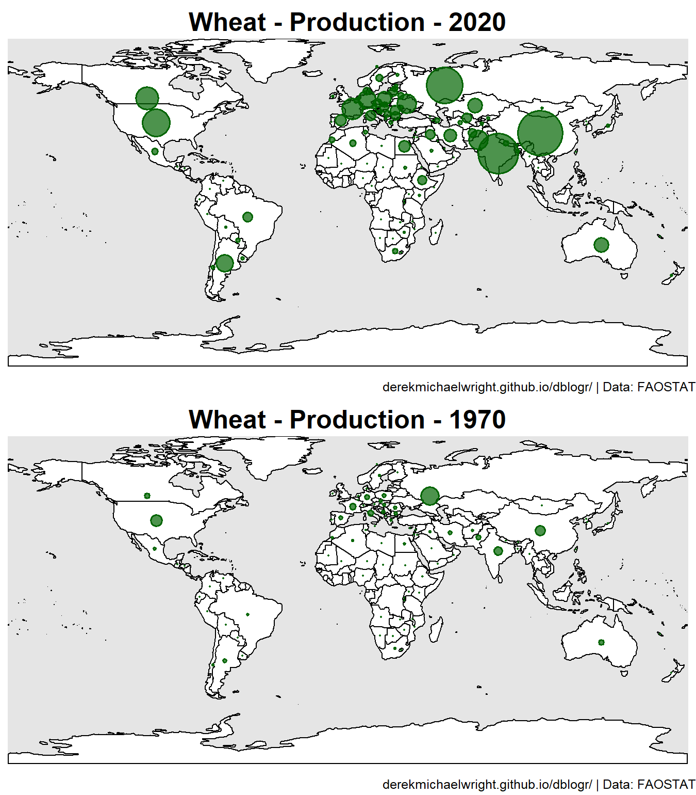

```{r setup, include=FALSE}
knitr::opts_chunk$set(echo = T, message = F, warning = F, out.width = "100%")
```

```{r echo = F}
library(shiny)
```

---

# `r shiny::icon("address-card")` About Me

<div class = "row"><div class = "col-md-8">
I was born in Regina, Saskatchewan and graduated with a **BSc in Biology** from the [*University of Regina*](https://www.uregina.ca/) in 2012, followed by a **MSc in Agrobiotechnology** from [*Justus-Liebig-Universität Gießen*](https://www.uni-giessen.de/) (*University of Giessen, Germany*) in 2015. I now work in the Plant Sciences department at the [*University of Saskatchewan*](https://www.usask.ca/) and have been involved in three research projects ([**AGILE**](https://knowpulse.usask.ca/study/2675314), [**EVOLVES**](https://knowpulse.usask.ca/study/2691111) & [**P2IRC**](https://p2irc.usask.ca/index.php)) with **lentil** (*Lens culinaris*). 

</div>

<div class = "col-md-4">

</div></div>

<div class = "row"><div class = "col-md-6">

**My Curriculum Vitae (CV)**

- &nbsp; `r shiny::icon("file-pdf")` [cv/cv.derek.m.wright.pdf](https://github.com/derekmichaelwright/dblogr/raw/main/cv/cv.derek.m.wright.pdf) 
- `r shiny::icon("laptop")` [cv/cv.derek.m.wright](cv/cv.derek.m.wright)
- `r shiny::icon("envelope")` derek.wright@usask.ca

</div>

<div class = "col-md-6">

**Social Media**

- `r shiny::icon("github")`  [github.com/derekmichaelwright](https://github.com/derekmichaelwright)
- `r shiny::icon("twitter")` [twitter.com/DerekMWright](https://twitter.com/DerekMWright)

</div></div>

---

# `r shiny::icon("newspaper")` Publications {.tabset .tabset-pills}

## LDP Phenology {.active}

<div class="box"><div class = "row"><div class = "col-md-4"></div>

<div class = "col-md-8">

**Wright, D.M.**, Neupane, S., Heidecker, T., Haile, T.A., Chan, C., Coyne, C.J., McGee, R.J., Udupa, S., Henkrar, F., Barilli, E., Rubiales, D., Gioia, T., Logozzo, G., Marzario, S., Mehra, R., Sarker, A., Dhakal, R., Anwar, B., Sarker, D., Vandenberg A. & Bett K.E. (2020) **Understanding photothermal interactions can help expand production range and increase genetic diversity of lentil (*Lens culinaris* Medik.)**. *Plants, People, Planet*. 00: 1-11. https://doi.org/10.1002/ppp3.10158

- `r shiny::icon("newspaper")` [*Plants, People, Planet*. (2020) 00: 1-11.](https://doi.org/10.1002/ppp3.10158)
- `r shiny::icon("github")` [Github Repository](https://github.com/derekmichaelwright/AGILE_LDP_Phenology)
- `r shiny::icon("save")` [Data](https://github.com/derekmichaelwright/AGILE_LDP_Phenology/tree/master/data)
- `r shiny::icon("chart-line")` [All Figures (HTML)](https://derekmichaelwright.github.io/AGILE_LDP_Phenology/README.html)
- `r shiny::icon("file-pdf")` [All Figures (pdf)](https://github.com/derekmichaelwright/AGILE_LDP_Phenology/blob/master/README.pdf)
- `r shiny::icon("r-project")` [R Script (HTML)](https://derekmichaelwright.github.io/AGILE_LDP_Phenology/Phenology_Vignette.html)
- `r shiny::icon("laptop-code")` [AGILE_LDP_Phenology (Shiny App)](https://derek-wright-usask.shinyapps.io/AGILE_LDP_Phenology/)
- `r shiny::icon("laptop-code")` [Predict DTF (Shiny App)](https://derek-wright-usask.shinyapps.io/AGILE_Predict_DTF/)

</div></div></div>

## LDP GWAS Phenology

<div class="box"><div class = "row"><div class = "col-md-4"></div>

<div class = "col-md-8">

Sandesh Neupane, **Derek M Wright**, Jakob Butler, Raul Martinez, Jim Weller, Kirstin E Bett (2022) **Focusing the GWAS Lens on days to flower using latent variable phenotypes derived from global multi-environment trials**. *The Plant Genome*. e20269. https://doi.org/10.1002/tpg2.20269

- `r shiny::icon("newspaper")` ["The Plant Genome. (2022) e20269.](https://doi.org/10.1002/tpg2.20269)
- `r shiny::icon("github")` [Github Repository](https://github.com/derekmichaelwright/AGILE_LDP_GWAS_Phenology)
- `r shiny::icon("chart-line")` [All Figures (HTML)](https://derekmichaelwright.github.io/AGILE_LDP_GWAS_Phenology/README.html)
- `r shiny::icon("file-pdf")` [All Figures (pdf)](https://github.com/derekmichaelwright/AGILE_LDP_GWAS_Phenology/blob/master/README.pdf)
- `r icon("r-project")` [R Script (HTML)](https://derekmichaelwright.github.io/AGILE_LDP_GWAS_Phenology/GWAS_Phenology_Vignette.html)

</div></div></div>

## Lentil UAV

<div class="box"><div class = "row"><div class = "col-md-4">

</div>

<div class = "col-md-8">

Disecting lentil crop growth across multi-environment trials using unoccupied aerial vehicles and genome-wide association studies

- `r shiny::icon("newspaper")` *unpublished*
- `r shiny::icon("github")` [Github Repository](https://github.com/derekmichaelwright/AGILE_LDP_UAV)
- `r shiny::icon("chart-line")` [All Figures (HTML)](https://derekmichaelwright.github.io/AGILE_LDP_UAV/README.html)
- `r shiny::icon("file-pdf")` [All Figures (pdf)](https://github.com/derekmichaelwright/AGILE_LDP_UAV/blob/master/README.pdf)
- `r icon("r-project")` [R Script (HTML)](https://derekmichaelwright.github.io/AGILE_LDP_UAV/LDP_UAV_Vignette.html)
- `r icon("youtube")` [P2IRC Conference](https://www.youtube.com/watch?v=FkjKaGJG7Xc&list=PLNqTYnctRQrkNKbRPBt6Z3Wb81Vq-rAum&index=11)

</div></div></div>

## LDP Nepal Phenology

<div class="box"><div class = "row"><div class = "col-md-4">

</div>

<div class = "col-md-8">

Neupane S., Dhakal R., **Wright D.M.**, Shrestha D.K., Dhakal B., Bett K.E. (2021) **Strategic Identification of New Genetic Diversity to Expand Lentil (*Lens culinaris* Medik.) Production (Using Nepal as an Example)**. *Agronomy*. 11(10): 1933. https://doi.org/10.3390/agronomy11101933

- `r shiny::icon("newspaper")` [Agronomy. (2021) 11(10): 1933.](https://doi.org/10.3390/agronomy11101933)
- `r shiny::icon("github")` [Github Repository](https://github.com/derekmichaelwright/AGILE_LDP_GWAS_Phenology)
- `r shiny::icon("chart-line")` [All Figures (HTML)](https://derekmichaelwright.github.io/AGILE_LDP_GWAS_Phenology/README.html)
- `r shiny::icon("file-pdf")` [All Figures (pdf)](https://github.com/derekmichaelwright/AGILE_LDP_GWAS_Phenology/blob/master/README.pdf)
- `r icon("r-project")` [R Script (HTML)](https://derekmichaelwright.github.io/AGILE_LDP_Nepal/Phenology_Vignette.html)

</div></div></div>

## Genomic Selection in Lentil

<div class="box"><div class = "row"><div class = "col-md-4">

</div>

<div class = "col-md-8">

Teketel A. Haile,  Taryn Heidecker,  **Derek Wright**,  Sandesh Neupane,  Larissa Ramsay,  Albert Vandenberg & Kirstin E. Bett (2020) **Genomic selection for lentil breeding: Empirical evidence**. *The Plant Genome*. 13(e20002): 1-15. https://doi.org/10.1002/tpg2.20002

- `r shiny::icon("newspaper")` [*The Plant Genome*. 13(e20002): 1-15.](https://doi.org/10.1002/tpg2.20002)

</div></div></div>

## NEU in Canola

<div class="box"><div class = "row"><div class = "col-md-4">

</div>

<div class = "col-md-8">

Derek Michael Wright (2015) **Influence of heterozygosity on nitrogen use efficiency in hybrid and purebred lines of *Brassica napus* (L.)**. *University of Giessen*. MSc. Thesis.

- `r shiny::icon("file-pdf")` [MSc Thesis (MastersThesis.pdf)](publications/canola_nue/MastersThesis.pdf)
- `r shiny::icon("r-project")` [R Script (HTML)](publications/canola_nue/)

</div></div></div>

# {-}

- Neupane *et al*. (**2022**) Focusing the GWAS Lens on days to flower using latent variable phenotypes derived from global multi-environment trials. *The Plant Genome*. e20269. https://doi.org/10.1002/tpg2.20269
- Neupane *et al*. (**2021**) Strategic Identification of New Genetic Diversity to Expand Lentil (*Lens culinaris* Medik.) Production (Using Nepal as an Example). *Agronomy*. 11(10): 1933. https://doi.org/10.3390/agronomy11101933
- Wright, *et al*. (**2020**) Understanding photothermal interactions can help expand production range and increase genetic diversity of lentil (*Lens culinaris* Medik.). *Plants, People, Planet*. 00: 1-11. https://doi.org/10.1002/ppp3.10158
- Haile *et al*. (**2020**) Genomic selection for lentil breeding: Empirical evidence. *The Plant Genome*. 13(e20002): 1-15. https://doi.org/10.1002/tpg2.20002
- Wright DM (**2015**) Influence of heterozygosity on nitrogen use efficiency in hybrid and purebred lines of *Brassica napus* (L.). *University of Giessen*. MSc. Thesis. 

---

# `r shiny::icon("laptop")` Academic {.tabset .tabset-pills}

## gwaspr

<div class="box"><div class = "row"><div class = "col-md-3">

</div>

<div class = "col-md-9">

`gwaspr`: an `r shiny::icon("r-project")` package for plotting GWAS results from the `GAPIT` package

- `r shiny::icon("house")` https://derekmichaelwright.github.io/gwaspr/
- `r shiny::icon("github")` https://github.com/derekmichaelwright/gwaspr/
- Install: `devtools::install_github("derekmichaelwright/gwaspr")`

</div></div></div>

## GWAS Tutorial

<div class="box"><div class = "row"><div class = "col-md-3">

</div>

<div class = "col-md-9">

[GWAS Vignette with gwaspr](academic/gwas_tutorial)

An R tutorial on running genome-wide association studies (GWAS) with GAPIT and gwaspr

</div></div></div>

## R Tutorial

<div class="box"><div class = "row"><div class = "col-md-3">

</div>

<div class = "col-md-9">

[R Tutorial](academic/r_tutorial)

An introduction to R

</div></div></div>

# {-}

---

# `r shiny::icon("r-project")` agData {.tabset .tabset-pills}

## agdata

<div class="box"><div class = "row"><div class = "col-md-3">

</div>

<div class = "col-md-9">

`agData`: An `r shiny::icon("r-project")` Package Containing Agricultural Data Sets

- `r shiny::icon("house")` https://derekmichaelwright.github.io/agData/
- `r shiny::icon("github")` https://github.com/derekmichaelwright/agData/
- Install: `devtools::install_github("derekmichaelwright/agData")`

</div></div></div>

## Maps of Global Crop Production

<div class="box"><div class = "row"><div class = "col-md-3">

</div>

<div class = "col-md-9">

[Maps of Global Crop Production](agdata/crops_world_maps)

Maps of crop production using FAO data

</div></div></div>

## Maps of Canadian Crop Production

<div class="box"><div class = "row"><div class = "col-md-3">

</div>

<div class = "col-md-9">

[Maps of Canadian Crop Production](agdata/crops_canada_maps)

Maps of crop production in Canada using STATCAN data

</div></div></div>

## Saskatchewan Crop Production

<div class="box"><div class = "row"><div class = "col-md-3">

</div>

<div class = "col-md-9">

[Saskatchewan Crop Production](agdata/crops_saskatchewan)

Graphs of crop production in Saskatchewan using STATCAN data

</div></div></div>

# {-}

---

# `r shiny::icon("chart-line")` Blog {.tabset .tabset-pills}

## Population Demographics In Canada

<div class="box"><div class = "row"><div class = "col-md-3">

</div>

<div class = "col-md-9">

[Population Demographics In Canada](blog/canada_population)

Graphs of population demographics in Canada using STATCAN data

</div></div></div>

## cypher

<div class="box"><div class = "row"><div class = "col-md-3">

</div>

<div class = "col-md-9">

`cypher`: an `r shiny::icon("r-project")` package for coding and decoding secret messages

- `r shiny::icon("house")` https://derekmichaelwright.github.io/cypher/
- `r shiny::icon("github")` https://github.com/derekmichaelwright/cypher/
- Install: `devtools::install_github("derekmichaelwright/cypher")`
- `r shiny::icon("code")` https://github.com/derekmichaelwright/cypher/blob/master/shinyapp/app.R

</div></div></div>

# {-}

---


---
