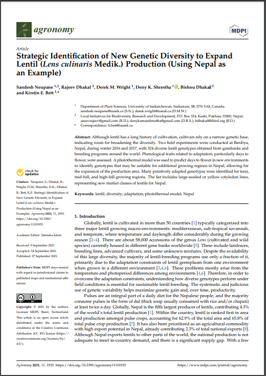

```{r setup, include=FALSE}
knitr::opts_chunk$set(echo = T, message = F, warning = F, out.width = "100%")
```

```{r echo = F}
library(shiny)
```

---

# `r shiny::icon("address-card")` About Me

<div class = "row"><div class = "col-md-8">
I was born in Regina, Saskatchewan and graduated with a **BSc in Biology** from the [*University of Regina*](https://www.uregina.ca/) in 2012, followed by a **MSc in Agrobiotechnology** from [*Justus-Liebig-Universität Gießen*](https://www.uni-giessen.de/) (*University of Giessen, Germany*) in 2015. I now work in the Plant Sciences department at the [*University of Saskatchewan*](https://www.usask.ca/) and have been involved in three research projects ([**AGILE**](https://knowpulse.usask.ca/study/2675314), [**EVOLVES**](https://knowpulse.usask.ca/study/2691111) & [**P2IRC**](https://p2irc.usask.ca/index.php)) with **lentil** (*Lens culinaris*). 

**My Curriculum Vitae (CV)**

- &nbsp; `r shiny::icon("file-pdf")` [Curriculum Vitae (PDF)](https://derekmichaelwright.github.io/dblogr/cv/cv.wright.derek.pdf) 
- `r shiny::icon("laptop")` [Curriculum Vitae (HTML)](https://derekmichaelwright.github.io/dblogr/cv/)

**Social Media**

- `r shiny::icon("github")`  https://github.com/derekmichaelwright
- `r shiny::icon("twitter")` https://twitter.com/DerekMWright

</div>

<div class = "col-md-4"></div></div>

---

# `r shiny::icon("newspaper")` Publications {.tabset .tabset-pills}

## LDP Phenology {.active}

<br><div class = "row"><div class = "col-md-4"></div>

<div class = "col-md-8">

**Wright, D.M.**, Neupane, S., Heidecker, T., Haile, T.A., Chan, C., Coyne, C.J., McGee, R.J., Udupa, S., Henkrar, F., Barilli, E., Rubiales, D., Gioia, T., Logozzo, G., Marzario, S., Mehra, R., Sarker, A., Dhakal, R., Anwar, B., Sarker, D., Vandenberg A. & Bett K.E. (2020) **Understanding photothermal interactions can help expand production range and increase genetic diversity of lentil (*Lens culinaris* Medik.)**. *Plants, People, Planet*. 00: 1-11.

- `r shiny::icon("newspaper")` [*Plants, People, Planet*. (2020) 00: 1-11.](https://doi.org/10.1002/ppp3.10158)
- `r shiny::icon("github")` [Github Repository](https://github.com/derekmichaelwright/AGILE_LDP_Phenology)
- `r shiny::icon("save")` [Data](https://github.com/derekmichaelwright/AGILE_LDP_Phenology/tree/master/data)
- `r shiny::icon("chart-line")` [All Figures (HTML)](https://derekmichaelwright.github.io/AGILE_LDP_Phenology/README.html)
- `r shiny::icon("file-pdf")` [All Figures (pdf)](https://github.com/derekmichaelwright/AGILE_LDP_Phenology/blob/master/README.pdf)
- `r shiny::icon("r-project")` [R Script (HTML)](https://derekmichaelwright.github.io/AGILE_LDP_Phenology/Phenology_Vignette.html)
- `r shiny::icon("laptop-code")` [AGILE_LDP_Phenology (Shiny App)](https://derek-wright-usask.shinyapps.io/AGILE_LDP_Phenology/)
- `r shiny::icon("laptop-code")` [Predict DTF (Shiny App)](https://derek-wright-usask.shinyapps.io/AGILE_Predict_DTF/)

</div></div>

## LDP GWAS Phenology

<br><div class = "row"><div class = "col-md-4"></div>

<div class = "col-md-8">
Sandesh Neupane, **Derek M Wright**, Jakob Butler, Raul Martinez, Jim Weller, Kirstin E Bett (2022) **Focusing the GWAS Lens on days to flower using latent variable phenotypes derived from global multi-environment trials**. *The Plant Genome*. e20269.

- `r shiny::icon("newspaper")` ["The Plant Genome. (2022) e20269.](https://doi.org/10.1002/tpg2.20269)
- `r shiny::icon("github")` [Github Repository](https://github.com/derekmichaelwright/AGILE_LDP_GWAS_Phenology)
- `r shiny::icon("chart-line")` [All Figures (HTML)](https://derekmichaelwright.github.io/AGILE_LDP_GWAS_Phenology/README.html)
- `r shiny::icon("file-pdf")` [All Figures (pdf)](https://github.com/derekmichaelwright/AGILE_LDP_GWAS_Phenology/blob/master/README.pdf)
- `r icon("r-project")` [R Script (HTML)](https://derekmichaelwright.github.io/AGILE_LDP_GWAS_Phenology/GWAS_Phenology_Vignette.html)

</div></div>

## Lentil UAV

<br><div class = "row"><div class = "col-md-4">

</div>

<div class = "col-md-8">

Disecting lentil crop growth across multi-environment trials using unoccupied aerial vehicles and genome-wide association studies

- `r shiny::icon("newspaper")` *unpublished*
- `r shiny::icon("github")` [Github Repository](https://github.com/derekmichaelwright/AGILE_LDP_UAV)
- `r shiny::icon("chart-line")` [All Figures (HTML)](https://derekmichaelwright.github.io/AGILE_LDP_UAV/README.html)
- `r shiny::icon("file-pdf")` [All Figures (pdf)](https://github.com/derekmichaelwright/AGILE_LDP_UAV/blob/master/README.pdf)
- `r icon("r-project")` [R Script (HTML)](https://derekmichaelwright.github.io/AGILE_LDP_UAV/LDP_UAV_Vignette.html)
- `r icon("youtube")` [P2IRC Conference](https://www.youtube.com/watch?v=FkjKaGJG7Xc&list=PLNqTYnctRQrkNKbRPBt6Z3Wb81Vq-rAum&index=11)

</div></div>

## LDP Nepal Phenology

<br><div class = "row"><div class = "col-md-4">

</div>

<div class = "col-md-8">

Neupane S., Dhakal R., **Wright D.M.**, Shrestha D.K., Dhakal B., Bett K.E. (2021) **Strategic Identification of New Genetic Diversity to Expand Lentil (*Lens culinaris* Medik.) Production (Using Nepal as an Example)**. *Agronomy*. 11(10): 1933.
https://doi.org/10.3390/agronomy11101933

- `r shiny::icon("newspaper")` [Agronomy. (2021) 11(10): 1933.](https://doi.org/10.3390/agronomy11101933)
- `r shiny::icon("github")` [Github Repository](https://github.com/derekmichaelwright/AGILE_LDP_GWAS_Phenology)
- `r shiny::icon("chart-line")` [All Figures (HTML)](https://derekmichaelwright.github.io/AGILE_LDP_GWAS_Phenology/README.html)
- `r shiny::icon("file-pdf")` [All Figures (pdf)](https://github.com/derekmichaelwright/AGILE_LDP_GWAS_Phenology/blob/master/README.pdf)
- `r icon("r-project")` [R Script (HTML)](https://derekmichaelwright.github.io/AGILE_LDP_Nepal/Phenology_Vignette.html)

</div></div>

## Genomic Selection in Lentil

<br><div class = "row"><div class = "col-md-4">

</div>

<div class = "col-md-8">

Teketel A. Haile,  Taryn Heidecker,  **Derek Wright**,  Sandesh Neupane,  Larissa Ramsay,  Albert Vandenberg & Kirstin E. Bett (2020) **Genomic selection for lentil breeding: Empirical evidence**. *The Plant Genome*. 13(e20002): 1-15. https://doi.org/10.1002/tpg2.20002

- `r shiny::icon("newspaper")` [*The Plant Genome*. 13(e20002): 1-15.](https://doi.org/10.1002/tpg2.20002)

</div></div>

## NEU in Canola

<br><div class = "row"><div class = "col-md-4">

</div>

<div class = "col-md-8">

Derek Michael Wright (2015) **Influence of heterozygosity on nitrogen use efficiency in hybrid and purebred lines of *Brassica napus* (L.)**. *University of Giessen*. MSc. Thesis.

- `r shiny::icon("file-pdf")` [MSc Thesis (MastersThesis.pdf)](https://derekmichaelwright.github.io/dblogr/publications/canola_nue/MastersThesis.pdf)
- `r shiny::icon("r-project")` [R Script (HTML)](https://derekmichaelwright.github.io/dblogr/publications/canola_nue/)

</div></div>

---

# `r shiny::icon("laptop")` Academic 

## gwaspr

under construction...

---

# `r shiny::icon("r-project")` agData 

An `r shiny::icon("r-project")` Package Containing Agricultural Data Sets

`r shiny::icon("house")` https://derekmichaelwright.github.io/agData/

Install: `devtools::install_github("derekmichaelwright/agData")`

under construction...

---

# `r shiny::icon("chart-line")` Blog

under construction...

---
