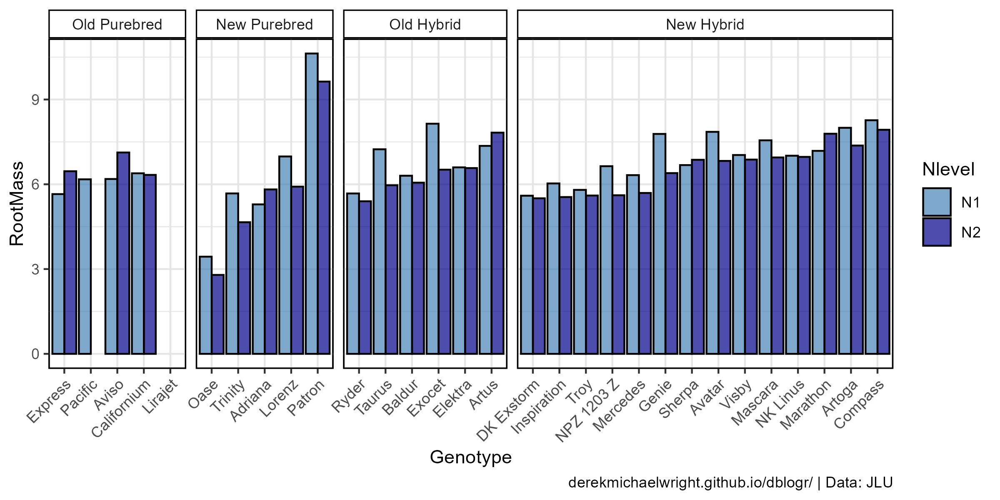
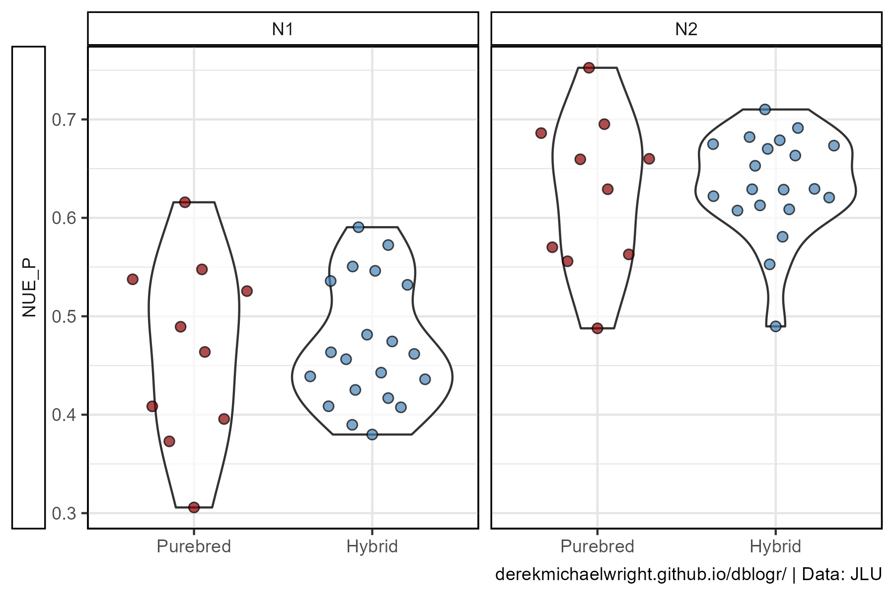
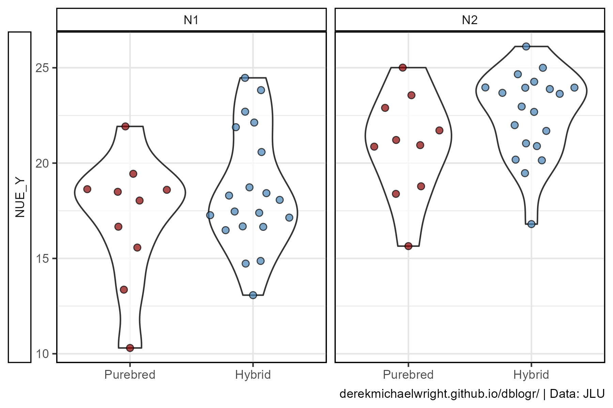
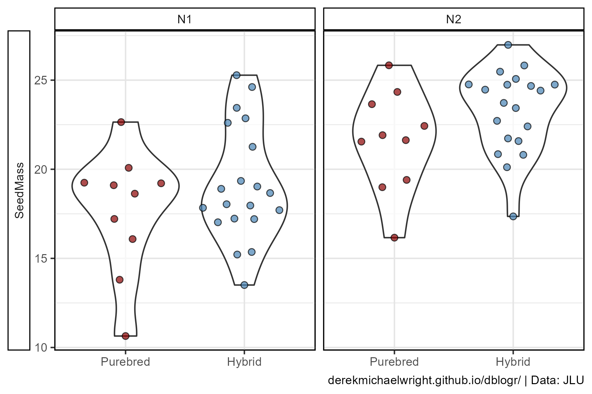
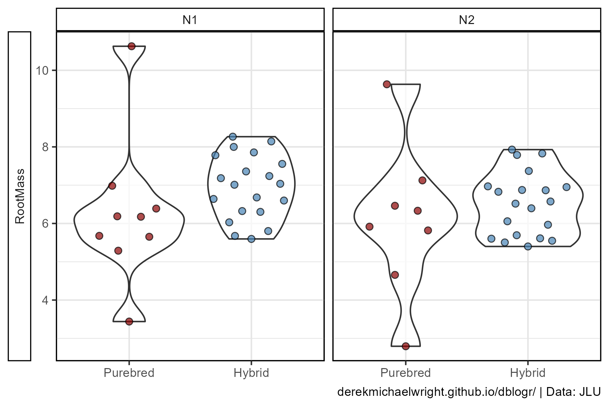
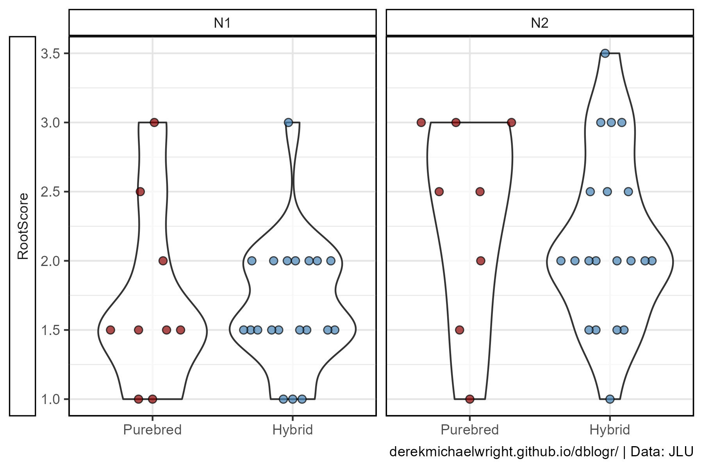
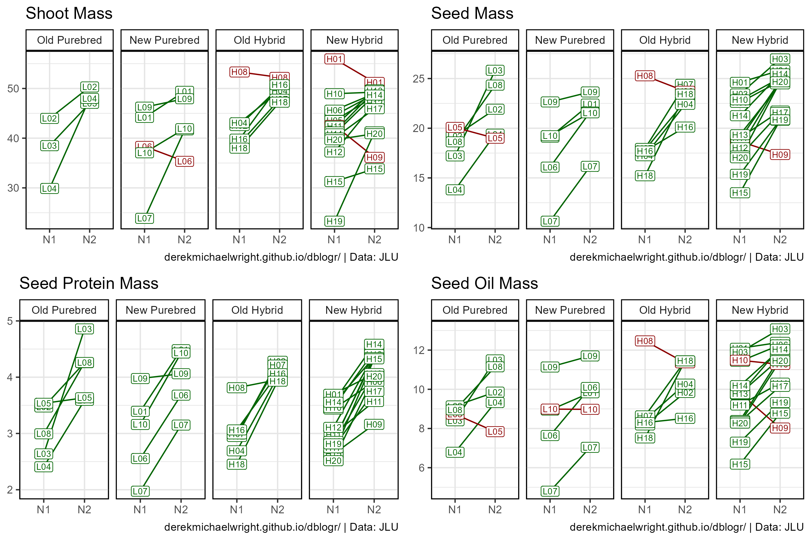
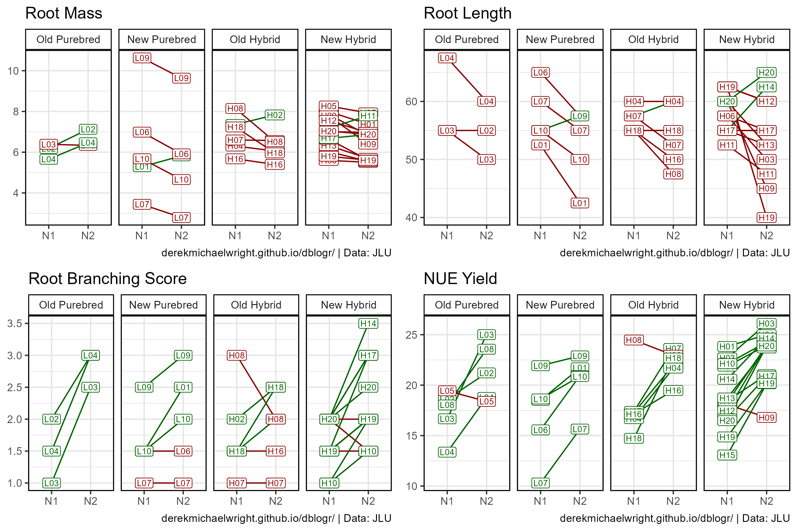

```{r setup, include=FALSE}
knitr::opts_chunk$set(echo = T, message = F, warning = F)
```

---


# Introduction

This is a vignette for my Masters thesis titled "Influence of heterozygosity on nitrogen use efficiency in hybrid and purebred lines of *Brassica napus* (L.)".

Department of Agronomy and Plant Breeding I, Justus-Liebig-Universität, Gießen 35392, Germany

> - `r shiny::icon("file-pdf")` [MastersThesis.pdf](MastersThesis.pdf)
> - `r shiny::icon("save")` [data_canola_nue.xlsx](data_canola_nue.xlsx)

---

# Materials and Methods

## Experiment

Thirty *Brassica napus* cultivars, 20 hybrid and 10 purebred lines, both old and new, were grown in a greenhouse under two fertilizer treatments: no N fertilization (N1) and 200 kg N/ha (N2). For each experimental replicate of genotype and fertilizer treatment, nine plants were grown in containers of 0.16 m2 surface area, filled with 147.5 kg of soil with a dry matter content of 88.2% (130.1 kg dry mass), in the layout described below.

## Data Collection & Analysis

Plant root mass, shoot mass, straw mass and seed mass was recorded, along with (NIRS) of seed for oil and protein content. Note: For plant shoots, 2 of the 9 plants were used for another study and not inluded in total mass measurements


---

# Formulas

$NUE=N_{in Seed}/N_{Available}$

Calculation of N fertilizatio when 1.6g N is added to container:

$(1.6gN)*(\frac{1kg}{1000g})*(\frac{1}{0.16m^2})*(\frac{10000m^2}{1ha})=100\frac{kgN}{ha}$

**N1** - Calculation of available N in soil

$N1=\frac{44.65\frac{mgNO_3}{kgsoil}+2.15\frac{mgNH_4}{kgsoil}*(130.1kgsoil)}{9plants}=677\frac{mgN}{perplant}$

**N2** - Calculation of available N with fertilization of 200 kg N/ha

$N2=677\frac{mgN}{perplant}+\frac{2*(1600mgN)}{9plants}=1033\frac{mgN}{perplant}$

[home](#)

---

# Prepare Data

```{r}
# devtools::install_github("derekmichaelwright/agData")
library(agData) # Loads: tidyverse, ggpubr, ggbeeswarm, ggrepel
library(readxl) # read_xlsx
# Cultivar data
cultivarTypes <- c("Old Purebred", "New Purebred", "Old Hybrid", "New Hybrid")
r1 <- read_xlsx("data_canola_nue.xlsx", "CultData") %>%
  mutate(Hybrid = plyr::mapvalues(Hybrid, c("H", "P"), c("Hybrid", "Purebred")),
         Age    = plyr::mapvalues(Age,    c("N", "O"), c("New", "Old")),
         Type   = factor(paste(Age, Hybrid), levels = cultivarTypes))
# Container data
r2 <- read_xlsx("data_canola_nue.xlsx", "ContData") %>%
  mutate(Nlevel = paste0("N", Nlevel))
# Plant data
r3 <- read_xlsx("data_canola_nue.xlsx", "PlantData")
# NIRS data main
r4 <- read_xlsx("data_canola_nue.xlsx", "NIRSmainRaw") %>%
  mutate(ErucicAcidPercent = ifelse(ErucicAcidPercent < 0, 
                                    0, ErucicAcidPercent),
         DryContent = 100 - WaterPercent) %>%
  group_by(Container) %>% 
  summarise_all(funs(mean), na.rm = T)
colnames(r4) <- paste0(colnames(r4),"_Main")
colnames(r4)[1] <- "Container"
# NIRS data side
r5 <- read_xlsx("data_canola_nue.xlsx", "NIRSsideRaw")
r5 <- r5 %>% mutate(DryContent = 100 - WaterPercent) %>%
  mutate(ErucicAcidPercent = ifelse(ErucicAcidPercent < 0, 
                                    0, ErucicAcidPercent),
         DryContent = 100 - WaterPercent) %>%
  group_by(Container) %>% 
  summarise_all(funs(mean), na.rm = T)
colnames(r5) <- paste0(colnames(r5),"_Side")
colnames(r5)[1] <- "Container"
#
myCaption <- "derekmichaelwright.github.io/dblogr/ | Data: JLU"
```

Notes:

- For straw mass 2 of the 9 plants were removed and used for another project.
- StemMass1: Small section of stem that was still attached to roots and removed prior to weighing.
- StemMass2: Bulk of straw collected during harvest. 

```{r}
rr <- left_join(r2, r1, by = c("Genotype"="Cultivar")) %>% 
  left_join(r3, by = "Container") %>%
  left_join(r4, by = "Container") %>%
  left_join(r5, by = "Container") %>%
  mutate(RootMass = RootMass / 9,
         StemMass = (StemMass1 + StemMass2) / 7,
         StrawMass = (StrawMassMain + StrawMassSide) / 7,
         ShootMass = StemMass + StrawMass,
         SeedMassMainDry = SeedMassMain * DryContent_Main / 100 / 7,
         SeedMassSideDry = SeedMassSide * DryContent_Side / 100 / 7,
         SeedMass = SeedMassMainDry + SeedMassSideDry,
         PlantMass = RootMass + StemMass + StrawMass + SeedMass,
         HarvestIndex = SeedMass / ShootMass,
         OilMassMain = OilPercent_Main * SeedMassMainDry / 100,
         OilMassSide = OilPercent_Side * SeedMassSideDry / 100,
         OilMass = OilMassMain + OilMassSide,
         ProteinMassMain = ProteinPercent_Main * SeedMassMainDry / 100,
         ProteinMassSide = ProteinPercent_Side * SeedMassSideDry / 100,
         ProteinMass = ProteinMassMain + ProteinMassSide,
         N_Available = ifelse(Nlevel == 1, 677, 1033),
         NUE_P = ProteinMass * 0.16 / N_Available * 1000, 
         NUE_Y = SeedMass           / N_Available * 1000) %>% 
  select(Container, Nlevel, AvailableN, Rep, Edge,
         Genotype, CultLabel, CultNumber, Hybrid, Age, Type, Breeder,
         RootMass, StemMass, StrawMass, ShootMass, SeedMass, 
         NUE_P, NUE_Y, everything()) %>%
  filter(Edge == "F")
trts <- colnames(rr)[13:ncol(rr)]
dd <- rr %>% 
  group_by(Nlevel, Genotype, CultLabel, Hybrid, Age, Type, Breeder) %>%
  summarise_at(vars(trts), funs(mean), na.rm = T) %>% 
  ungroup()
dd_sd <- rr %>% 
  group_by(Nlevel, Genotype, CultLabel, Hybrid, Age, Type, Breeder) %>%
  summarise_at(vars(trts), funs(sd), na.rm = T) %>% 
  ungroup()
```

---

# Biomass


```{r}
gg_PlantMass <- function(nlevel, title) {
  x1 <- dd %>% 
    mutate(SeedMass  = ifelse(Genotype == "Pacific" & Nlevel == "N2", 0, SeedMass),
           StrawMass = ifelse(Genotype == "Pacific" & Nlevel == "N2", 0, StrawMass),
           StemMass  = ifelse(Genotype == "Pacific" & Nlevel == "N2", 0, StemMass),
           RootMass  = ifelse(Genotype == "Pacific" & Nlevel == "N2", 0, RootMass),
           RootScore = ifelse(Genotype == "Pacific" & Nlevel == "N2", 0, RootScore))
  genoOrder <- x1 %>% 
    filter(Nlevel == nlevel) %>%
    arrange(SeedMass, Type) %>% 
    pull(Genotype)
  xi <- x1 %>% 
    filter(Nlevel == nlevel, !is.na(StemMass), !is.na(StrawMass), 
           !is.na(SeedMass), !is.na(RootMass))
  traits1 <- c("SeedMass","StrawMass","StemMass","RootMass")
  traits2 <- c("Seed","Straw","Stem","Roots")
  colors <- c("darkgreen","darkorange","forestgreen","brown")
  xs <- xi %>% 
    select(Genotype, Hybrid, Type, StemMass, StrawMass, SeedMass) %>% 
    gather(Trait, Value, StemMass, StrawMass, SeedMass) %>%
    mutate(Genotype = factor(Genotype, levels = genoOrder),
           Trait = plyr::mapvalues(Trait, traits1, traits2),
           Trait = factor(Trait, levels = traits2))
  xr <- xi %>% rename(Value=RootMass) %>% 
    mutate(Genotype = factor(Genotype, levels = genoOrder),
           Trait = "Roots",
           Trait = factor(Trait, levels = traits2))
  mp1 <- ggplot(xs, aes(x = Genotype, y = Value, 
                        fill = Trait, group = Trait)) + 
    geom_bar(stat= "identity", aes(color = Trait)) +
    geom_line(data = xs %>% filter(Trait == "Seed"), color = "black") +
    facet_grid("Shoots" ~ Type, scales= "free_x", space = "free_x") +
    scale_y_continuous(limits = c(0,85), expand = c(0,0)) +
    scale_color_manual(name = NULL, breaks = traits2, 
                       labels = traits2, values = colors) +
    scale_fill_manual(name = NULL,  breaks = traits2, 
                      labels = traits2, values = alpha(colors,0.7)) +
    theme_agData(axis.text.x = element_blank(),
                 axis.ticks.x = element_blank()) +
    labs(title = title, x = NULL, y = "g")
  mp2 <- ggplot(xr, aes(x = Genotype, y = Value)) + 
    geom_bar(stat = "identity", aes(fill = RootScore, color = "Roots")) +
    geom_text(aes(label = RootScore, y = 1), size = 3)  +
    facet_grid("Roots" ~ Type, scales= "free_x", space = "free_x") +
    scale_y_reverse(limits = c(11,0), expand = c(0,0)) +
    scale_color_manual(guide = F, values = "brown") +
    scale_fill_continuous(guide = F, low = alpha("brown",0.3), 
                                     high = alpha("brown",1)) +
    theme_agData(axis.text.x = element_text(angle = 45, hjust = 1), 
                 strip.text.x = element_blank()) +
    labs(y = "g", x = NULL)
  ggarrange(mp1, mp2, ncol = 1, align = "v", heights = c(1.3,1), 
            legend = "right", common.legend = T)
}
#
mp1 <- gg_PlantMass("N2", "High Nitrogen Treatment")
mp2 <- gg_PlantMass("N1", "Low Nitrogen Treatment")
mp <- ggarrange(mp1, mp2, ncol = 1) %>%
  annotate_figure(fig.lab.pos = "bottom.right", fig.lab  = myCaption)
ggsave("canola_nue_01.png", mp, width = 10, height = 10, bg = "white")
```

---

# Rootmass



```{r}
# Prep data
xx <- dd %>% arrange(RootMass) %>%
  mutate(Genotype = factor(Genotype, levels = unique(.$Genotype)))
# Plot
mp <- ggplot(xx, aes(x = Genotype, y = RootMass, fill = Nlevel)) +
  geom_bar(stat = "identity", position = "dodge",
           color = "black", alpha = 0.7
           ) +
  facet_grid(. ~ Type, scales = "free_x", space = "free_x") +
  scale_fill_manual(values = c("steelblue", "darkblue")) +
  theme_agData(axis.text.x = element_text(angle = 45, hjust = 1)) +
  labs(caption = myCaption)
ggsave("canola_nue_02.png", mp, width = 8, height = 4)
```

---

# N1 vs N2

```{r}
ggN1N2 <- function(myTrait) {
  # Prep data
  xi <- dd %>% gather(Trait, Value, myTrait) %>%
    mutate(Hybrid = factor(Hybrid, levels = c("Purebred","Hybrid")))
  # Plot
  ggplot(xi, aes(x = Hybrid, y = Value)) +
    geom_violin(alpha = 0.7) +
    geom_quasirandom(aes(fill = Hybrid), size = 2, pch = 21, alpha = 0.7) +
    facet_grid(Trait ~ Nlevel, scales = "free_y", switch = "y") +
    scale_fill_manual(name = NULL, values = c("darkred","steelblue")) +
    theme_agData(legend.position = "none", strip.placement = "outside") +
    labs(y = NULL, x = NULL,
         caption = myCaption)
}
```

---

## NUE Protein



```{r}
# Plot
mp <- ggN1N2(myTrait = "NUE_P")
ggsave("canola_nue_03.png", mp, width = 6, height = 4)
```

---

## NUE Yield



```{r}
# Plot
mp <- ggN1N2(myTrait = "NUE_Y")
ggsave("canola_nue_04.png", mp, width = 6, height = 4)
```

---

## Seed Mass



```{r}
# Plot
mp <- ggN1N2(myTrait = "SeedMass")
ggsave("canola_nue_05.png", mp, width = 6, height = 4)
```

---

## Root Mass



```{r}
# Plot
mp <- ggN1N2(myTrait = "RootMass")
ggsave("canola_nue_06.png", mp, width = 6, height = 4)
```

---

## NUE Protein



```{r}
# Plot
mp <- ggN1N2(myTrait = "RootScore")
ggsave("canola_nue_07.png", mp, width = 6, height = 4)
```

---

# Scatter Plot


```{r}
gg_Corr <- function(trait = "NUE_P", title = trait) {
  xi <- dd %>% select(Genotype, Type, Nlevel, Hybrid, Value=trait) %>%
    spread(Nlevel, Value)
  mymin <- min(xi$N1, xi$N2, na.rm = T)
  mymax <- max(xi$N1, xi$N2, na.rm = T)
  x2 <- bind_rows(
    xi %>% filter(Type != "Old Purebred") %>% mutate(Type = "Old Purebred"),
    xi %>% filter(Type != "New Purebred")  %>% mutate(Type = "New Purebred"),
    xi %>% filter(Type != "Old Hybrid")  %>% mutate(Type = "Old Hybrid"),
    xi %>% filter(Type != "New Hybrid")  %>% mutate(Type = "New Hybrid") )
  myColors <- c("darkgreen","darkred","darkgreen","darkred")
  ggplot(xi, aes(x = N1, y = N2)) + 
    geom_point(aes(shape = Type, fill = Type), size = 3, alpha = 0.7) + 
    geom_point(data = x2, alpha = 0.2) + geom_abline() + 
    facet_wrap(Type~., ncol = 2) +
    scale_fill_manual(values = myColors) +
    scale_shape_manual(values = c(22, 23, 25, 24)) +
    coord_cartesian(xlim = c(mymin, mymax), ylim = c(mymin, mymax)) +
    theme_agData(legend.position = "none") +
    labs(title = title, x = "Low N", y = "High N",
         caption = myCaption)
}
mp01 <- gg_Corr("PlantMass",   "Plant Mass")
mp02 <- gg_Corr("ShootMass",   "Shoot Mass")
mp03 <- gg_Corr("SeedMass",    "Seed Mass")
mp04 <- gg_Corr("ProteinMass", "Protein Mass")
mp05 <- gg_Corr("OilMass",     "Seed Oil Mass")
mp06 <- gg_Corr("RootMass",    "Seed Root Mass")
mp07 <- gg_Corr("RootScore",   "Root Branching Score")
mp08 <- gg_Corr("RootLength",  "Root Length")
mp09 <- gg_Corr("NUE_P",       "NUE Protein")
mp10 <- gg_Corr("NUE_Y",       "NUE Yield")
mp <- ggarrange(mp01, mp02, mp03, mp04, mp05, 
                mp06, mp07, mp08, mp09, mp10, ncol = 5, nrow = 2)
ggsave("canola_nue_08.png", mp, width = 14, height = 8)
```

---

# Treatment Change





```{r}
# Plotting function
gg_Diff <- function(trait = "ProteinMass", title = trait) {
  xi <- dd %>% 
    rename(Value = trait) %>%
    select(Nlevel, Genotype, CultLabel, Hybrid, Age, Type, Value) %>%
    spread(Nlevel, Value) %>%
    mutate(Diff = N2 - N1,
           Diff2 = ifelse(Diff > 0, "Positive", "Negative"),
           Diff2 = factor(Diff2, levels = c("Positive","Negative"))) %>%
    gather(Nlevel, Value, N1, N2) %>%
    filter(!is.na(Diff))
  #
  ggplot(xi, aes(x = Nlevel, y = Value, color = Diff2)) + 
    geom_line(aes(group = Genotype)) +
    geom_label(aes(label = CultLabel), size = 2.5,
               label.padding = unit(0.15, "lines")) +
    facet_grid(. ~ Type) +
    scale_color_manual(values = c("darkgreen", "darkred")) +
    theme_agData(legend.position = "none") +
    labs(title = title, x = NULL, y = NULL,
         caption = myCaption)
}
# Plot
mp01 <- gg_Diff("ShootMass",   "Shoot Mass")
mp02 <- gg_Diff("SeedMass",    "Seed Mass")
mp03 <- gg_Diff("ProteinMass", "Seed Protein Mass")
mp04 <- gg_Diff("OilMass",     "Seed Oil Mass")
mp05 <- gg_Diff("RootMass",    "Root Mass")
mp06 <- gg_Diff("RootLength",  "Root Length")
mp07 <- gg_Diff("RootScore",   "Root Branching Score")
mp08 <- gg_Diff("NUE_Y",       "NUE Yield")
mp <- ggarrange(mp01, mp02, mp03, mp04, ncol = 2, nrow = 2)
ggsave("canola_nue_09.png", mp, width = 9, height = 6)
mp <- ggarrange(mp05, mp06, mp07, mp08,  ncol = 2, nrow = 2)
ggsave("canola_nue_10.png", mp, width = 9, height = 6)
```

---

# Correlation Plots


```{r results="hide"}
library(corrplot)
traits <- c("RootMass", "RootScore", "StemMass", "ShootMass", 
            "StrawMass", #"StrawMassMain", #"StrawMassSide",
            "SeedMass", "SeedMassMain", "SeedMassSide",
            "NUE_P", "NUE_Y", "RootLength", 
            "ProteinMass", "OilMass", "HarvestIndex", 
            "OilPercent_Main", "OilPercent_Side",
            "ProteinPercent_Main", "ProteinPercent_Side")
m1 <- dd %>% filter(Nlevel == "N1", !is.na(RootMass)) %>% select(traits)
m2 <- dd %>% filter(Nlevel == "N2", !is.na(RootMass)) %>% select(traits)
#
png("canola_nue_11.png", width = 600, height = 600)
mp1 <- corrplot(cor(m1), addrect=2)#order = "hclust",
dev.off()
#
png("canola_nue_12.png", width = 600, height = 600)
mp2 <- corrplot(cor(m2), addrect=2)
dev.off()
```

```{r eval = F, echo = F}
ggplot(dd, aes(x = Hybrid, y = SeedMass)) + 
  geom_boxplot(width = 0.2) +
  geom_beeswarm(aes(color = Type)) +
  facet_grid(. ~ Nlevel) +
  theme_agData(legend.position = "bottom")
library(GGally)
# 

x1 <- dd %>% filter(Nlevel == "N1")
ggpairs(dd, columns = traits)
```

---
