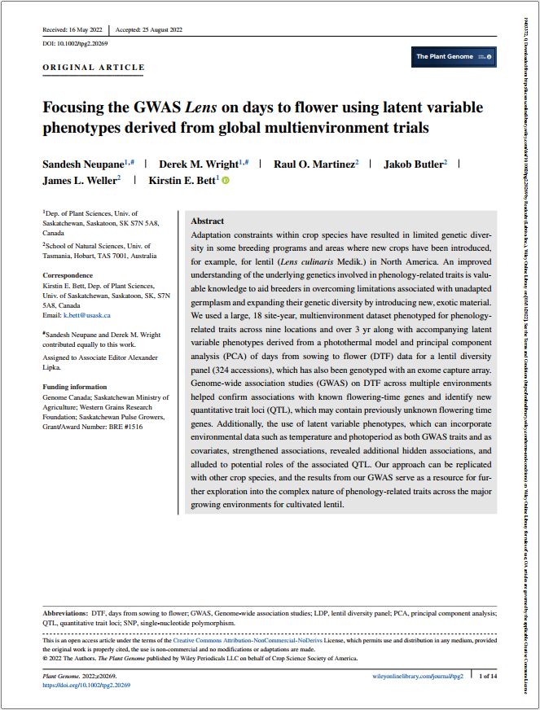
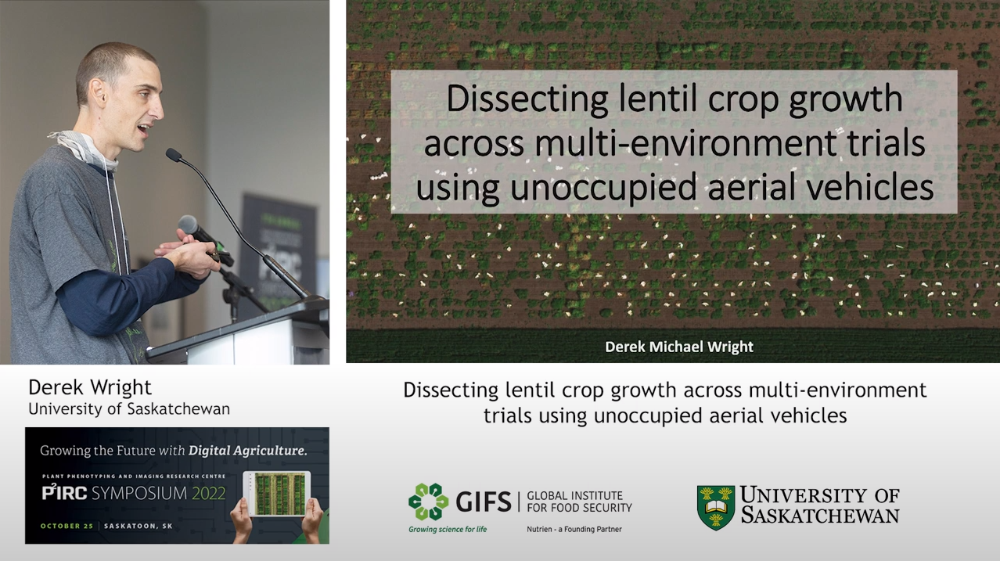
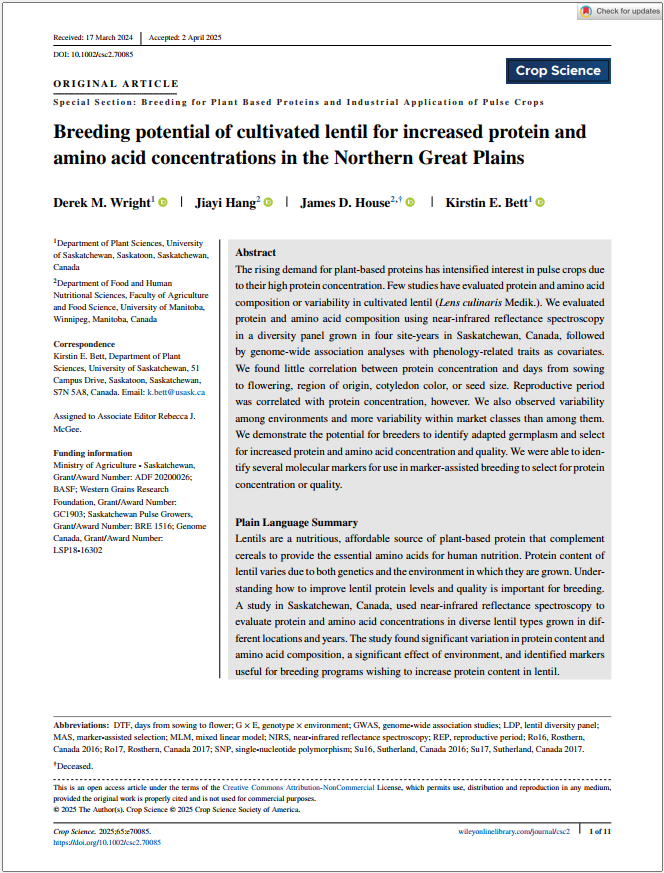
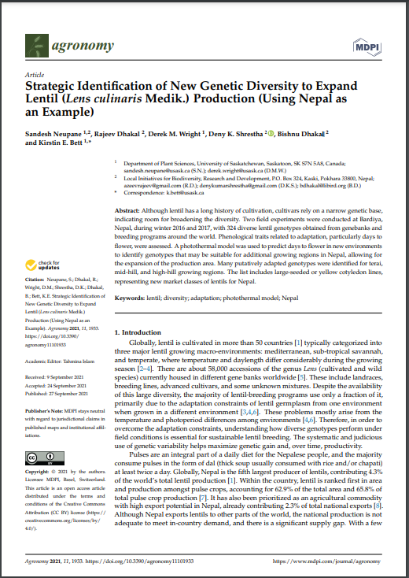
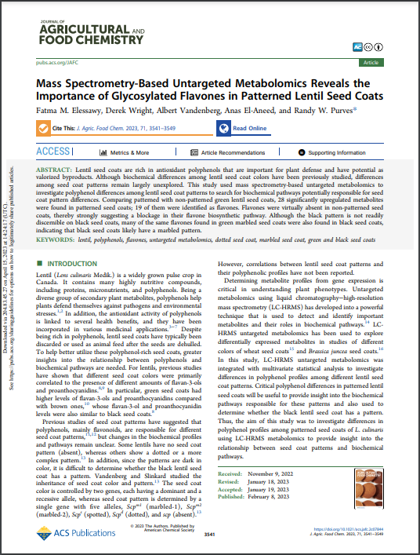
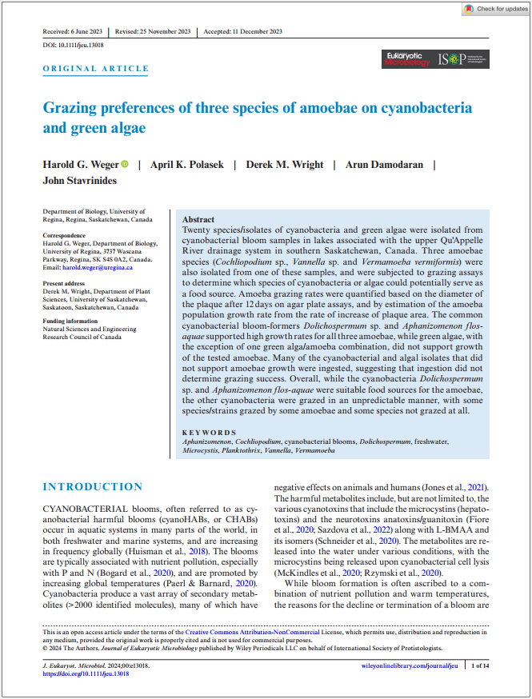
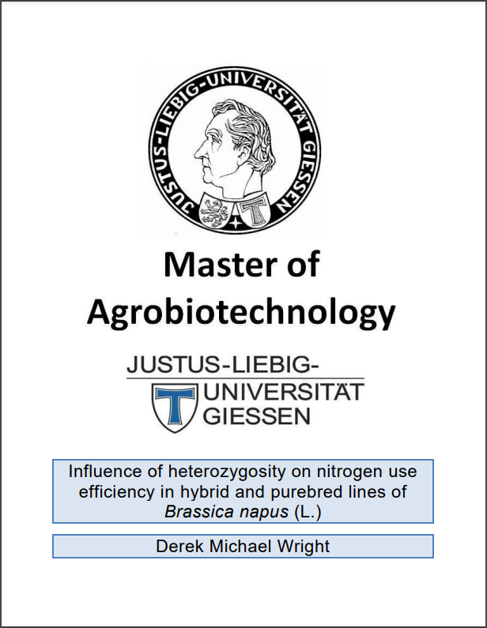

```{r setup, include=FALSE}
knitr::opts_chunk$set(echo = TRUE, message = F, warning = F)
```

```{r echo = F}
library(shiny)
# https://derekmichaelwright.github.io/dblogr/home
```

---

Scientific publications I have been involved in while working/studying at [***University of Regina***](https://www.uregina.ca/){target="_blank"}, [***Justus-Liebig-Universität Gießen (University of Giessen)***](https://www.uni-giessen.de/){target="_blank"} & the [***University of Saskatchewan***](https://www.usask.ca/){target="_blank"}.

# All Publications

<div class="box">

- `r icon("newspaper")` (**2025**) [<u>**Disecting lentil crop growth across multi-environment trials using unoccupied aerial vehicles and genome-wide association studies**</u>](https://doi.org/10.1002/ppj2.70040){target="_blank"}. *The Plant Phenome Journal*. 8(1): e70040. doi.org/10.1002/ppj2.70040
- `r icon("newspaper")` (**2025**) [<u>**Breeding potential of cultivated lentil for increased protein and amino acid concentrations in the Northern Great Plains**</u>](http://dx.doi.org/10.1002/csc2.70085){target="_blank"}. *Crop Science*. 65(3): e70085. doi.org/10.1002/csc2.70085
- `r icon("newspaper")` (**2024**) [<u>**Grazing preferences of three species of amoebae on cyanobacteria and green algae**</u>](https://doi.org/10.1111/jeu.13018){target="_blank"}. *The Journal of Eukaryotic Microbiology*. e13018: 1-14. doi.org/10.1111/jeu.13018
- `r icon("newspaper")` (**2023**) [<u>**Mass Spectrometry-Based Untargeted Metabolomics Reveals the Importance of Glycosylated Flavones in Patterned Lentil Seed Coats**</u>](https://doi/10.1021/acs.jafc.2c07844){target="_blank"}. *Journal of Agricultural and Food Chemistry*. 71(7): 3541–3549. doi.org/10.1021/acs.jafc.2c07844
- `r icon("newspaper")` (**2022**) [<u>**Focusing the GWAS Lens on days to flower using latent variable phenotypes derived from global multi-environment trials**</u>](https://doi.org/10.1002/tpg2.20269){target="_blank"}. *The Plant Genome*. e20269. doi.org/10.1002/tpg2.20269
  + `r icon("podcast")` [Field Lab Earth Podcast](http://fieldlabearth.libsyn.com/latent-variable-phenotypes-in-lentil-with-sandesh-neupane-and-derek-wright)
- `r icon("newspaper")` (**2021**) [<u>**Strategic Identification of New Genetic Diversity to Expand Lentil (*Lens culinaris* Medik.) Production (Using Nepal as an Example)**</u>](https://doi.org/10.3390/agronomy11101933){target="_blank"}. *Agronomy*. 11(10): 1933. doi.org/10.3390/agronomy11101933
- `r icon("newspaper")` (**2021**) [<u>**Understanding photothermal interactions can help expand production range and increase genetic diversity of lentil (*Lens culinaris* Medik.)**</u>](https://doi.org/10.1002/ppp3.10158){target="_blank"}. *Plants, People, Planet*. 3(2): 171-181. doi.org/10.1002/ppp3.10158
- `r icon("newspaper")` (**2020**) [<u>**Genomic selection for lentil breeding: Empirical evidence**</u>](https://doi.org/10.1002/tpg2.20002){target="_blank"}. *The Plant Genome*. 13(e20002): 1-15. doi.org/10.1002/tpg2.20002
- `r icon("newspaper")` (**2015**) [<u>**Influence of heterozygosity on nitrogen use efficiency in hybrid and purebred lines of *Brassica napus* (L.)**</u>](canola_nue/){target="_blank"}. *University of Giessen*. MSc. Thesis.

</div>

---

# LDP Phenology

<div class="box"><div class="row"><div class="col-md-6">

[<u>**Understanding photothermal interactions can help expand production range and increase genetic diversity of lentil (*Lens culinaris* Medik.)**</u>](https://doi.org/10.1002/ppp3.10158){target="_blank"}. *Plants, People, Planet*. (**2021**) 3(2): 171-181. doi.org/10.1002/ppp3.10158

**Derek M. Wright**, Sandesh Neupane, Taryn Heidecker, Teketel A. Haile, Crystal Chan, Clarice J. Coyne, Rebecca J. McGee, Sripada Udupa, Fatima Henkrar, Eleonora Barilli, Diego Rubiales, Tania Gioia, Giuseppina Logozzo, Stefania Marzario, Reena Mehra, Ashutosh Sarker, Rajeev Dhakal, Babul Anwar, Debashish Sarker, Albert Vandenberg & Kirstin E. Bett 

- `r icon("newspaper")` [*Plants, People, Planet*. (**2021**) 3(2): 171-181.](https://doi.org/10.1002/ppp3.10158){target="_blank"}
- `r icon("github")` [Github Repository](https://github.com/derekmichaelwright/AGILE_LDP_Phenology){target="_blank"}
- `r icon("save")` [Data](https://github.com/derekmichaelwright/AGILE_LDP_Phenology/tree/master/data){target="_blank"}
- `r icon("r-project")` [R Script (HTML)](https://derekmichaelwright.github.io/AGILE_LDP_Phenology/Phenology_Vignette.html){target="_blank"}
- `r icon("laptop-code")` [AGILE_LDP_Phenology (Shiny App)](https://derek-wright-usask.shinyapps.io/AGILE_LDP_Phenology/){target="_blank"}
- `r icon("laptop-code")` [Predict DTF (Shiny App)](https://derek-wright-usask.shinyapps.io/AGILE_Predict_DTF/){target="_blank"}
- `r icon("chart-line")` [All Figures (HTML)](https://derekmichaelwright.github.io/AGILE_LDP_Phenology/README.html){target="_blank"}
- `r icon("file-pdf")` [All Figures (pdf)](https://github.com/derekmichaelwright/AGILE_LDP_Phenology/blob/master/README.pdf){target="_blank"}

</div><div class="col-md-6"></div></div>

<u>**News Articles**</u>

- `r icon("globe")` [<u>**Genome Canada - Application of genomics to innovation in the lentil economy (AGILE)**</u>](https://www.genomecanada.ca/en/application-genomics-innovation-lentil-economy-agile){target="_blank"}

- `r icon("globe")` [**Genome Prairie - AGILE Innovating the growth of lentils**](http://www.genomeprairie.ca/project/current/agile){target="_blank"}

- `r icon("globe")` [**Global Plant Council Blog - Lentils under the lens: Improving genetic diversity for sustainable food security**](http://blog.globalplantcouncil.org/research/lentils-under-the-lens/){target="_blank"}

- `r icon("globe")` [**The Western Producer - Genetics project provides foundation for new Canadian lentil varieties**](https://www.producer.com/2019/01/genetics-project-provides-foundation-for-new-canadian-lentil-varieties/){target="_blank"}

- `r icon("globe")` [**SeedWorld - USask Scientists Develop Model to Identify Best Lentils for Climate Change Impacts**](https://www.seedworld.com/usask-scientists-develop-model-to-identify-best-lentils-for-climate-change-impacts/){target="_blank"}

</div>

---

# LDP GWAS Phenology

<div class="box"><div class="row"><div class="col-md-6">

[<u>**Focusing the GWAS Lens on days to flower using latent variable phenotypes derived from global multi-environment trials**</u>](https://doi.org/10.1002/tpg2.20269){target="_blank"}. *The Plant Genome*. (**2022**) 16(1): e20269. doi.org/10.1002/tpg2.20269

Sandesh Neupane, **Derek M. Wright**, Raul O. Martinez, Jakob Butler, Jim L. Weller, Kirstin E. Bett

- `r icon("newspaper")` [*The Plant Genome*. (**2022**) 16(1): e20269.](https://doi.org/10.1002/tpg2.20269){target="_blank"}
- `r icon("github")` [Github Repository](https://github.com/derekmichaelwright/AGILE_LDP_GWAS_Phenology){target="_blank"}
- `r icon("r-project")` [R Script (HTML)](https://derekmichaelwright.github.io/AGILE_LDP_GWAS_Phenology/GWAS_Phenology_Vignette.html){target="_blank"}
- `r icon("chart-line")` [All Figures (HTML)](https://derekmichaelwright.github.io/AGILE_LDP_GWAS_Phenology/README.html){target="_blank"}
- `r icon("file-pdf")` [All Figures (pdf)](https://github.com/derekmichaelwright/AGILE_LDP_GWAS_Phenology/blob/master/README.pdf){target="_blank"}
- `r icon("podcast")` [Field Lab Earth Podcast](http://fieldlabearth.libsyn.com/latent-variable-phenotypes-in-lentil-with-sandesh-neupane-and-derek-wright){target="_blank"}

</div><div class="col-md-6"></div></div></div>

---

# LDP GWAS UAV

<div class="box"><div class="row"><div class="col-md-6">

[<u>**Disecting lentil crop growth across multi-environment trials using unoccupied aerial vehicles and genome-wide association studies**</u>](https://doi.org/10.1002/ppj2.70040){target="_blank"}. *The Plant Phenome Journal*. (**2025**) 8(1): e70040. doi.org/10.1002/ppj2.70040

**Derek M Wright**, Sandesh Neupane, Steve Shirtlife, Tania Gioia, Giuseppina Logozzo, Stefania Marzario, Karsten M.E. Nielsen & Kirstin E Bett

- `r icon("newspaper")` [*The Plant Phenome Journal*. (**2025**) 8(1): e70040.](https://doi.org/10.1002/ppj2.70040){target="_blank"}
- `r icon("github")` [Github Repository](https://github.com/derekmichaelwright/AGILE_LDP_UAV){target="_blank"}
- `r icon("r-project")` [R Script (HTML)](https://derekmichaelwright.github.io/AGILE_LDP_UAV/LDP_UAV_Vignette.html){target="_blank"}
- `r icon("chart-line")` [All Figures (HTML)](https://derekmichaelwright.github.io/AGILE_LDP_UAV/README.html){target="_blank"}
- `r icon("file-pdf")` [All Figures (pdf)](https://github.com/derekmichaelwright/AGILE_LDP_UAV/blob/master/README.pdf){target="_blank"}
- `r icon("youtube")` [P2IRC Conference](https://www.youtube.com/watch?v=FkjKaGJG7Xc&list=PLNqTYnctRQrkNKbRPBt6Z3Wb81Vq-rAum&index=11){target="_blank"}

</div><div class="col-md-6"></div></div></div>

---

# LDP GWAS Protein

<div class="box"><div class="row"><div class="col-md-6">

[<u>**Breeding potential of cultivated lentil for increased protein and amino acid concentrations in the Northern Great Plains**</u>](http://dx.doi.org/10.1002/csc2.70085){target="_blank"}. *Crop Science*. (**2025**) 65(3): e70085. doi.org/10.1002/csc2.70085

**Derek M. Wright**, Jiayi Hang, James D. House & Kirstin E. Bett

- `r icon("newspaper")` [*Crop Science*. (**2025**) 65(3): e70085.](doi.org/10.1002/csc2.70085){target="_blank"}
- `r icon("github")` [Github Repository](https://github.com/derekmichaelwright/AGILE_LDP_Protein){target="_blank"}
- `r icon("r-project")` [R Script (HTML)](https://derekmichaelwright.github.io/AGILE_LDP_Protein/LDP_Protein_Vignette.html){target="_blank"}
- `r icon("chart-line")` [All Figures (HTML)](https://derekmichaelwright.github.io/AGILE_LDP_Protein/README.html){target="_blank"}
- `r icon("file-pdf")` [All Figures (pdf)](https://github.com/derekmichaelwright/AGILE_LDP_Protein/blob/master/README.pdf){target="_blank"}

A follow up to:

[<u>**Prediction of protein and amino acid contents in whole and ground lentils using near-infrared reflectance spectroscopy**</u>](https://doi.org/10.1016/j.lwt.2022.113669){target="_blank"}. *LWT*. (**2022**) 165: 113669. doi.org/10.1016/j.lwt.2022.113669

Jiayi Hang, Da Shi, Jason Neufeld, Kirstin E. Bett & James D. House

- `r icon("newspaper")` [*LWT*. (**2022**) 165: 113669.](https://doi.org/10.1016/j.lwt.2022.113669){target="_blank"}

</div><div class="col-md-6"></div></div></div>

---

# LDP Nepal Phenology

<div class="box"><div class="row"><div class="col-md-6">

[<u>**Strategic Identification of New Genetic Diversity to Expand Lentil (*Lens culinaris* Medik.) Production (Using Nepal as an Example)**</u>](https://doi.org/10.3390/agronomy11101933){target="_blank"}. *Agronomy*. (**2021**) 11(10): 1933. doi.org/10.3390/agronomy11101933

Sandesh Neupane, Rajeev Dhakal, **Derek M. Wright**, Deny K. Shrestha, Bishnu Dhakal & Kirstin E. Bett

- `r icon("newspaper")` [*Agronomy*. (**2021**) 11(10): 1933.](https://doi.org/10.3390/agronomy11101933){target="_blank"}
- `r icon("github")` [Github Repository](https://github.com/derekmichaelwright/AGILE_LDP_Nepal){target="_blank"}
- `r icon("r-project")` [R Script (HTML)](https://derekmichaelwright.github.io/AGILE_LDP_Nepal/Phenology_Vignette.html){target="_blank"}
- `r icon("chart-line")` [All Figures (HTML)](https://derekmichaelwright.github.io/AGILE_LDP_Nepal/README.html){target="_blank"}
- `r icon("file-pdf")` [All Figures (pdf)](https://github.com/derekmichaelwright/AGILE_LDP_Nepal/blob/master/README.pdf){target="_blank"}

</div><div class="col-md-6"></div></div></div>

---

# Genomic Selection in Lentil

<div class="box"><div class="row"><div class="col-md-6">

[<u>**Genomic selection for lentil breeding: Empirical evidence**</u>](https://doi.org/10.1002/tpg2.20002){target="_blank"}. *The Plant Genome*. (**2020**) 13(e20002): 1-15. doi.org/10.1002/tpg2.20002

Teketel A. Haile,  Taryn Heidecker,  **Derek M. Wright**,  Sandesh Neupane,  Larissa Ramsay,  Albert Vandenberg & Kirstin E. Bett.

- `r icon("newspaper")` [*The Plant Genome*. (**2020**) 13(e20002): 1-15.](https://doi.org/10.1002/tpg2.20002){target="_blank"}

</div><div class="col-md-6"></div></div></div>

---

# Lentil Flavones

<div class="box"><div class="row"><div class="col-md-6">

[<u>**Mass Spectrometry-Based Untargeted Metabolomics Reveals the Importance of Glycosylated Flavones in Patterned Lentil Seed Coats**</u>](https://doi/10.1021/acs.jafc.2c07844){target="_blank"}. *Journal of Agricultural and Food Chemistry*. (**2023**) 71(7): 3541–3549. doi.org/10.1021/acs.jafc.2c07844

Fatma M. Elessawy, **Derek M. Wright**, Albert Vandenberg, Anas El-Aneed & Randy W. Purves.

- `r icon("newspaper")` [*Journal of Agricultural and Food Chemistry*. (**2023**) 71(7): 3541–3549.](https://doi/10.1021/acs.jafc.2c07844){target="_blank"}

</div><div class="col-md-6"></div></div></div>

---

# Algae Grazers

<div class="box"><div class="row"><div class="col-md-6">

[<u>**Grazing preferences of three species of amoebae on cyanobacteria and green algae**</u>](https://doi.org/10.1111/jeu.13018){target="_blank"}. *The Journal of Eukaryotic Microbiology*. (**2024**) e13018: 1-14. doi.org/10.1111/jeu.13018

Harold G. Weger, April K. Polasek, **Derek M. Wright**, Arun Damodaran, John Stavrinides

- `r icon("newspaper")` [*The Journal of Eukaryotic Microbiology*. (**2024**) e13018: 1-14. doi.org/10.1111/jeu.13018](https://doi.org/10.1111/jeu.13018){target="_blank"}

</div><div class="col-md-6"></div></div></div>

---

# NEU in Canola

<div class="box"><div class="row"><div class="col-md-6">

<u>**Influence of heterozygosity on nitrogen use efficiency in hybrid and purebred lines of *Brassica napus* (L.)**</u>. *University of Giessen*. (**2015**) MSc. Thesis.

**Derek M. Wright**.

- `r icon("file-pdf")` [MSc Thesis (MastersThesis.pdf)](canola_nue/MastersThesis.pdf){target="_blank"}
- `r icon("r-project")` [R Script (HTML)](canola_nue/){target="_blank"}

</div><div class="col-md-6"></div></div></div>

---
